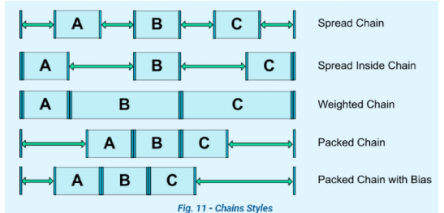
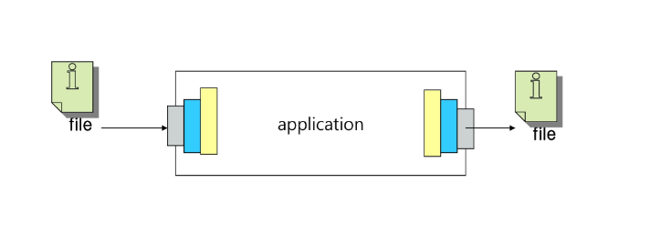
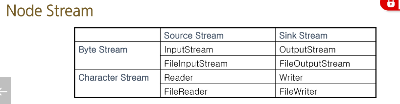
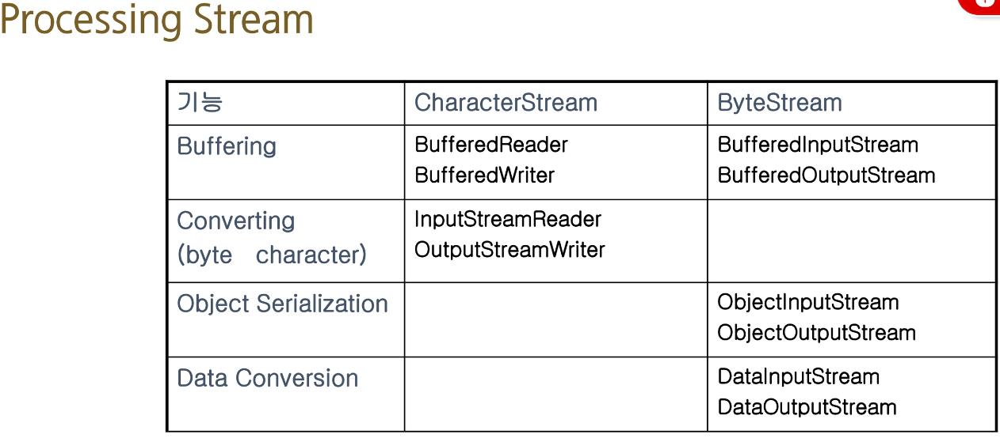

# Constraint Layout

* 레이아웃 중첩으로 복잡해지는 레이아웃 구조를 ConstraintLayout으로 단순하게 바꾼다.
* 부모 아래에 `자식 View들 끼리 관계를 정의`해서 `레이아웃을 구성`한다는 점이 Relative Layout과 비슷하지만 더 많은 기능들을 제공합니다.
* 뷰계층이 간단하여 유지보수와 성능 측면에서 유리합니다.

1. latout_constraint[연결할 위치]to_[target 위치]of

2. start_,bottom_, top_ , end_만 입력해도 자동원성 제공합니다.

3. 제약조건을 만족하는 최소 단위는 수직 , 수평 방향으로 하나 씩 걸어놓는 것입니다.  

- 의도한 UI에 맞게 필요한 방향만 제약을 거는 것이 예상치 못한 동작을 방지하는 길입니다.

```html

B와 나란히 정렬
[top_topOf"B" +bottom_bottomOf"B" (나란히 정렬)]
[+ baseLine 맞추기 ]  
[+  start_startOfParent or end_endOfParent (부모에게 끝 점 붙이기)] 

* Tip:  원하는 그룹의 제일 오른쪽 요소을 부모에 연결하고 
왼쪽 요소에 수평 BIAS를 1로 주면 그룹이 통째로 오른쪽으로 붙음   
head의 바이어스 조절해서 적절히 배치하기 ...


B 아래에 나란히 수직 정렬

start_startOf"B" +top_bottomOf"B"
B 정확히 아래에 연결됨 마진 주면 디자인가능    

```
<hr>

# 뷰 크기 설정하기
1. `0dp` : 남는 공간을 자신으로 채웁니다.`부모 공간을 꽉 채우고 싶다면`, 뷰의 양쪽(Start/End 또는 Top/Bottom)을 parent에 연결한 뒤 너비/높이를 0dp로 설정해야 의도한 대로 정확히 동작합니다.

2. match_parent: 부모의 공간만큼 채웁니다. (권장 x )

3. wrap_content: 내부 콘텐츠(텍스트, 이미지 등) 크기만큼만 영역을 차지합니다.
<hr>

# bias 

제약조건이 `같은 방향`으로 `양쪽에 붙어`있을때 가능합니다.<br>
0: 왼쪽에 붙이기 / 1: 오른쪽에 붙이기, 0.5 중간에 위치<br>


# 체인 

1. 서로 연결되어 `그룹으로 동작`하는 뷰의 모음 

2.  체인으로 연결된 뷰 끼리도 체인이 연결된 방향으로만 그룹으로 동작합니다. 

3. 생성 조건 : `마주보는 뷰`끼리 `마주보는 방향`으로 constraint를 설정합니다.
4.   B ---&lt;  &gt;--- A 

```Java
바이어스 (Bias): `체인이 아니어도` 적용 가능 (⭕)
가중치 비율 (Weight): 체인으로 묶여있어야만 적용 가능
```


헤드에 bias를 줘서 위치를 조절할 수 있으며, 한 요소가 동시에 같은 체인에 속할 수는 없습니다.

체이닝 스타일

```java
Spread (기본값): 뷰들이 남는 여백을 똑같이 나눠 가지며 균등한 간격으로 띄워져서 배치됩니다.

Spread_inside: 체인의 양 끝 뷰는 화면(또는 제약조건) 가장자리에 딱 붙고, 나머지 가운데 뷰들끼리만 균등한 간격을 가집니다.

Packed: 뷰들이 뷰 사이의 여백 없이 중앙으로 옹기종기 뭉칩니다.

Packed with bias: Packed로 뭉친 뷰 그룹 전체를 좌우(또는 상하)로 치우치게 만듭니다. 앞서 노트에 잘 정리해주신 것처럼, 이 바이어스 조절은 반드시 **체인 헤드(가장 첫 번째 뷰)**에 주셔야 그룹 전체가 움직입니다.

Weighted: 크기를 0dp (match_constraint)로 설정한 뷰들이 지정된 weight 비율에 맞춰서 남은 공간을 쫙 늘어나며 나눠 가집니다. 기존 LinearLayout에서 쓰던 layout_weight와 완벽히 동일한 역할입니다.

```
체인 헤드 : 체인의 가장 앞쪽에 위치한 뷰.(왼쪽 혹은 윗쪽)


# SharedPreferences란?

데이터를 저장하기위한 기능. (키값 쌍으로)간단한 데이터 저장 <br>

`xml파일`로 키값 쌍의 간단한 데이터를 앱에 영구적으로 저장합니다.<br>
앱이 삭제되면 그대로 키, 값이 삭제됩니다.<br>


저장 위치: 앱의 로컬 데이터는 기기 내부의 /data/data/[앱 패키지명]/shared_prefs/ 경로에 저장됩니다.<br>

비밀번호나 결제 토큰 같은 민감한 정보를 여기에 그대로 저장하면, 안드로이드 파일 시스템에 접근할 수 있는 상화이 생깁니다.<br>

내부적으로 getSharedPreferences(현재 액티비티의 클래스명, mode)를 알아서 호출해주기 때문에 클래스명 대신에 파일이름을지정해주면 우너하는 경로를 만들 수 있습니다.

<hr>

File은 Java가 가지고 있는 java.io API를 사용합니다.<br>
기본적인 입출력을 수행하는 NodeStream, <br>
Node Stream뒤에서 버퍼링 기능이나 데이터를 가공하기 위한 Processing Stream으로 구성<br>





# SQLite

SQLite를 사용하면 Local database를 생성할 수 있음<br>
관계형데이터 베이스 구조를 따름<br>
작은 규모의 안드로이드 앱에서 사용하기 적합함<br>
기존의 sql문과 동일하며 insert, delete, update, select 문 사용가능 <br>

1. Main Thread 작업 금지 (매우 중요 🔴)
터치 이벤트를 처리하는 Main Thread에서 DB 읽기/쓰기 같은 무거운 I/O 작업을 실행하면, 화면이 버벅거리거나 앱이 멈춰버리는 ANR크래시가 발생

2. DB 작업은 반드시 **코틀린 코루틴(Coroutine)**이나 백그라운드 스레드를 이용해 비동기적으로 처리해야 합니다.


# SQLiteDatabase

* 데이터베이스를 다루는 작업(추가, 삽입, 삭제, 쿼리) 담당

# SQLiteOpenHelper

* 데이터베이스의 `생성, 열기, 업그레이드` 담당

# ContentValues

* 데이터 베이스에 자료 입력 할 때 사용하는 클래스
# `Cursor`
```xml
SQLite 관련 클래스


1. Cursor는 `SQL을 실행하는 객체`, 데이터는 테이블 형식

2. Cursor에는 현재 가리키고 있는 로우를 나타내는 위치가 있음

3. 처음 커서를 반환 받았을 때 커서의 위치는 -1번째 행을 가리킴

주요 메서드

1. moveToNext()

다음 행으로 이동하는 메서드. 이동 성공 여부에 따라 true/false 리턴

2. moveToFirst()

첫 번째 행으로 위치를 움직여주는 메서드

3. getColumnIndex(String heading)

컬럼 헤딩을 넘겨주면 특정 컬럼의 인덱스를 가져오는 메서드

```

# SQLite 연동을 위한 샘플 클래스
```xml

`DBHelper.kt`

SQLiteOpenHelper를 상속받고 테이블 생성 관련 기능 정의

DB에 mytable이라는 table을 생성하고, txt라는 text타입의 column을 생성

id는 _id integer auto increment로 선언하는 것이 일반적

라이프 사이클 메서드

onCreate: `테이블 생성` 등 `초기 설정` 처리

onOpen: `구동될 DB`가 있다면 `실제 사용` 그 DB를 사용

onUpgrade: 만약 현재의 DB가 구 버전이라면 DB 업그레이드 처리(`drop 후 create`, `alter table`등으로 구현)

`MyTableDao.kt`

SQLiteDatabase를 활용하여 C/R/U/D 처리하는 비즈니스 로직을 구현

MainActivity 에서 생성한다.

```


# sqlite 사용하기  (ContentValues 혹은 execSql)

```java
# class dao -> activity의 listener에서 호출합니다.

fun insert(dto: MemberDto) {
    // ContentValues를 이용한 저장
    val contentValues = ContentValues()
    contentValues.put("name", dto.name); contentValues.put("age", dto.age)
    db.beginTransaction()
    val result = db.insert(TABLE, null, contentValues)
    // sql을 이용한 저장
//    val query = "INSERT INTO $TABLE('name', 'age') values(?, ?);"
//    var result:Int = -1
//    db.beginTransaction()
//    runCatching {
//        db.execSQL(query, arrayOf(dto.name, dto.age.toString()))
//    }.onSuccess { result = 1 }
    if (result > 0) {
        db.setTransactionSuccessful()
    }
    db.endTransaction()
}

```

 RESULT에는 행번호가 저장됩니다. (영향을 미친 행의 개수가 아니라.)
<hr>

# SELECT문 사용법

1. SELECT는 query함수를 사용해서 구현 가능

2. 리턴 타입은 Cursor로 JDBC의 ResultSet과 같은 역할

3. moveToNext를 이용해 실제 데이터 위치로 이동 후 데이터 타입에 따라 getXXX로 데이터 조회

4. rawQuery 함수 사용하는 방법도 존재


```java

fun list(): ArrayList<MemberDto> {
    val columns = arrayOf("_id", "name", "age")
    val result = arrayListOf<MemberDto>()
    db.query(TABLE, columns, null, null, null, null, null).use {
        //sql로 직접 수행
//        db.rawQuery("select * from $TABLE", null).use{
            while (it.moveToNext()) {
                result.add(MemberDto(it.getInt(0), it.getString(1), it.getInt(2)))
            }
    }
    return result
}

```
