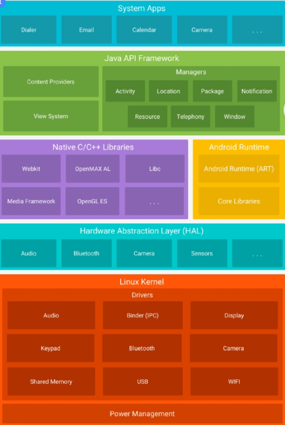
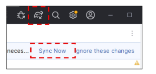

# Android platform Architecture

모바일 기기를 구동하기 위해 설계된 소프트웨어 스택입니다.<br>
최하단의 운영체제(리눅스)부터 최상단위 애플리케이션까지 총 5개의 주요 계층으로 구성되어 있습니다.<br>
상위 게층은 하위 계층의 기능을 활용합니다.  <br>

<table>
<thead><tr><th>Android platform</th></tr><thread>
<tr>
<td>

1. Linux Kernel (리눅스 커널)<br>
안드로이드는 <string>리눅스 커널</string> 위에서 동작하며, 기기의 하드웨어와 소프트웨어를 연결하는 핵심 역할을 합니다.<br>
스레딩,프로세스 관리,파일시스템 관리, 메모리 관리, 보안, 전원 관리(Power Management),네트워크 스택, 그리고 디바이스 드라이버(디스플레이, 카메라, 블루투스, 오디오 등)를 제공합니다.<br>
* 커널이 하드웨어적인 제어를 전담,<br>
* 상위 단의 개발자들은 하드웨어의 복잡한 스펙을 직접 신경 쓰지 않아도 됩니다<hr>

2. Hardware Abstraction Laye (HAL)<br>
<strong>Java API 프레임워크가 하드웨어 장치에 접근</strong>할 수 있도록 표준 <strong>인터페이스를 제공</strong><br>
<strong>주요 역할:</strong> 카메라, 오디오, 블루투스 등 특정 하드웨어 구성 요소에 대한 인터페이스를 정의<br>
API가 기기 하드웨어에 접근하라는 호출 -> 안드로이드 시스템이 해당 하드웨어 컴포넌트에 맞는 HAL 모듈을 로드<hr>

3. Android Runtime (ART) 및 C/C++ 네이티브 라이브러리<br>
<strong>Android Runtime (ART):</strong><br>
* 애플리케이션이 실행되는 환경<br>
* 각 앱은 자체 프로세스 내에서 ART의 인스턴스를 통해 실행<br>
* AOT(Ahead-Of-Time) 및 JIT(Just-In-Time) 컴파일을 모두 사용하여 앱 실행 속도를 최적화<br>
* GC을 통해 메모리 할당 및 해제 시 발생하는 딜레이를 최소화<br>
<strong> C/C++ 네이티브 라이브러리:</strong><br>
 * ART 및 HAL은 C/C++로 작성된 네이티브 라이브러리를 필요<br>
 * 2D/3D 그래픽 렌더링을 위한 OpenGL,데이터베이스 관리를 위한 SQLite,웹 렌더링을 위한 WebKit<br>
 * Java API 프레임워크를 통해 이러한 네이티브 라이브러리의 기능에 접근<hr>
 
4. Java API Framework (애플리케이션 프레임워크)<br>
  * 앱 개발을 할 때 가장 직접적으로 다루게 되는 계층<br>
  * 주요 역할: 앱 제작에 필요한 다양한 컴포넌트와 시스템 서비스를 제공합니다.<br>

Activity Manager: 앱의 생명주기(Lifecycle)와 내비게이션 <strong>백스택</strong>을 관리합니다.<br>

View System: UI를 구축하는 데 사용되는 <strong>뷰(View, ViewGroup 등)를 제공</strong>합니다.<br>

Content Providers: <strong>앱 간에 데이터를 공유</strong>하거나, 연락처 같은 시스템 데이터에 접근할 수 있게 해줍니다.<br>

Resource Manager: 문자열, 그래픽, 레이아웃 등 코드가 아닌 리소스에 대한 접근을 제공합니다.<br>

5. System Apps (시스템 애플리케이션)<br>
가장 최상단에 위치한 계층으로, 사용자가 직접 상호작용하는 앱들<br><br>
이메일, SMS, 캘린더, 카메라 등 시스템과 함께 기본적으로 제공되는 앱들,사용자가 추가로 설치한 서드파티 애플리케이션도 모두 이 계층에서 실행<br>
시스템 앱은 사용자를 위한 앱으로도 작동하지만, 하위 계층(Java API 프레임워크)을 통해 <strong>다른 앱</strong>에서 <strong>호출되어</strong> 핵심 기능을 제공<br>
<strong>ex &gt; 개발 중인 앱에서 사진을 찍기 위해 기본 카메라 앱을 호출</strong><br>
</td>
</tr>
</table>




# Android Component - 앱 구성단위, 조합하여 앱을 만든다. 

 1.앱의 구성 단위 ( 앱을 구성하는 빌딩 블록)<br>
 2.앱 내의 독립적인 실행단위<br>
 * 생명 주기를 안드로이드 시스템이 관리.<br>
 * 컴포넌트간 Intent라는 클래스를 통해 통신하며 독립적으로 실행(상호 참조x ,낮은 결합성)<br>
* Main함수 같은 진입점이 따로 없다. (최초 시작 시 메인화면이 보임, 알림 누르면 알림(ex-메신저)화면 진입)<br>


- Activity<br>
: UI구성을 위한 컴포넌트 , 하나의 화면 <br>
*화면이 생성되고, 가려지고, 파괴되는 일련의 '생명주기(onCreate, onStart, onResume 등)'를 갖습니다.
<br>
화면을 이동할 때마다 액티비티들이 차곡차곡 쌓이는 '백스택' 구조로 관리됩니다.<br>

- Service <br>
 : UI(화면)없이 백그라운드에서 수행하는 컴포넌트 ( MP3)<br>

- Broadcast Receiver<br>
이벤트로 수행되는 컴포넌트(방송 수신)<br>
시스템에 배터리가 부족or 시스템 부팅이 완료되는 이벤트 발생-> 할 작업이 없다면 이벤트 수신하는 컴포넌트<br>

- Content Provider <br>
애플리케이션 간 데이터를 공유하기 위한 컴포넌트<br>
* 웹 주소처럼 생긴 **URI(Uniform Resource Identifier)**라는 고유한 주소 체계를 사용해 데이터에 접근<br>


<hr>
컴포넌트 4가지만 덜렁 있어서는 앱이 돌아가지 않습니다. 작성하신 리스트에 아래 두 가지 개념을 추가로 <br>묶어서 이해하셔야 완벽합니다.<br>

Intent (인텐트): 이 4개의 컴포넌트들을 서로 호출하고 데이터를 전달할 때 사용하는 **'메시지 <br>객체'**입니다. (예: A 액티비티에서 B 액티비티를 부를 때 인텐트를 던짐)<br>

AndroidManifest.xml:<br>
운영체제(OS)에게 **"이 앱은 어떤 앱이고, 어떻게 실행해야 하며, 무엇이 필요한가?"**를 알려주는 `앱의 명세서`<br>
1. 4대 컴포넌트 선언 (가장 중요)<br>
 앱을 만들 때 사용한 `모든 컴포넌트`(동적 리시버 제외)는 반드시 이 매니페스트 <br>파일에 `신고(등록)`되어야만 안드로이드 OS가 인식하고 실행해 줍니다.<br>
2. 앱의 진입점(시작 화면) 지정<br>
앱 아이콘을 터치했을 때 어떤 화면(Activity)이 가장 먼저 켜져야 하는지 결정합니다.<br>

3. 권한(Permission) 요청<br>
앱이 사용자의 개인정보나 민감한 하드웨어 기능에 접근하기 위해 필요한 권한들을 명시<br>
카메라 촬영 기능이 있거나, 연락처를 읽어와야 한다면 반드시 이 파일에 &lt;uses-permission&gt; 태그를 이용해 해당 권한을 요청<br>


4. 하드웨어 및 소프트웨어 요구사항 명시<br>
앱이 정상적으로 돌아가기 위해 필요한 최소한의 환경을 정의합니다.<br>

* 앱이 지원하는 최소 안드로이드 버전(Min SDK) 지정.<br>
* 블루투스 기능이 필수적인지 등을 설정<br>

5. 앱 메타데이터 및 UI 기본 설정<br>
앱의 이름, 홈 화면에 보일 아이콘 이미지, 그리고 앱 전체에 적용될 디자인 테마(Theme) 등 전반적인 앱의 기본 설정 값을 지정합니다.<br>
<hr>

```xml
<?xml version="1.0" encoding="utf-8"?>
<manifest xmlns:android="http://schemas.android.com/apk/res/android"
    package="com.example.myapp">

    <uses-permission android:name="android.permission.INTERNET" />

    <application
        android:icon="@mipmap/ic_launcher"
        android:label="나의 멋진 앱"
        android:theme="@style/Theme.MyApp">

        <activity android:name=".MainActivity"
            android:exported="true">
            <intent-filter>
                <action android:name="android.intent.action.MAIN" />
                <category android:name="android.intent.category.LAUNCHER" />
            </intent-filter>
        </activity>

        <activity android:name=".DetailActivity" />

    </application>
</manifest>

```

<pre>
📂 프로젝트 (디렉터리 파일 구조)
├── 📄 AndroidManifest.xml
│   └── 앱의 메인 환경 파일이다.
│
├── 📄 MainActivity.java
│   └── 화면 구성을 위한 액티비티 컴포넌트로 실제 이 파일이 수행되어 화면에 UI가 출력됨
│
└── 📂 res (앱의 모든 리소스 파일은 res 폴더 하위에 위치)
    ├── 📂 drawable
    │   └── 리소스 중 이미지 파일을 저장하기 위한 폴더
    │
    ├── 📂 layout
    │   └── 리소스 중 UI 구성을 위한 레이아웃 XML 파일을 위한 폴더
    │
    ├── 📂 mipmap
    │   └── 리소스 중 앱의 아이콘 이미지를 위한 폴더
    │
    └── 📂 values
        └── 리소스 중 문자열 값 등을 위한 폴더
</pre>

<hr>
<br>
# 리소스를 통한 개발 (R.java,@)<br>

* 기본적으로 프로젝트에서는 보이지 않는 파일입니다.<br>

* 개발자가 res 폴더 밑에 리소스(이미지, 레이아웃 등) 파일을 추가하면, 해당 파일명으로 된 int형 변수가 R.<br>java 파일 내부에 자동으로 생성됩니다.<br>

* Kotlin이나 Java 소스 코드 파일에서 res 폴더의 자원을 참조하고자 할 때 이 클래스를 사용합니다.<br>
<hr>
필요한 리소스는 외부에.<br>

사용자의 스마트폰 환경 설정(언어 등)에 따라 달라질 수 있는 부분을 비즈니스 로직(코드)에서 완전히 <br>분리하도록 설계되었습니다.<br>

```xml
activity.xml
<TextView android:text="@string/message" />

언어별 리소스 분리 (다국어 지원 예시):
res/values/strings.xml
<resources>
    <string name="message">Hi. Nice to Meet you </string>
</resources>

<resources>
    <string name="message">안녕하세요. 반갑습니다.</string>
</resources>

```

<hr>

# Gradle

Gradle이란?<br>

안드로이드 빌드 자동화 시스템<br>

수많은 이미지 `리소스(res)`, `매니페스트 파일`, `외부 라이브러리`, 그리고 `자바/코틀린 코드`가 하나로 합쳐져야 비로소 스마트폰에 설치할 수 있는 `APK`(또는 AAB) 파일이 됩니다.
이 복잡한 과정을 버튼 하나로 알아서 처리해 주는 `공장장`이 바로 `Gradle`입니다.


build.gradle 파일을 통해 여러가지 환경 설정<br>

프로젝트를 위한 build.gradle과 모듈을 위한 build.gradle 존재<br>

proguard : 난독화 설정<br>
클래스나 변수 이름을 a, b, c처럼 의미 없는 글자로 바꾸고(난독화), 쓰지 않는 코드를 쳐내서 앱 용량을 <br>줄여주는(최적화) 기술<br>


gradle.properties : gradle 설정 파일<br>

gradle-wrapper.properties : 사용하는 gradle의 버전 정보 등이 지정<br>

libs.versions.toml : gradle에서 사용하는 `버전 정보 저장`<br>


1. 프로젝트 vs 모듈 build.gradle의 차이<br>

프로젝트 build.gradle: 앱 전체를 아우르는 최상위 설정입니다. 공장 전체의 기본 규칙을 정합니다.<br>

모듈 build.gradle (build.gradle.kts): 실제 앱(app)이 어떻게 빌드될지 세부적으로 정합니다. 최소 <br>안드로이드 버전 지정, 앱의 패키지명(네임스페이스) 설정, 외부 라이브러리(Retrofit, Glide 등) <br>추가를 모두 여기서 합니다. 개발하면서 가장 많이 열어보게 될 파일입니다.<br>

파일을 수정하면 sync now 번튼으로 프로젝트 수동 반영(혹은 gradle 아이콘)- <br>
application.properties / pom.xml / build.gradle스프링,<br>
 뷰(package.json / Webpack / Vite)처럼 자동 아님<br>

 성능 저하 방지: 만약 파일이 수정될 때마다 이 무거운 Gradle 빌드가 자동으로 실행된다면, 코드를 <br>타이핑하는 내내 IDE(안드로이드 스튜디오)가 멈칫거리거나 컴퓨터 리소스를 과도하게 사용하여 개발 <br>환경이 매우 느려질 것<br>




# Activity , Intent , startActivity


# Click EventHandling 

```java
//토스트 기능 구현
class MainActivity : AppCompatActivity() {
    // 사용하려는 버튼 선언
    private lateinit var clickMe: Button

    override fun onCreate(savedInstanceState: Bundle?) {
        super.onCreate(savedInstanceState)
        setContentView(R.layout.activity_main)

        // activity_main에 선언한 id에 근거하여 clickMe 버튼 획득
        clickMe = findViewById(R.id.clickMe)
        
        // 버튼 클릭 시 동작할 이벤트 콜백 등록
        clickMe.setOnClickListener {
            // Toast를 통해서 화면에 정보 표시
            Toast.makeText(this, "Hello Toast", Toast.LENGTH_LONG).show()
        }
    }
}

```

1. 이벤트 리스너의 진화: SAM과 람다(Lambda); 임시 객체 생성

```Java
btn1.setOnClickListener(object : View.OnClickListener {
    override fun onClick(v: View) {
        Toast.makeText(this@MainActivity, "Hello", Toast.LENGTH_SHORT).show()
    }
})
```
2. 2단계 (람다 적용): 메서드가 1개뿐이니 object... override fun...을 다 지워버리고 화살표(->)를 씁니다.
```Java
btn1.setOnClickListener({ v: View? -> Toast.makeText(this@MainActivity, "Hello", Toast.LENGTH_SHORT).show() })
```
3. 3단계 (소괄호 생략):
```Java
    btn1.setOnClickListener { v -> Toast... }
```
4. 4단계 (최종 - 암묵적 it 사용):

```Java
    btn1.setOnClickListener { 
    // 여기서 it은 클릭된 버튼(View) 객체를 의미합니다.
    Toast.makeText(this, "Hello " + it.javaClass.name, Toast.LENGTH_SHORT).show()
}
```
<hr>
혁명적인 UI 연결: ViewBinding (뷰 바인딩)<br>
Gradle 설정 (모듈 단위 build.gradle)<br>

뷰 바인딩 기능을 켜겠다고 선언합니다. 이 설정을 켜고 'Sync Now'를 누르면, 안드로이드 스튜디오가<br> res/layout에 있는 XML 파일들을 분석해서 자동으로 바인딩 클래스를 생성해 줍니다.<br>
(예: activity_main.xml -> ActivityMainBinding 이라는 클래스로 자동 생성)<br>

```Java

class MainActivity : AppCompatActivity() {
    // 1. 뷰 바인딩 객체를 담을 변수 선언
    private lateinit var binding: ActivityMainBinding

    override fun onCreate(savedInstanceState: Bundle?) {
        super.onCreate(savedInstanceState)
        
        // 2. 바인딩 객체 초기화 (XML 화면을 메모리에 부풀려 올림 = inflate)
        binding = ActivityMainBinding.inflate(layoutInflater)// XML 2 JAVA
        
        // 3. 중요! 이제 R.layout.activity_main 대신 binding.root를 화면에 세팅합니다.
        // binding.root는 XML의 가장 최상단 부모 레이아웃을 의미합니다.
        setContentView(binding.root)

        // 4. findViewById 없이 버튼 사용하기!
        // XML에 아이디가 clickMe로 되어있다면, 카멜 케이스로 자동 변환되어 binding.clickMe로 바로 꺼내 쓸 수 있습니다.
        binding.clickMe.setOnClickListener {
            // 클릭 동작 처리...
        }
    }
}
```

<hr>

# Logcat


tag로 보고 싶은 로그만 디버깅 가능