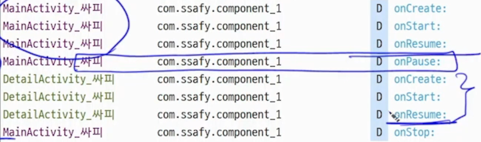

# 액티비티와 생명주기 


컴포넌트, 사용자에게 UI 화면을 제공<br>
`하나의 앱`은 앱 `최초 실행 시 보여지는` `하나의 메인 액티비티`를 가진다.<br>
액티비에 다양항 `뷰들`을 추가하여 화면을 구성한다. <br>
```html
* 뷰(View):사용자와 애플리케이션이 `상호작용하는 가장 기본적인 빌딩 블록`
뷰의 역할
1. 화면상의 직사각형 영역을 차지
2. 그리기(Drawing)**와 **이벤트 처리(Event Handling)**를 담당

시각적 요소: 텍스트, 이미지, 버튼처럼 눈에 보이는 모든 것이 뷰입니다.
사용자 상호작용: 터치, 클릭, 키 입력 등을 감지하고 반응합니다.

뷰 그룹(ViewGroup):뷰를 담는 그릇, 뷰(자식 뷰)나 또 다른 뷰 그룹을 포함할 수 있는 특수한 뷰
뷰는 여러 개가 모여 화면을 구성하는데, 이를 관리하는 것이 ViewGroup입니다.
레이아웃(Layout): `ConstraintLayout, LinearLayout` 등이 대표적인 뷰 그룹입니다.

Measure (측정): 뷰가 "나는 이 정도 크기가 필요해"라고 자신의 사이즈를 결정하는 단계입니다.


```
# 설정 파일 manifest.html

Lancher를 호출하면 MainActivity가 호출됩니다. <br>
Manifest.html파일에서 MainActivity 대상을 조절할 수 있습니다. <br>
(Intent-filter로 런처 이벤트 발생할때 어떤 액티비티를 안드로이드가 생성할 지 결정할 수 있습니다.)<br>
Manifest.html 파일에는 모든 액티비티를 기록해야합니다. 안드로이드 시스템이  이 설정파일을 보고 new 생성자를 호출하여 화면을 생성합니다.<br>

# 생명 주기 


<table>
<thead><tr><th></th></tr></thead>
<tbody><tr><td>

1. OnCreate()
화면이 처음 생성될 때 호출됩니다. 
뷰바인딩 및 이벤트 주입, setContentView()로 레이아웃을 설정하고 초기화 작업을 수행합니다.

2. OnStart()
화면을 ForeGround에 노출 시킬 때 한 번 호출됩니다. 상호작용은 안됩니다.( 화면이 보이기 시작할 때)

3. OnResume()
화면에 포커스를 얻고 사용자와 상호작용이 가능할 때 호출됩니다.
ex -> 화면의 일부가 보이지만, 팝업창이 화면 위에 뜨서 가려진 경우 포커스가 뺏긴겁니다. 

4. OnPause()
화면의 포커스를 가져갑니다. DB 작업 등 무거운 트랜잭션 작업은 여기서 처리하지 않고 onStop()에서 처리합니다. 

5. OnStop()
화면을 ForeGround에서 내릴때 호출됩니다.

6.OnDestroy()
화면(activity)를 삭제할 때 호출됩니다. finish()가 호출되건나 앱이 종료될때 주로 호출됩니다.

1-2-3-4-5-6 순으로 호출됩니다.

extra -> onRestart() 
백그라운드에서 포어그라운드로 액티비티가 올라온 경우에 호출됩니다.
</td></tr></tbody>
</table>



onPause() 에서 db작업을 하지 않는 이유입니다.
모든 액티비티는 라이프사이클 `순서대로 진행`되기 때문에  `포커스를 때고 난 후 새로운 화면을 덮어 쒸우는 과정`을 빨리 수행하려면 무거운 작업을 OnPause()에서 처리하면 안됩니다. (새로운 화면의 1,2,3 과정이 늦게 일어나기 때문입니다.) 일단 `새 화면 보여주고` 백그라운드로 `뺼 때` onStop()에서 무거운 저장작업 수행합니다.


## 화면 회전 이슈

화면을 회전하면 화면이 파괴되고 다시 생성되는 과정에서 데이터를 잃게 됩니다. 
```java

override fun onCreate(savedInstance : Bundle){

    ...

    val = if(savedInstance!=null){
        savedInstance.getInt("value")
    }:?0;

    btn.setOnClickListener{
        val ++
        tv.text = val.toString();
    }
    ...
}
override fun onSaveInstanceState(outState : Bundle){
    super.onSaveInstanceState(outState);

    outState.putInt("value",data);
}
```


# 인텐트 

액티비티, 서비스 , 브로드캐스트 리시버, 콘텐트 프로바이더  4가지 컴포넌트 간 작업수행을 위한 정보를 전달합니다.<br>
intent를 통해 메시지를 전달하고 데이터를 주고 받습니다. <br>
모든 액티비티는 자신을 호출한 인텐트가 반드시 존재합니다.(인텐트를 통해 다음 액티비티 호출 !)
## ㅑintent-Filter 
특정 인텐트를 받을지 말지를 정의하는 역할을 수행합니다
인텐트 필터에 android.intent.action.MAIN과 android.intent.CATEGORY.launcher로 선언하면 런처에서 클릭시 집입점이되는 액티비티가 됩니다.<br>
d인텐트 필터는 AndroidManifest.xml에 정의됩니다.  

런처에서 앱 클릭 -> 해당 액션의 인텐트를 생성-> 해당 인텐트 필터 옵션을 가진 액티비티를 찾고 실행
```xml
<activity android:name=".MainActivity">
    <intent-filter>
        <action android:name="android.intent.action.MAIN" />

        <category android:name="android.intent.category.LAUNCHER" />
    </intent-filter>
</activity>
```

# 명시적 Intent

실행하고자 하는 **컴포넌트의 이름(Package Name)**과 **클래스명(Class Name)**을 명시적으로 작성하여, 호출할 대상을 확실히 알 수 있는 경우에 사용합니다.


1. 클래스 객체를 직접 지정하는 방법
가장 일반적인 방법으로, 같은 모듈 내의 액티비티를 호출할 때 사용합니다.<br>

```java
val intent = Intent(this, NextActivity::class.java)
startActivity(intent)

this: 현재 액티비티의 Context
NextActivity::class.java: 이동하고자 하는 대상 액티비티 클래스
```
2. ComponentName을 사용하는 방법
패키지명과 클래스 경로를 문자열로 지정하여 호출하는 방식입니다.<br> 이미지 내 수기 메모로 **Pkg(패키지)**와 **Class(클래스)**가 표시된 부분입니다.<br>
```java
var intent = Intent()
// ComponentName("패키지명", "전체 클래스 경로")
var name = ComponentName("com.ssafy.banking", "com.ssafy.banking.Banking2Account")

intent.setComponent(name)
startActivity(intent)

com.ssafy.banking: 호출하려는 앱의 패키지 이름입니다.

com.ssafy.banking.Banking2Account: 호출하려는 액티비티의 전체 경로를 포함한 클래스 이름입니다.

```

## StartActivity 

- 단방향으로 새로운 Activity 실행
- 결과는 못받음


명시적 인텐트 vs 암시적 인텐트<br> 

명시적: "A 액티비티를 실행해!" (대상이 확실함)<br> 

암시적: "지도 보여줄 수 있는 앱 아무거나 실행해!" (대상이 확실하지 않고 기능 위주)<br> 
## NextActivity 종료후 Main에소 결과를 돌려받기

```java
// 버튼 클릭 리스너 설정
clickMe.setOnClickListener {
    val intent = Intent().apply {
        putExtra("to_main", "잘 받았습니다.")
    }
    setResult(Activity.RESULT_OK, intent)
    finish()
}

1. putExtra("key", value)
데이터 포장: 인텐트라는 택배 상자에 데이터를 담는 과정입니다.

"to_main"은 데이터를 식별하기 위한 **Key(이름)**이고, "잘 받았습니다."는 실제 전달할 **Value(값)**입니다.

2. setResult(resultCode, data)
응답 확정: 현재 액티비티가 작업을 잘 마쳤는지 상태를 알리고, 데이터를 전달합니다.

Activity.RESULT_OK: "작업이 성공적으로 끝났다"는 것을 의미하는 시스템 상수입니다.

이때 위에서 만든 intent를 함께 실어 보냅니다.

3. finish()
화면 닫기: 현재 액티비티를 생명주기상 onPause -> onStop -> onDestroy로 보내며 종료시킵니다.

이 메서드가 호출되어야 비로소 이전 화면(MainActivity)으로 돌아가게 되며, 보냈던 데이터가 전달됩니다.
```
# MainActivity에서
```java
override onCreate(){
    ...
    val requestActivity = registerForActivityResult(
        contract = ActivityResultContracts.StartActivityForResult()) { it: ActivityResult ->
    
        // 1. 결과가 성공(RESULT_OK)인지 확인
        if (it.resultCode == RESULT_OK) {
            // 2. 전달받은 인텐트(데이터 묶음)를 가져옴
            val intent = it.data
            
            // 3. 인텐트 안에서 "to_main"이라는 이름의 문자열을 꺼냄
            val returnValue = intent?.getStringExtra(name = "to_main")
            
            // 4. 꺼낸 값을 토스트 메시지로 화면에 출력
            Toast.makeText(context = this, text = returnValue, duration = Toast.LENGTH_SHORT).show()
        }
    }
    btn.setOnClickListener{
        ...
        var intent = Intent( this, nextActivity::class.java)
        requestActivity.launch(intent); 
        콜백을 nextActivity 갔다가 돌아왔을때 실행합니다.
    }
    ...

}
```


# 암시적 Intent
사용자가 어떤 앱을 사용할지 모르니, 대상 컴포넌트는 사용자가 결정하도록 짬때리고, <br>
의도만을 지정하여 컴포넌트를 실행합니다.<br>
구글맵? 네이버 지도? 기능은 동일하나 사용자가 무엇을 사용할 지는 의문 <br>

```java
// 웹페이지를 열고 싶다는 '의도(Action)'와 '데이터(Uri)'만 설정
val intent = Intent(Intent.ACTION_VIEW, Uri.parse("https://www.google.com"))


val intent = Intent(
    action = Intent.ACTION_VIEW, 
    Uri.parse(uriString = "geo:36.123456,128.123456")
)
/*
대표적인 **암시적 인텐트(Implicit Intent)**의 예시입니다.
Action (액션): Intent.ACTION_VIEW

"무언가를 보여줘!"라는 의도를 담고 있습니다.

Data (데이터): Uri.parse("geo:36.123456,128.123456")

Scheme: geo: (지리적 좌표임을 나타냄)

Value: 위도와 경도 데이터입니다.

이 인텐트를 실행하면 안드로이드 시스템은 내 스마트폰에 설치된 앱 중 "지도(geo)" 데이터를 보여줄 수 있는 앱(구글 맵, 네이버 지도, 카카오 맵 등)을 찾아 사용자에게 선택지를 보여주거나 바로 실행합니다.
*/

// 시스템이 이 의도를 처리할 수 있는 브라우저 앱(크롬, 삼성 인터넷 등)을 찾아 실행
startActivity(intent)

앱: "시스템님, ACTION_VIEW 할 수 있는 앱 좀 찾아주세요."

시스템: 설치된 앱들의 AndroidManifest.xml에 등록된 **인텐트 필터(Intent Filter)**를 전수 조사합니다.

결과:

앱이 하나라면? 바로 그 앱 실행.

앱이 여러 개라면? 사용자에게 어떤 앱을 쓸지 물어보는 선택창(Chooser)을 띄움.

앱이 없다면? 앱이 크래시(종료)될 수 있으므로 사전에 체크가 필요함.
```

| 요소 | 설명 | 예시 / 활용 |
| :--- | :--- | :--- |
| **Action (액션)** | 수행할 **전반적인 작업**을 정의합니다. | `ACTION_DIAL`, `ACTION_VIEW` |
| **Data (데이터)** | 액션이 수행될 **대상 데이터의 주소(URI)**입니다. | `tel:01012345678`, `https://google.com` |
| **Category (카테고리)** | 액션에 대한 **추가적인 환경 정보**를 제공합니다. | `CATEGORY_LAUNCHER` (홈 화면 실행 앱 표시) |
| **Type (타입)** | 데이터의 **MIME 타입(형식)**을 명시합니다. | `image/*`, `video/mpeg` |
| **Component Name** | **대상의 클래스명**을 직접 지정합니다. | `.MainActivity` (작성 시 **명시적 인텐트**가 됨) |
| **Flag (플래그)** | 액티비티의 **동작 방식(흐름)**을 제어합니다. | `FLAG_ACTIVITY_NO_HISTORY` (기록을 남기지 않음) |
| **Extras (추가 정보)** | 전달할 값을 **Key-Value 쌍**으로 담습니다. | `putExtra("id", "user123")` |

# Permission


| 권한 종류 | 설명 | 특징 |
| :--- | :--- | :--- |
| **Install time permissions** | 앱 설치 시점에 권한이 부여됩니다. | 플레이스토어에 명시되며, 설치 시 권한 선언 필요(인터넷 권한) |
| **Runtime Permissions** | 앱 실행 중에 사용자에게 직접 허가를 받아야 합니다. | **코드상으로 구현(Check & Request)**해야 함(주소록 접근, 카메라, 비디오,위치정보 등 개인정보) |
| **Special Permissions** | 시스템 수준의 민감한 권한입니다. | 플랫폼(Android)과 OEM만이 정의할 수 있음 |


## 권한 요청 (AndroidManifest.xml)
안드로이드 앱에서 특정 기능(위치, 카메라 등)을 사용하려면 가장 먼저 AndroidManifest.xml 파일에 사용하고자 하는 권한을 선언해야 합니다.
```xml
<uses-permission android:name="android.permission.ACCESS_COARSE_LOCATION" />
<uses-permission android:name="android.permission.ACCESS_FINE_LOCATION" />

ACCESS_COARSE_LOCATION: 대략적인 위치 권한 (와이파이나 기지국 기반)

ACCESS_FINE_LOCATION: 정밀한 위치 권한 (GPS 기반)

위치 정보는 민감한 권한이기 때문에 매니페스트에 선언하는 것만으로는 부족합니다. 반드시 앱 실행 중에 사용자가 "허용"을 눌러야 실제 데이터를 가져올 수 있어요!
```

# Task 

# Activity 실행모드 

# Task 내 Activity 정리 및 변경

