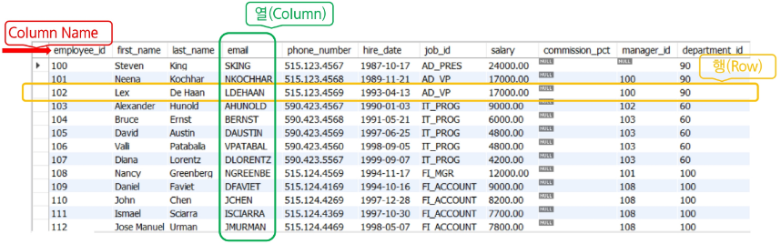
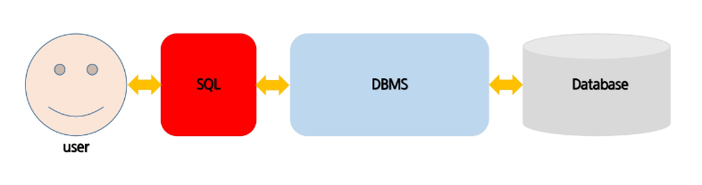

# RDBMS & SQL

## RDBMS란?:


데이터를 테이블 형태로 저장하고, 그 테이블간의 관계를 정의하여 데이터를 관리하는 시스템.
대표적으로 PostgreSQL, MySQL, Oracle등이 있다.

1. 데이터를 테이블단위로 구성
* 하나의 테이블은 여러 개의 컬럼으로 구성됩니다.

2. 중복 데이터를 최소화시킴
* 같은 데이터가 여러 컬럼 또는 테이블에 존재했을 경우.-> 데이터 수정 시 문제 발생 가능성 높아짐

3. 여러 테이블에 분산되어있는 데이터를 검색 시 테이블 간의 (Join)관계를 이용하여 필요한 데이터를 검색.



## SQL이란? 

* 데이터베이스에 있는 정보를 사용할 수 있도록 지원하는 언어, 모든 DBMS에서 사용가능.
* 대소문자는(명령어)의 구분하지 않는다.( 데이터의(컬럼)의 대소문자는 구분하게 설정할 수 있다.)




<table border="1" style="border-collapse: collapse; width: 100%; text-align: left;">
  <thead>
    <tr style="background-color: #f2f2f2;">
      <th style="padding: 10px; text-align: center;">문장</th>
      <th style="padding: 10px; text-align: center;">설명</th>
    </tr>
  </thead>
  <tbody>
    <tr>
      <td style="padding: 10px;">
        INSERT<br>
        UPDATE<br>
        DELETE
      </td>
      <td style="padding: 10px;">
        DML(Data Manipulation Language)이라 부르며, 개별적으로 Database 테이블에서<br>
        새로운 행을 입력하고, 기존의 행을 변경하고 제거한다.
      </td>
    </tr>
    <tr>
      <td style="padding: 10px;">
        SELECT
      </td>
      <td style="padding: 10px;">
        Database로 부터 Data를 검색합니다. SELECT 역시 DML로 분류된다.
      </td>
    </tr>
    <tr>
      <td style="padding: 10px;">
        CREATE<br>
        ALTER<br>
        DROP<br>
        RENAME
      </td>
      <td style="padding: 10px;">
        DDL(Data Definition Language)이라 부르며, 테이블로부터 데이터 구조를 생성, 변경,<br>
        제거한다.
      </td>
    </tr>
    <tr>
      <td style="padding: 10px;">
        COMMIT<br>
        ROLLBACK
      </td>
      <td style="padding: 10px;">
        DML 명령문으로 수행한 변경을 관리한다.
      </td>
    </tr>
    <tr>
      <td style="padding: 10px;">
        GRANT<br>
        REVOKE
      </td>
      <td style="padding: 10px;">
        DCL(Data Control Language)이라 부르며, Database와 그 구조에 대한 접근권한을<br>
        제공하거나 제거한다.
      </td>
    </tr>
  </tbody>
</table>

# DDL (데이터 정의어)
* 데이터 베이스 객체의 구조를 정의합니다.( Table, View,Index)의 구조를 정의
* 테이블 생성, 컬럼 추가, 타입 변경, 제약조건 지정, 수정 등 

<table border="1" style="border-collapse: collapse; width: 100%; text-align: left;">
  <thead>
    <tr style="background-color: #f2f2f2;">
      <th style="padding: 10px; text-align: center;">SQL문</th>
      <th style="padding: 10px; text-align: center;">설명</th>
    </tr>
  </thead>
  <tbody>
    <tr>
      <td style="padding: 10px; text-align: center;">create</td>
      <td style="padding: 10px;">데이터베이스 객체를 생성.</td>
    </tr>
    <tr>
      <td style="padding: 10px; text-align: center;">drop</td>
      <td style="padding: 10px;">데이터베이스 객체를 삭제.</td>
    </tr>
    <tr>
      <td style="padding: 10px; text-align: center;">alter</td>
      <td style="padding: 10px;">기존에 존재하는 데이터베이스 객체를 수정.</td>
    </tr>
  </tbody>
</table>


# DML(Insert, Update, Delete)

# DML(Select)

<div>
  <p><b>✓ SQL 종류.</b></p>
  <ul>
    <li>DML (Data Manipulation Language) : 데이터 조작어.
      <ul>
        <li>Data 조작기능.</li>
        <li>테이블의 레코드를 CRUD (Create, Retrieve, Update, Delete)</li>
      </ul>
    </li>
  </ul>
</div>

<table border="1" style="border-collapse: collapse; width: 100%; text-align: left;">
  <thead>
    <tr style="background-color: #f2f2f2;">
      <th style="padding: 10px; text-align: center;">SQL문</th>
      <th style="padding: 10px; text-align: center;">설명</th>
    </tr>
  </thead>
  <tbody>
    <tr>
      <td style="padding: 10px; text-align: center;">insert (C)</td>
      <td style="padding: 10px;">데이터베이스 객체에 데이터를 입력.</td>
    </tr>
    <tr>
      <td style="padding: 10px; text-align: center;">select (R)</td>
      <td style="padding: 10px;">데이터베이스 객체에서 데이터를 조회.</td>
    </tr>
    <tr>
      <td style="padding: 10px; text-align: center;">update (U)</td>
      <td style="padding: 10px;">데이터베이스 객체에 데이터를 수정.</td>
    </tr>
    <tr>
      <td style="padding: 10px; text-align: center;">delete (D)</td>
      <td style="padding: 10px;">데이터베이스 객체에 데이터를 삭제.</td>
    </tr>
  </tbody>
</table>


<div>
  <p><b>✓ SQL 종류.</b></p>
  <ul>
    <li>DCL (Data Control Language) : 데이터 제어어.
      <ul>
        <li>DB, Table의 접근권한이나 CRUD 권한을 정의.</li>
        <li>특정 사용자에게 테이블의 검색권한 부여/금지등.</li>
      </ul>
    </li>
  </ul>
</div>

<table border="1" style="border-collapse: collapse; width: 100%; text-align: left;">
  <thead>
    <tr style="background-color: #f2f2f2;">
      <th style="padding: 10px; text-align: center;">SQL문</th>
      <th style="padding: 10px; text-align: center;">설명</th>
    </tr>
  </thead>
  <tbody>
    <tr>
      <td style="padding: 10px; text-align: center;">grant</td>
      <td style="padding: 10px;">데이터베이스 객체에 권한을 부여.</td>
    </tr>
    <tr>
      <td style="padding: 10px; text-align: center;">revoke</td>
      <td style="padding: 10px;">데이터베이스 객체 권한 취소.</td>
    </tr>
  </tbody>
</table>


<div>
  <p><b>✓ SQL 종류.</b></p>
  <ul>
    <li>TCL (Transaction Control Language) : 트랜잭션 제어어.
      <ul>
        <li>transaction이란 데이터베이스의 논리적 연산 단위.</li>
      </ul>
    </li>
  </ul>
</div>

<table border="1" style="border-collapse: collapse; width: 100%; text-align: left;">
  <thead>
    <tr style="background-color: #f2f2f2;">
      <th style="padding: 10px; text-align: center;">SQL문</th>
      <th style="padding: 10px; text-align: center;">설명</th>
    </tr>
  </thead>
  <tbody>
    <tr>
      <td style="padding: 10px; text-align: center;">commit</td>
      <td style="padding: 10px;">실행한 Query를 최종적으로 적용.</td>
    </tr>
    <tr>
      <td style="padding: 10px; text-align: center;">rollback</td>
      <td style="padding: 10px;">실행한 Query를 마지막 commit 전으로 취소시켜 데이터를 복구.</td>
    </tr>
  </tbody>
</table>


Collation 접미사 옵션<br>
문자를 비교할 때 대소문자나 악센트를 구분할지 결정하는 규칙들입니다.<br>

ai : accent_sensitive (악센트 구분)<br>

*_ci : case insensitive (대소문자 구분 안 함)<br>

*_bin : case sensitive (대소문자 구분함, 바이너리 값으로 비교)<br>
```SQL
create database 데이터베이스명 default character set 값 collate 값;

create database 데이터베이스명 default character set uft8mb3 collate uft8mb3_general_ci;

alter database 데이터베이스명 default character set uft8mb3 collate uft8mb3_general_ci;

drop database 데이터베이스명
use 데이터베이스명

```
<div>
  <p><b>✓ 데이터베이스 생성.</b></p>
  <ul style="list-style-type: disc;">
    <li>데이터베이스 생성.
      <ul style="list-style-type: none; color: #800080; font-weight: bold;">
        <li>&gt; create database 데이터베이스명;</li>
        <li>&gt; create database 데이터베이스명 default character set 값 collate 값;</li>
      </ul>
    </li>
  </ul>
</div>

<table border="1" style="border-collapse: collapse; width: 100%; margin-top: 10px;">
  <tr style="background-color: #fffde7;">
    <td style="padding: 15px; line-height: 1.6;">
      <b>&gt; Character set</b>은 각 문자가 컴퓨터에 저장될 때 어떠한 '코드'로 저장될지에 대한 규칙의 집합을 의미한다.<br><br>
      <b>&gt; Collation</b>은 특정 문자 셋에 의해 데이터베이스에 저장된 값들을 비교 검색하거나 정렬 등의 작업을 위해 문자들을 서로 '비교'할 때 사용하는 규칙들의 집합을 의미한다.<br>
      <span style="font-size: 0.9em;">ai : accent_sensitive, *_ci : case insensitive, *_bin : case sensitive</span>
    </td>
  </tr>
</table>


# 내장함수

