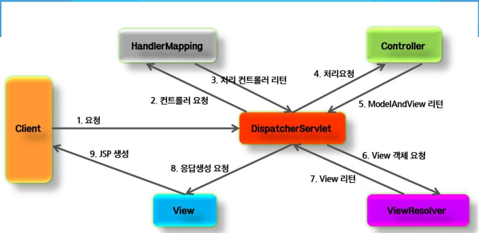
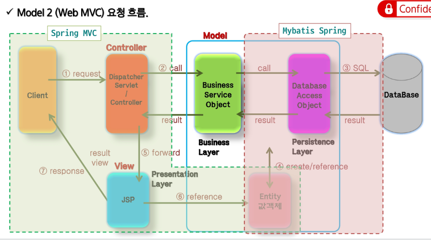

# 스프링과 WEB MVC



## sPRING MVC 핵심 컴포넌트와 동작 과정(다이어그램)

 - Spring MVC : 스프링 프레임워크에서 웹 애플리케이션(백엔드)를 개발하기 위해 서블릿API를 기반으로 구축된 MVC(Model, View, Controller) 디자인 패턴입니다. 중앙에 DispatcherServlet을 두어 모든 요청을 통제하는 프론트 컨트롤러 패턴을 사용합니다.
  
1. Dispatcher Servlet : 클라이언트의 모든 요청을 가장 먼저받는 `문지기, 프론트 컨트롤러`이자 , 중앙에서 `전체흐름을 제어`하는 역할을 수행하는 `서블릿 클래스 타입`의 인스턴스입니다. 

2. HandlerMapping : 사용자가 요청한 `url`을 보고 등록된 컨트롤러(빈)들을 모두 뒤져서 `요청을 처리할 메서드를 찾아줍니다`(주소록).
 
<ol>
   <p> @Controller 애너테이션을 붙인 클래스 안에 호출할 메서드를 <code>@ + http 데이터 통신 방식+ Mapping</code> 에너테이션과함께 구현합니다.</p>
<li> @GetMapping("url"): 조회</li>
<li> @PostMapping("url"): 삽입</li>
<li> @PutMapping("url"): 수정</li>
<li> @DeleteMapping("url"): 삭제</li>
</ol> 

3. Controller : 사용자가 요청한 `서비스 계층`을 `호출`하고, 그 결과를 받아 `Model` 혹은 `HtttEntity<?>(객체 등의 데이터,code)`에 담는 등 실질적인 일을 처리합니다.

<hr>

## JSP를 사용하는 경우에만 유효합니다. (ResponseBody(json)이나 HttpEntity<?>로 반환하는 경우 는 해당 사항 ❌) 

4. View Resolver :  Controller가 반환한 뷰의 '이름'(예: "home")을 받아서, 실제 뷰 파일이 있는 '물리적인 경로'(예: /WEB-INF/views/home.jsp)로 변환하는 것뿐 아니라 `View객체를 생성해서 서블릿 디스패처에 반환`합니다.
 
 - 왜쓰나요? why❓<br>
Controller가 뷰의 전체 경로를 알 필요가 없게 만들어 결합도를 낮추고, 나중에 뷰 템플릿(JSP, Thymeleaf 등)을 바꾸더라도 Controller 코드를 수정하지 않기 위함<br>

5. Model: 서블릿은 뷰 리졸버로부터 받은 View오브젝트에게 컨트롤러가 담아준 Model(데이터를 담는 바구니)를 넘겨줍니다.

6. View: 최종적으로 사용자에게 보여질 화면(HTML)을 jsp나 thymleaf같은 엔진을 통해 HTML파일을 완성합니다 

7. 최종적으로 완성된 `HTML`이 `HTTP ResponseBody`에 담겨 브라우저로 전송됩니다.

🛠️ 2. Controller 데이터 처리 완벽 가이드
📍 2-1. 요청 매핑 (Request Mapping)
특정 URL 요청을 어떤 자바 메서드와 연결할지 정의합니다.

<kbd>@RequestMapping</kbd> : HTTP 메서드 상관없이 URL을 매핑할 때 사용 (최근엔 용도 분리를 위해 잘 사용하지 않음)

<kbd>@GetMapping</kbd> : 데이터 조회용 (Read)

<kbd>@PostMapping</kbd> : 데이터 생성/전송용 (Create)

📥 2-2. 파라미터 수신 방법 (Input)
클라이언트가 보낸 데이터를 Controller에서 변수로 받는 방법입니다.

🔍 <kbd>`@RequestParam`</kbd>

용도: `?name=홍길동` 같은 `쿼리 스트링`이나 `폼 데이터`를 받을 때 사용합니다. 세밀한 통제(필수 여부 등)가 가능합니다. ➡️Get방식이면 경로에 노출,`post` 방식을 쓰거나 `Request Header/Body` 사용: 

예시: @RequestParam("name") String name

🔗 <kbd>`@PathVariable`</kbd>

용도: /user/1 처럼 `URL 경로 자체에 포함된 값`을 변수로 추출할 때 사용합니다. (RESTful API 설계 시 필수)

예시: @GetMapping("/user/`{id}`") ➡️ `@PathVariable("id") Long id`

📦 <kbd>`@RequestBody`</kbd>

용도: 클라이언트가 `JSON 형태`로 보낸 본문(Body) 데이터를 자바 `객체(DTO)로 자동 변환`하여 받습니다. (REST API 필수)

예시: `@RequestBody` `UserDto` `user`

📤 2-3. 응답 반환 타입 (Output)
Controller가 로직을 끝내고 무엇을 반환할지 결정합니다.

String: 가장 기본적인 형태로, 렌더링할 뷰(JSP, HTML)의 이름을 문자열로 반환합니다.

ModelAndView: 데이터(Model)와 화면 이름(View)을 동시에 담아 반환하는 구형 방식입니다.

⚡ <kbd>@ResponseBody</kbd>: 화면을 렌더링하지 않고, **데이터 자체(주로 JSON)**를 HTTP 응답 본문에 담아 클라이언트에게 직접 반환합니다. (Vue, React 등 프론트엔드 프레임워크와 통신할 때 주로 사용)


🤝 3. Controller와 JSP의 데이터 연동
Controller에서 Model 객체에 데이터를 담으면, JSP에서는 EL(Expression Language)인 ${} 를 사용하여 쉽게 값을 꺼내어 출력할 수 있습니다.


<p>☕ Controller 측 (Java)</p>

```Java
@GetMapping("/profile")
public String getProfile(Model model) {
    // 1. 비즈니스 로직 처리 후 데이터 생성
    String userName = "스프링개발자";
    
    // 2. Model에 "user"라는 키값으로 데이터를 담음
    model.addAttribute("user", userName);
    
    // 3. profile.jsp 화면으로 이동
    return "profile"; 
}
```
🎨 View 측 (profile.jsp)
```html
<%@ page language="java" contentType="text/html; charset=UTF-8" pageEncoding="UTF-8"%>
<!DOCTYPE html>
<html>
<head>
    <title>프로필 페이지</title>
</head>
<body>
    <h1>환영합니다! ${user} 님!</h1>
</body>
</html>
```
