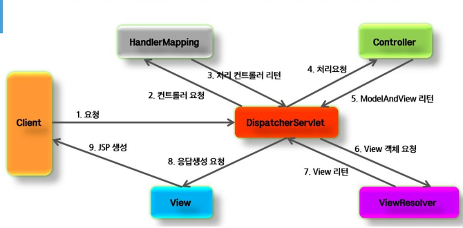
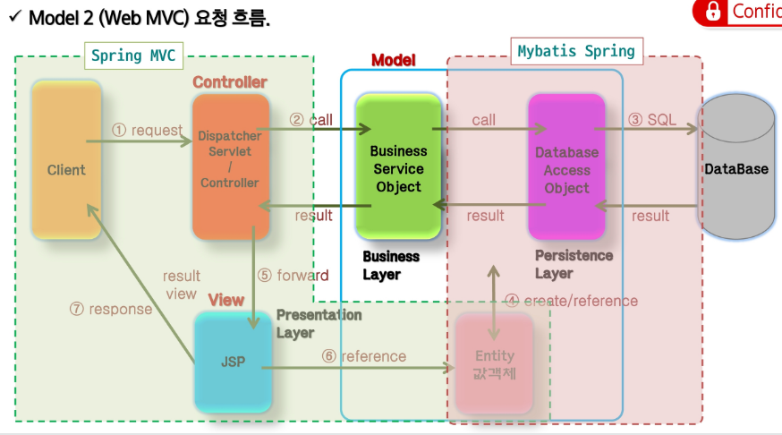
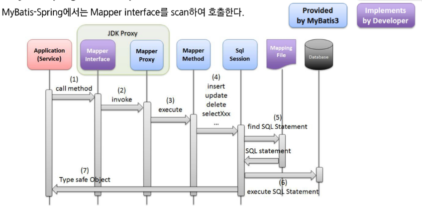
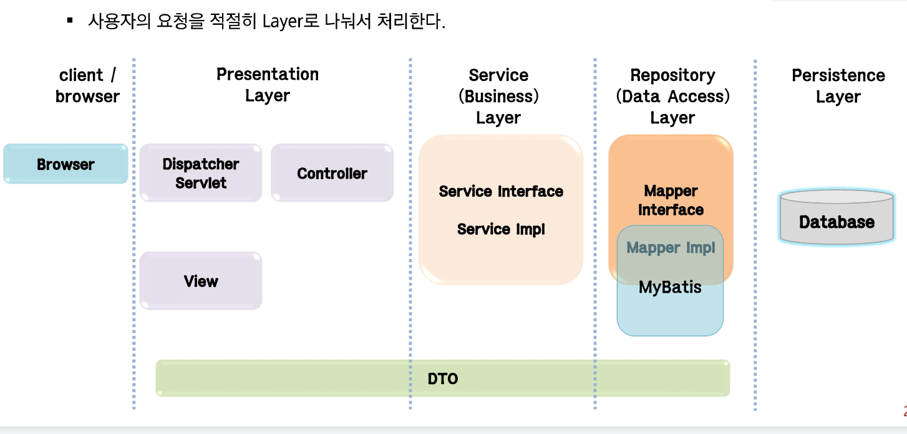

# MyBatis의 개요

- MyBatis의 구현

- 설정

- 단건조회

- 멀티 조횐

- CRUD 구현

- Connection Pool

MyBatis란 ❓

- `MyBatis`는 자바 기반의 애플리케이션에서 DB에 쉽게 접근할 수 있도록 도와주는 `SQL Mapper` `프레임워크`입니다.
   <pre>
    DB와 통신하기 위해 <code>JDBC API</code>를 사용하게되는데 My Batis는 JDBC에서의 번거로운작업을 대신해주고,
    XML 파일을 이용해 SQL 관리를 효율적으로 만듭니다.
  </pre>


  <ol>
<code> MyBatis의 주요 특징</code>
  <li><code>SQL 매퍼(SQL Mapper):</code>자바 '객체'와 개발자가 작성한 'SQL 쿼리의 실행 결과'를 매핑합니다.
  (JPA와 같은 ORM(Object-Relational Mapping)이 자바 '객체'와 데이터베이스 '테이블' 자체를 매핑)
  </li>
  <li> <code>Dao(Mapper, Repository)에서 SQL의 분리 (XML 기반):</code> 자바 소스 코드 안에 길게 섞여 있던 SQL 쿼리문을 별도의 XML 파일과 어노테이션으로 완전히 분리하여 관리할 수 있습니다.
  </li>
  <li><code>직접적인 데이터베이스 제어:</code> 프레임워크가 쿼리를 자동 생성하는 것이 아니라 개발자가 직접 SQL을 작성하므로, 복잡한 조인 쿼리를 자유롭게 구사할 수 있습니다.
  </li>

  <li>
  <code>강력한 동적 SQL (Dynamic SQL):</code>XML 파일 내에서 <code>&lt;if&gt;, &lt;choose&gt;, &lt;foreach&gt;</code>등의 태그를 제공하여, 검색 조건이나 파라미터에 따라 쿼리의 형태가 동적으로 바뀌는 SQL을 매우 쉽게 작성할 수 있습니다.
  </li>
  </ol>

  - 왜 사용하나요❓

<ol>
<li>기존 순수 JDBC를 사용하면 데이터베이스 연결, Statement 객체 생성, 파라미터 바인딩, ResultSet을 통해 결과를 하나하나 자바 객체에 담는 코드를 DAO 인터페이스만 작성하고 쿼리 XML 파일을 작성 후 매핑하는 작업으로 대체</li>
<li><code>SQL 쿼리와 자바 코드가 분리,</code>쿼리를 수정해야 할 때 자바 코드를 건드리고 재컴파일할 필요 없이 XML 파일의 SQL문만 수정. 이는 협업과 유지보수에 유리.</li>
<li>다중 조인이 걸린 복잡한 화면 등 세밀한 쿼리 튜닝과 최적화가 필수적인 비즈니스 로직에서는 개발자가 SQL을 100% 제어 가능</li>
<li>동적 SQL:  상황에 따라 분기 처리를 통해 SQL문을 동적으로 만드는 유연한 기능을 제공합니다.</li>
</ol>

```xml

  <select id="getStudentInfo" parameterType="hashMap" resultType="hashMap">
      SELECT *
      FROM BOARD
      WHERE USE_YN = 'Y'
      <choose>
          <when test='"writer".equals(searchType)'>
              AND WRITER = #{searchValue}
          </when>
          <when test='"content".equals(searchType)'>
              AND CONTENT = #{searchValue}
          </when>
          <otherwise>
              AND TITLE = #{searchValue}
          </otherwise>
      </choose>
  </select>

```




## application.properties설정( 뷰 리졸버)

```Java
# JSP Path (ViewResolver)

spring.mvc.view.prefix=/WEB-INF/views/
spring.mvc.view.suffix=.jsp

```

## jsp 설정
```xml
<dependency>
    <groupId>jakarta.servlet</groupId>
    <artifactId>jakarta.servlet-api</artifactId>
</dependency>

<dependency>
    <groupId>jakarta.servlet.jsp.jstl</groupId>
    <artifactId>jakarta.servlet.jsp.jstl-api</artifactId>
</dependency>

-- jstl: TAGRIB <c:if x = $"{varNamea}">, <c:forEach var="변수명" items="${컬렉션}"></c: forEach>
<dependency>
    <groupId>org.glassfish.web</groupId>
    <artifactId>jakarta.servlet.jsp.jstl</artifactId>
</dependency>

<dependency>
    <groupId>org.apache.tomcat.embed</groupId>
    <artifactId>tomcat-embed-jasper</artifactId>
</dependency>
```
## DB 드라이버 설정 (application.properties)

``` Java
  # MySQL Database setting (application.properties)

  # db 드라이버 세팅 db마다 상이
  spring.datasource.driver-class-name = com.mysql.cj.jdbc.Driver
  
  # 현재 실행중인 db의 url 기입
  spring.datasource.url = jdbc:mysql://127.0.0.1:3306/ssafyweb?serverTimezone=Asia/Seoul&useUnicode=yes&characterEncoding=UTF-8
  
  # db의 사용자 이름과 패스워드 기입
  spring.datasource.username = ssafy
  spring.datasource.password = ssafy
```
<ol>
jdbc 커넥션을 위한 기본 정보 (application.properties)
<li>driver Class</li>
<li>url</li>
<li>username</li>
<li>password</li>
</ol>

# MyBatis 설정

```xml
<dependency>
    <groupId>org.mybatis.spring.boot</groupId>
    <artifactId>mybatis-spring-boot-starter</artifactId>
    <version>4.0.0</version>
</dependency>

<dependency>
    <groupId>com.mysql</groupId>
    <artifactId>mysql-connector-j</artifactId>
    <scope>runtime</scope>
</dependency>
```
## MyBatis 매퍼(Mapper) 설정
<p> application.properties에 이 설정을 추가해야 MyBatis가 XML 파일에 작성된 SQL 쿼리를 인식할 수 있습니다.</p>
<ol>
<li>기본 경로: Spring Boot 프로젝트에서 src/main/resources가 기본 루트(Root) 경로입니다.</li>
<li>역할: 자바 인터페이스(DAO/Mapper)와 실제 SQL 쿼리가 담긴 XML 파일을 연결해 주는 징검다리 역할을 합니다.</li>
</ol>

```java
# MyBatis Setting
mybatis.mapper-locations=mapper/**/*.xml

# mapper/: src/main/resources/mapper 폴더를 기준으로 찾습니다.
# **: 해당 폴더의 모든 하위 폴더를 포함한다는 뜻입니다.
# *.xml: 파일 확장자가 .xml인 모든 파일을 매퍼 파일로 인식합니다.

```

# my batis 기본 

# 단건 조회하기 

1. 단건 조회 결과를 담을 Entity class 생성하기(멤버는 컬럼과 동일하게 구성)
2. 객체 생성 후, getter, setter를 호출하는 것이 기본이므로 <code>사용자 정의 생성자는 만들지 않는 것이 좋습니다- (default 생성자가 만들어지도록) </code>
  기본 생성자: DTO에 사용자 정의 생성자만 있을 경우 MyBatis가 객체를 생성하지 못하므로 @NoArgsConstructor를 반드시 확인하세요.
```java
 package com.ssafy.mybatis.entity;

//Dto : Data Transfer Object
public class GuestBook {

    private int articleno;
    private String userid;
    private String subject;
    private String content;

    //setters, getters...
}
```

3. 구현체 불필요: 예전에는 Dao 인터페이스를 만들고 DaoImpl에서 SQL 세션을 열어 직접 쿼리를 호출했지만, MyBatis Mapper 방식을 쓰면 인터페이스만 정의하면 됩니다.
4. 연결 고리: 이 인터페이스의 메서드 이름(selectGuestBook)은 나중에 작성할 Mapper XML의 id 값과 반드시 일치해야 합니다.
5.  역할: MyBatis 라이브러리가 이 인터페이스를 참조하여 실제 DB 쿼리 동작을 수행합니다.

```java 
package com.ssafy.mybatis.mapper;

import com.ssafy.mybatis.entity.GuestBook;
@Mapper
public interface GuestBookRepo {//==dao ==mapper==repository

    public GuestBook selectGuestBook(int articleno);

}
```

# GuestBook.xml
```xml
<?xml version="1.0" encoding="UTF-8" ?>
<!DOCTYPE mapper PUBLIC "-//mybatis.org//DTD Mapper 3.0//EN" 
    "http://mybatis.org/dtd/mybatis-3-3-mapper.dtd">

<mapper namespace="com.ssafy.mybatis.mapper.GuestBookRepo">

    <select id="selectGuestBook" parameterType="int" resultType="com.ssafy.mybatis.dto.GuestBook">
        select * from guestbook where articleno = #{no}
    </select>

</mapper>
```

7. namespace: XML의 &lt; mapper namespace="..." &gt; 값은 반드시 **인터페이스의 전체 경로(패키지 포함)**와 일치해야 합니다.

8. id: &lt;select id="..."&gt;의 값은 인터페이스의 메서드 이름과 동일해야 합니다.

9. resultType: 쿼리 결과를 담을 객체는 아까 만든 DTO의 전체 경로를 적어줍니다.

10. #{no}: 파라미터가 1개일 때는 #{no}, #{id}, #{articleno} 등 이름을 자유롭게 지어도 MyBatis가 알아서 매칭해 줍니다.

# 📌 MyBatis 매핑 핵심 정리

1. XML과 Mapper의 1:1 관계
- 정의: 작성한 Query XML 파일과 자바의 Mapper 인터페이스는 반드시 1:1로 매핑되어야 합니다.

- 결과: 이 연결이 틀어지면 Spring 서버가 구동될 때(Context 로딩 시) 즉시 오류를 뱉으며 실행되지 않습니다. (주로 BindingException 발생)

2. @Mapper 어노테이션의 역할
- Bean 등록: @Mapper를 붙이면 Spring이 이를 스캔하여 Bean으로 관리합니다. 덕분에 Service 계층에서 @Autowired나 생성자 주입으로 이 인터페이스를 가져와 바로 사용할 수 있습니다.

- 자동 구현: 개발자가 구현체(Impl)를 직접 만들지 않아도, MyBatis 라이브러리가 인터페이스의 정보를 토대로 실제 동작하는 프록시 객체를 생성해 줍니다.



# 계층구조



1. 클라이언트(브라우저)
2. 표현 계층(요청을 받고 컨트롤러를 뒤지는 `디스패처 서블릿(프론트 컨트롤러))`, 요청을 처리하는 `컨트롤러`, 데이터 및 화면을 담당하는 뷰)
3. 서비스 계층 ( 비즈니스 로직)
4. 레포지토리 계층 ( db로 보낼 쿼리 관련 로직 처리)
5. 영속성 계층( db)
-  url request -> url 요청에 해딩하는 컨트롤러 호출 -> 컨트롤러 내에 서비스 빈을 호출 ->서비스는 dao(mapper)빈을 호출함으로써 쿼리 수행   

```Java
@Controller
public class HomeController {

    @Autowired
    GuestBookService service;//애너테이션보다는 생성자 구현을 추천 ( 메인앱의 스캔 범위 내에 있다면 빈 자동 생성)

    @GetMapping("/")
    public String home(Model model) {
        GuestBookDto dto = service.selectGuestBook(1);

        logger.debug("dto조회 : {}", dto);
        model.addAttribute("dto", dto);

        return "home";
    }
}
```
- 기본은 controller - service - repository 이지만 서비스 레이어가 복잡해지면 레이어를 추가하기도 함

- 조회 (xml은 단건과 똑같이 하고(select resultType은 entity그대로 명시하고) dao클래스 내의 id로 매핑된 매핑된 매서드의 인터페이스 반환값만 list로 하면 멀티건 조회입니다.)
- 삽입(useGeneratedKeys="true", keyProperty="pk" 등의 옵션을 주면 삽입할때 db가 부여한 autoincrement 속성의 pk의 값을 가져와 entity 객체의 default 값을 갱신된 pk값으로 초기화해 줍니다.) 
- <code>TypeAlias</code>:parameterType이나 resultTypedml 대상을 푸류ㅐ스로 입력을 해야 하는데 이 풀 경로를 입력하면 오타 및 에러가 날 수 도 있고, 이걸 application.Propertiesdp 명시하면 풀패스 경로를 생략하고 엔티티 클래스 이름만 명시해도 매핑가능 

```xml
    # MyBatis Setting
    # entity 객체의 (반환 또는 파라미터 값이 될 클래스의 경로를 명시, 데소문자 및 )
    mybatis.type-aliases-package=com.ssafy.mybatis.entity
    
    # DB의 Snake Case(언더바 사용) 명명 규칙을 Java의 Camel Case(대소문자 구분) 규칙으로 자동 변환해줍니다.
    # SQL 문에서 AS 키워드를 써서 일일이 별칭을 주지 않아도 MyBatis가 알아서 매핑을 처리해줍니다.
    mybatis.configuration.map-underscore-to-camel-case=true
```

<table border="1" style="border-collapse: collapse; width: 100%;">
  <tr style="background-color: #f8f9fa;">
    <th style="padding: 10px; text-align: left;"> <strong> Connection Pool </strong> </th>
  </tr>
  <tr>
    <td style="padding: 20px; line-height: 1.8;">
   DB Connection을 내가 만들어야 할까? 그리고, connection관리는 누가 해야 할까?<br>

   Spring Boot에서는 default connection pool로 HikariCP가 사용되며<br>
   
   Tomcat JDBC Connection Pool<br>
   
   Commons DBCP2<br>
   
   Spring Framework SimpleDriverDataSource<br>
   
   등으로도 교체 가능하다.<br>
   
   mybatis를 사용하기 위해서 mybatis-spring-boot-starter에 의존성을 주었다면, default로 HikariCP가 사용된다.<br>
   </td>
</tr>
 <tr>
    <td style="padding: 20px; line-height: 1.8;">
   2. 핵심 개념 이해하기<br>
   왜 커넥션 풀을 쓰나요❓<br>
   매번 사용자가 요청을 보낼 때마다 DB와 <strong>연결(Connection)</strong>을 새로 맺는 과정은 비용이 매우 큽니다. (TCP/IP 핸드셰이크 등)<br>
   
   비유: 손님이 올 때마다 정수기 배관을 새로 깔고 물을 주는 게 아니라, 미리 물통에 물을 채워두고(Pool) 손님이 오면 컵에 따라주는 방식입니다.<br>
   
   장점: 응답 속도가 빨라지고, 시스템 자원을 효율적으로 관리할 수 있습니다.<br>
   
   
   **HikariCP(Connection Pool)**는 이 Connection 객체들을 미리 여러 개 만들어두고 관리하는 '보관함' 역할을 합니다.(미리 만들어 놓고<code>풀링과 재사용</code>>)<br>
   
   커넥션(Connection): DB와 데이터를 주고받기 위한 통로입니다. 이미지 설정의 maximum-pool-size=10은 이 통로를 최대 10개까지 유지하겠다는 뜻입니다.<br>
   
   ResultSet과의 차이: ResultSet은 쿼리 실행 결과(데이터)를 담고 있는 객체이므로 커넥션과는 다릅니다. 커넥션이 **'통로'**라면, ResultSet은 그 통로를 통해 가져온 **'화물'**이라고 이해하시면 됩니다.<br>
   
   히카리풀 없어도 되나요❓ (성능 vs 필수)<br>
   필수는 아닙니다: 히카리풀이 없어도 DriverManager를 써서 매번 연결을 맺고 끊으며 DB를 사용할 수는 있습니다. (순수 JDBC 방식)<br>
   
   하지만 실무에서는 필수입니다: 말씀하신 대로 '압도적으로 빨라서' 사용합니다. 커넥션 풀이 없으면 사용자 100명이 동시에 접속했을 때 DB가 연결을 맺느라 비명을 지르며 서버가 멈출 수도 있습니다. <br>
   히카리풀은 이 연결을 미리 10개(기본값) 정도 만들어두고 돌려막기(?)를 함으로써 서버 부하를 엄청나게 줄여줍니다.<br>
</td>
</tr>
</table>
