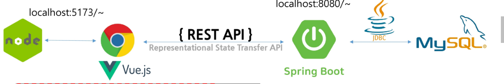

# Rest API란?

- Rest는 'Representational State Transfer'의 약어로 하나의 <code>URL</code>는 <code>>하나의 고유한 리소스</code>를 대표하도록 설계해야한다는 개념의 <code>전송방식<code>입니다.


- HTTP URL을 통해 제어할 자원을 명시하고 , http method(get,post,put,delete)를 통해 해당 자원을 제어하는 명령을 내리는 방식의 아키텍쳐입니다.

<ol>
잘표현된 HTTP URL로 자원을 정의하고 HTTP method로 리소스에 대한 행위를 정의합니다. 
<code>클라이언트에서 자원을 요청</code>하면 서버로부터 표현을 받는데, 표현은 <code>json,xml,html</code>과 같은 형태로 제공합니다.
<li><code>자원(Resource):</code> -  (Uniform Resource Locator)</li>
<li><code>행위(verb):</code> -  (HTTP Method)</li>
<li><code>표현(Representations)</code></li>
</ol>
- 하이픈(-)은 사용 가능, 언더바(*)는 금지: 가독성을 위해 하이픈은 쓰되, 언더바는 사용하지 않습니다. (단, query - string은 *나 camelCase를 사용하기도 함)
- 소문자 사용: 대문자는 가급적 사용하지 않습니다. (RFC 3986은 URI를 대소문자로 구분하기 때문)
- 마지막 슬래시(/) 미포함: URI의 마지막에는 슬래시를 붙이지 않습니다.
- 계층 관계 표현: 슬래시(/)는 리소스 간의 계층 관계를 나타내는 데 사용합니다.
- <code>명사(URL) 사용</code>: URL는 행동이 아닌 자원을 식별합니다. (행위는 HTTP Method로 표현)

## rest api 설계 예시

```Java
// Controller.java 내의 메서드를 애너테이션으로 매핑시킨다.

@GetMapping("/blog/{id}")   // 조회(단건)
@PostMapping("/blog")       // 생성(삽입)
@PutMapping("/blog/{id}")   // 수정(갱신)
@DeleteMapping("/blog/{id}") // 삭제
```

<table border="1" style="border-collapse:collapse;width:100%;"><thead><tr style="background-color:#f8f9fa;"><th>작업</th><th>기존 방식</th><th>REST 방식</th><th>비고</th></tr></thead><tbody><tr><td>Create (Insert)</td><td>POST /write.do</td><td>POST /blog/gildong</td><td>쓰기</td></tr><tr><td>Read (Select)</td><td>GET /view.do?id=gildong&amp;articleno=25</td><td>GET /blog/gildong/25</td><td>읽기</td></tr><tr><td>Update (Update)</td><td>POST /modify.do?id=gildong&amp;articleno=25</td><td>PUT /blog/gildong/25</td><td>수정</td></tr><tr><td>Delete (Delete)</td><td>GET /delete.do?id=gildong&amp;articleno=25</td><td>DELETE /blog/gildong/25</td><td>삭제</td></tr></tbody></table>

# REST API 관련 애너테이션

<table border="1" style="border-collapse:collapse;width:100%;"><thead><tr style="background-color:#f8f9fa;"><th>Annotation</th><th>Description</th></tr></thead><tbody><tr><td><code>@RestController</code></td><td>Controller가 REST 방식을 처리하기 위한 것임을 명시 (Controller + ResponseBody), 모든 컨트롤러내의 매서드는 @ResponseBodt를 생략해도 json, String등의 데이터로 반환한다.</td></tr><tr><td><code>@ResponseBody</code></td><td>JSP 같은 뷰로 전달되는 것이 아니라 데이터 자체(JSON/String)를 응답 바디에 넣는다. 반환형이 entity같은 객체라면 jackson 라이브러리를 이용해 json 형태로 직렬화하는 역할도 수행</td></tr><tr><td><code>@PathVariable</code></td><td>URL 경로에 있는 값을 메서드 파라미터로 추출 (예: /users/{id})</td></tr><tr><td><code>@CrossOrigin</code></td><td>Ajax의 크로스 도메인(CORS) 문제를 해결하여 외부 도메인 접근 허용(기본으로 브라우저 정책(sop) 상 다른 포트로의 접근을 허용하지 않기 때문에 서버가 클라의 주소를 허용해야함)</td></tr><tr><td><code>@RequestBody</code></td><td>HTTP 요청의 JSON 데이터를 자바 객체(DTO 등) 타입으로 바인딩</td></tr></tbody></table>

- @ResponseBody로 받는 컨트롤러 매서드.
  전체 흐름 검증

1. 클라이언트가 서버의 url로 Get방식의 http 요청
2. tomcat은 http 요청을 받고 요청을 servlet객체로 변환.
   (HttpServletRequest,HttpServletResponse 객체를 생성하고 Dispatcher Srvlet에게 전달)
3. DispatcherServlet(프론트 컨트롤러)가 HandlerMapping에게 해당 요청의 url을 어떤 컨트롤러가 처리하는지 묻고 Handler Adapter를 통해 컨트롤러를 실행
4. 컨트롤러 실행 ( 서비스 레이어의 비지니스 로직 실행)

```Java
@GetMapping("/blog/{id}")

public @ResposneBody Blog getBlog(@PathVariable String id) {
   return blog;
}
```

5. ReturnValueHandler가 반환값을 어떻게 처리할지 판단.
<table border="1" style="border-collapse: collapse; width: 100%;">
  <tr style="background-color: #f8f9fa;">
    <th style="padding: 10px; text-align: left;">ReturnValueHandler 분기 처리 상세</th>
  </tr>
  <tr>
    <td style="padding: 20px; line-height: 1.8;">
      <strong>✅ 분기 1: @ResponseBody가 있는 경우</strong><br>
      • <strong>흐름:</strong> ViewResolver <span style="color: #d73a49;">❌</span> → <strong>HttpMessageConverter</strong> <span style="color: #28a745;">✅</span><br>
      • <strong>동작:</strong> Java 객체를 <strong>JSON</strong> 데이터로 변환<br>
      • <strong>도구:</strong> <code>Jackson</code> 라이브러리 사용 (MappingJackson2HttpMessageConverter)<br>
      <br>
      <hr style="border: 0.5px solid #eee;">
      <br>
      <strong>✅ 분기 2: @ResponseBody가 없는 경우</strong><br>
      • <strong>흐름:</strong> <strong>ViewResolver</strong> 호출 <span style="color: #28a745;">✅</span><br>
      • <strong>동작:</strong> 반환된 문자열을 바탕으로 실제 뷰 파일(JSP, Thymeleaf 등)을 찾아 렌더링
    </td>
  </tr>
</table>


6. (case-1)HttpMessageConverter (JSON 변환)
<pre style="font-size: 2.1em; line-height: 1.5;">

- 역할
  Java 객체 → JSON 문자열 변환
- 실제 구현
Spring의 MappingJackson2HttpMessageConverter( spring이 내부적으로 Jackson을 사용해 구현)
</pre>

6.  (case-1)ViewResolver (뷰 렌더링)
<pre style="font-size: 2.1em; line-height: 1.5;">
역할
View 이름 → 실제 파일(JSP 등)로 변환
</pre>

7.  HttpServletResponse 작성
<pre style="font-size: 2.1em; line-height: 1.5;">
역할

👉 최종 응답 데이터 작성
JSON(spa) 또는 HTML(ssr)이 여기 들어감

</pre>

8. Tomcat → 클라이언트 응답
<pre style="font-size: 2.1em; line-height: 1.5;">
역할
HttpServletResponse를 기반으로
HTTP Response 생성 후 전송

👉 특징:

기존 연결을 통해 응답
새로운 요청 보내는 거 아님

</pre>

# HttpMessageConverter 핵심 요약

## 1. 이미지 내용 추출

정의: 스프링 프레임워크(Spring MVC)에서 제공하는 인터페이스입니다.

역할: HTTP 요청 본문(Request Body)을 객체로 변경하거나, 객체를 HTTP 응답 본문(Response Body)으로 변경할 때 사용합니다.

사용 어노테이션: @RequestBody, @ResponseBody와 함께 작동합니다.

동작 원리: 요청 본문에 데이터가 있을 때 @RequestBody를 파라미터에 붙이면 body 내부의 데이터를 Object로 자동 변환해 줍니다.

## 2. 주요 컨버터 종류

<table border="1" style="border-collapse:collapse;width:100%;"><thead><tr style="background-color:#f8f9fa;"><th>Converter 명칭</th><th>지원하는 데이터 타입</th><th>미디어 타입 (MIME)</th></tr></thead><tbody><tr><td><b>ByteArrayHttpMessageConverter</b></td><td><code>byte[]</code></td><td><code>application/octet-stream</code> 등 모든 미디어 타입</td></tr><tr><td><b>StringHttpMessageConverter</b></td><td><code>String</code></td><td><code>text/plain</code></td></tr><tr><td><b>MappingJackson2HttpMessageConverter</b></td><td><code>Object</code> (주로 DTO/Entity)</td><td><code>application/json</code></td></tr></tbody></table>

<pre style="font-size: 2.1em; line-height: 1.5;">
① 컨버터 결정 방식: "너 이거 할 줄 알아?"
스프링은 등록된 여러 컨버터를 순회하며 두 가지 조건을 체크합니다.

1. 대상 클래스 타입: 컨트롤러 메서드의 파라미터나 반환 타입이 컨버터가 처리 가능한 타입인가?

2. HTTP Content-Type / Accept 헤더: 요청의 Content-Type 혹은 응답의 Accept 헤더를 지원하는가?

예: 클라이언트가 JSON을 보냈다면 MappingJackson2...가 선택됩니다.

② Jackson 라이브러리와의 관계 (중요)
 MappingJackson2HttpMessageConverter, 이 클래스 내부에는 <code>Jackson 라이브러리의 ObjectMapper</code>가 들어있어, 실질적인 JSON 직렬화/역직렬화 작업을 수행합니다.

③ 우선순위
스프링 부트는 컨버터들을 리스트에 담아 관리하는데, 기본적으로 우선순위가 정해져 있습니다.

바이트 배열 (byte[])

문자열 (String)

객체 (Object/JSON) 순으로 체크하며 적합한 것을 찾습니다.
</pre>

# 기본 REST API 구현 예시

<table border="1" style="border-collapse:collapse;width:100%;"><thead><tr style="background-color:#f8f9fa;"><th>Method</th><th>Path</th><th>Request Body</th><th>Response</th><th>설명</th></tr></thead><tbody><tr><td><b>GET</b></td><td><code>/admin/user</code></td><td>-</td><td><code>List&lt;MemberDto&gt;</code> - Json Array</td><td>회원 전체 조회</td></tr><tr><td><b>GET</b></td><td><code>/admin/user/{userid}</code></td><td>-</td><td><code>MemberDto</code> - Json</td><td>회원 한 명 조회</td></tr><tr><td><b>POST</b></td><td><code>/admin/user</code></td><td>json - <code>MemberDto</code></td><td>입력된 <code>MemberDto</code> - Json</td><td>회원 등록</td></tr><tr><td><b>PUT</b></td><td><code>/admin/user/{userid}</code></td><td>json - <code>MemberDto</code></td><td>수정된 <code>MemberDto</code> - Json</td><td>회원 수정</td></tr><tr><td><b>DELETE</b></td><td><code>/admin/user/{userid}</code></td><td>-</td><td>-</td><td>회원 삭제</td></tr></tbody></table>

# 멀티 조회 예시

# repo 코드

```Java
//메인앱 scan 영역에 있어야합니다.
@Mapper
public interface UserDao {
    public List<MemberDto>  userList();
}
```

## 매퍼.xml 파일 쿼리 작성 ,id는 userList()

```xml
<mapper namespace="com.ssafy.rest.dao.UserDao">

    <select id="userList" resultType="memberDto">
        SELECT
            userid,
            userpwd,
            username,
            email,
            address,
            joindate
        FROM ssafy_member member
        ORDER BY member.joindate DESC;
    </select>

</mapper>
```

# <code>cors와 클라이언트, 서버와의 통신 구현</code>

1. 프론트엔드와 백엔드의 분리
   Node.js 서버 (Port 5173): 브라우저는 먼저 5173 포트로 동작하는 Node 서버(Vite 등)로부터 html, css, js 파일을 다운로드합니다.

Spring 서버 통신: 정적 리소스를 로드한 이후에는 백엔드인 Spring 서버와 **ajax(Axios 등)**를 통해 데이터를 주고받습니다.

2. 환경 설정
   .env 파일: 프로젝트의 환경 변수를 관리하는 .env 파일에 설정된 base url을 확인하여 API 요청을 보낼 서버의 주소를 결정합니다.
   

## 1. Vite 환경 변수 활용 및 Axios 설정

```javascript
// 환경 변수에서 REST API URL 추출
const { VITE_REST_API_URL } = import.meta.env;

// axios 객체 생성
export default axios.create({
  baseURL: VITE_REST_API_URL,
  headers: {
    "Content-type": "application/json;charset=utf-8",
  },
});
```

## 2. 환경 변수 설정 (.env)

```javascript
# must starts with VITE_
VITE_REST_API_URL=http://localhost:8080/
```

# CORS

<pre style="font-size: 2.1em; line-height: 1.5;">
CORS(Cross-Origin Resource Sharing)
특정 서버에서 다운 받은 js로 다른 웹 사이트를 제약없이 서핑할 수 있을까?

웹은 기본적으로 Same-Origin-Policy 정책을 따르고 있다.

즉, 5173번 port에서 다운 받은 파일로 8080 서비스를 호출할 수 없는 것이 기본이다.

하지만 지금 우리와 같이 다른 서비스이지만 연결을 허용해 줘야 하는 경우가 있는데, 어떤 도메인에 접속을 허용할 것인지 정책은 해당 서버(Spring Boot)에서 설정해 줘야 한다.

Controller에서 @CrossOrigin annotation으로 허용한다.(자세한 내용은 따로 다룬다.)
</pre>
