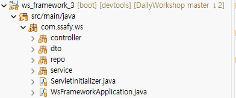

# Spring Boot 시작하기 및 초기 설정

## Spring Boot란 무엇인가요?

- Spring Boot란 Spring 프레임워크를 편리하게 사용할 수 있도록 지원하는 `도구`입니다.
- 왜 사용하나요? why❓
  - 과거에 'Spring 프레임워크'를 사용하려면 설정해야 할 것들이 너무 많아 진입 장벽이 높았습니다. 스프링 부트는 이러한 Spring의  하고, 바로 실행 가능한  을 만들 수 있게 해줍니다.

<ol>
  <li><strong>자동 설정 (Auto Configuration):</strong> 공통적으로 필요한 설정을 프레임워크(Spring Boot)가 알아서 해줍니다.</li>
  <li><strong>내장 서버 (Embedded Server):</strong> 별도의 WAS(Tomcat)를 설치하거나 설정할 필요 없이, 애플리케이션 자체에서 서버를 실행할 수 있습니다. (Jar 파일 하나로 실행)</li>
  <li><strong>스타터 (Starter) 의존성:</strong> 여러 라이브러리의 버전 호환성을 고민할 필요 없이, 목적에 맞는 'Starter' 팩 하나만 추가하면 관련 라이브러리들이 세트로 관리됩니다.</li>
</ol>

## 어노테이션 기반 설정 

<ol>
  <li> 
   : 
  <ol>
    <li><code>@ComponentScan</code>이 포함되어 있습니다. 기본 설정값은 <code>Application.java</code> 클래스가 위치한 현재 패키지 및 그 하위 전체입니다.</li>
    <li>
      빈 주입(DI)
      <ol>
        <li><strong>Service 주입:</strong> <code>com.ssafy.ws.service</code> 패키지의 <span style="color: #E24B4A;">서비스 빈</span>을 컨트롤러에서 <span style="color: #E24B4A;">@Autowired</span>나 <span style="color: #E24B4A;">생성자 주입</span>으로 가져올 수 있습니다.</li>
        <li><strong>Repo 주입:</strong> <code>com.ssafy.ws.repo(dao)</code> 패키지의 인터페이스나 클래스도 서비스 계층에서 바로 주입받아 사용할 수 있습니다.</li>
      </ol>
     </li>
    <li>
      
      <p><code>WsFrameworkApplication.java</code> 클래스는 <code>com.ssafy.ws</code> 패키지와 그 하위에 있는 모든 패키지를 탐색 범위로 가집니다.</p>
      <blockquote>
      스프링 부트는 메인 클래스가 위치한 패키지를 <strong>루트(Root)</strong>로 인식합니다. 따라서 아래의 모든 패키지 안에 있는 클래스들이 <code>@Controller</code>, <code>@Service</code>, <code>@Repository</code>, <code>@Component</code> 등의 어노테이션을 가지고 있다면 자동으로 빈으로 등록됩니다.
      </blockquote>
      <ol>
        <li><code>com.ssafy.ws.controller</code> (컨트롤러 패키지)</li>
        <li><code>com.ssafy.ws.dto</code> (주로 데이터 전달 객체이므로 빈 등록은 안 하겠지만, 탐색 범위에는 포함됨)</li>
        <li><code>com.ssafy.ws.repo</code> (레포지토리 패키지)</li>
        <li><code>com.ssafy.ws.service</code> (서비스 패키지)</li>
      </ol>
    </li>
  </ol>
  </li>
  <li>
    <strong>@Configuration:</strong> 개발자가 직접 자바 코드로 빈(Bean)을 등록하고 싶을 때 사용합니다.
  </li>
  <li>
    <strong>application.properties / application.yml:</strong> 주로 <code>src/main/resources</code> 경로에 위치하며, 포트 번호, JSP(prefix, suffix), JDBC 설정(SQL 사용자, SQL password, DB URL, 드라이버 경로), 디버그 모드 등을 설정합니다.
  </li>
  <li>
    <strong>pom.xml 또는 build.gradle:</strong> 프로젝트의 의존성 및 버전을 지정하며 빌드 시 설정에 따라 Library를 가져옵니다.
  </li>
</ol>
1. 수정자 주입 (Setter Injection)

```Java
  @Service 
  public class OrderServiceImpl implements OrderService {

    private DiscountPolicy discountPolicy;
      
    @Autowired
    public void setDiscountPolicy(DiscountPolicy discountPolicy) {
      this.discountPolicy = discountPolicy;
    }
  } 
```
<pre>
메서드를 public으로 열어두어야 하기 때문에 누군가 실수로 변경할 수도 있고, 변경하면 안 되는 메서드를 열어두는 것은 좋은 설계 방법이 아닙니다.수정자 주입을 사용할 경우에는 주입 데이터를 누락했을 때, 런타임에 Null Pointer Exception이 발생합니다.
</pre>

2. 생성자 주입 (Constructor Injection)
```Java
 @Service 
public class OrderServiceImpl implements OrderService {

	private final DiscountPolicy discountPolicy;
    
	@Autowired 
	public OrderServiceImpl(DiscountPolicy discountPolicy) {
		this.discountPolicy = discountPolicy;
	}
} 
```
<pre>
주입 데이터를 누락했을 때 컴파일 오류가 발생합니다. 이는 개발자가 IDE를 통해 누락된 의존성을 쉽게 파악하고 수정할 수 있게 합니다.
</pre>

 3. 필드 주입
```Java
 @Service 
public class OrderServiceImpl implements OrderService {
  
  @Autowired
	private final DiscountPolicy discountPolicy;
    
	//...
} 
```

## 주요 의존성 (Dependencies)

<table>
  <thead>
    <tr>
      <th>의존성 명칭</th> 
      <th>설명</th>
    </tr>
  </thead>
  <tbody>
    <tr>
      <td><strong>Spring Web</strong></td>
      <td>RESTful API, Spring MVC 등을 구축할 때 사용하며 내장 톰캣이 포함됩니다.</td>
    </tr>
    <tr>
      <td><strong>Spring Data JPA</strong></td>
      <td>Hibernate를 사용해 DB를 자바 객체처럼 다룰 수 있게 해줍니다. (DAO, Mapper, Repository) JPA가 요구하는 네이밍 규칙에 맞게 인터페이스만 작성하면 JPA가 구현체를 자동으로 생성합니다.</td>
    </tr>
    <tr>
      <td><strong>Lombok</strong></td>
      <td>Getter, Setter, 생성자 등을 어노테이션 하나로 자동 생성해 코드를 깔끔하게 만듭니다. STS에서 사용하려면 <code>sts.ini</code> 파일에 <code>-javaagent:lombok.jar</code>을 지정해야 하고, <code>lombok.jar</code> 파일이 STS 루트에 있어야 합니다. (컴파일 시점에 코드를 생성하는 Lombok의 특성상 IDE 에디터가 자동 생성될 코드들을 에러 없이 미리 인식하게 만들기 위함입니다.)</td>
    </tr>
    <tr>
      <td><strong>Spring Security</strong></td>
      <td>애플리케이션의 인증, 인가 및 웹 보안 기능을 담당합니다.</td>
    </tr>
    <tr>
      <td><strong>Spring Boot DevTools</strong></td>
      <td>코드 수정 시 서버를 자동으로 재시작해주는 등 개발 생산성을 높여줍니다.</td>
    </tr>
  </tbody>
</table>

🚀 Spring Boot 프로젝트 생성 및 핵심 어노테이션
1. Spring Boot 프로젝트 생성 요소
스프링 부트 프로젝트는 보통 웹(Spring Initializr: start.spring.io)에서 생성하거나 STS, IntelliJ 같은 IDE 내장 기능을 통해 생성합니다. 생성 시 설정하는 주요 항목들은 다음과 같습니다.

<ul>
<li>
<strong><span style="color: #378ADD;">Project (빌드 도구)</span></strong> : <code>Maven</code>과 <code>Gradle</code> 중 선택합니다. (최근에는 빌드 속도가 빠르고 스크립트가 유연한 <strong>Gradle</strong>을 많이 사용하는 추세입니다.)
</li>
<li>
<strong><span style="color: #EF9F27;">Language</span></strong> : Java, Kotlin, Groovy 중 사용할 언어를 선택합니다.
</li>
<li>
<strong><span style="color: #639922;">Spring Boot (버전)</span></strong> : 프로젝트의 뼈대가 될 스프링 부트 버전을 선택합니다.
<ul>
<li><strong>SNAPSHOT :</strong> 현재 활발히 개발 중인 버전 (불안정할 수 있음)</li>
<li><strong>M (Milestone) :</strong> <i>(※ 자료의 Minor는 Milestone의 오기입일 확률이 높습니다.)</i> 정식 릴리즈 전 단계의 마일스톤 버전. 추가로 <strong>RC (Release Candidate)</strong>라는 정식 배포 직전의 후보 버전도 있습니다.</li>
<li><strong>아무것도 안 붙은 것 (GA) :</strong> 정식 릴리즈된 안정적인 버전입니다. 💡 <span style="color: #E24B4A;"><strong>항상 정식 릴리즈된 버전 중 최신 버전을 선택하는 것이 가장 좋습니다!</strong></span></li>
</ul>
</li>
<li>
<strong><span style="color: #7F77DD;">Project Metadata</span></strong> : 프로젝트의 기본 정보를 설정합니다.
<ul>
<li><strong>Packaging :</strong> <code>Jar</code> 또는 <code>War</code> 중 선택합니다.


👉 <strong>보충 설명:</strong> 스프링 부트는 <strong>내장 Tomcat</strong>을 지원하므로, 별도의 서버 설정 없이 독립 실행이 가능한  방식을 기본으로 사용하는 것이 좋습니다. (이전 노트의 '내장 서버' 개념과 연결됩니다!)</li>
<li><strong>Java :</strong> 사용할 JDK 버전을 지정합니다.</li>
</ul>
</li>
<li>
<strong>Dependencies</strong> : 프로젝트에 필요한 라이브러리(Spring Web, Lombok, Data JPA 등)를 미리 선택하여 주입합니다.
</li>
</ul>

💡 Tip: 강의에서는 "WEB에서 생성하지 않고 STS에서 생성하자"고 하셨는데, 이는 STS 내부에 Spring Initializr API가 연동되어 있어서 굳이 브라우저를 켜고 zip 파일을 다운로드 후 압축 해제하는 번거로운 과정을 생략할 수 있기 때문입니다.

2. ✨ 메인 클래스의 심장: @SpringBootApplication
스프링 부트 프로젝트를 생성하면 만들어지는 메인 실행 클래스에는  이라는 어노테이션이 붙어 있습니다. 이것은 사실 3가지 핵심 어노테이션이 하나로 합쳐진 콤보 패키지입니다.

자료에 손글씨로 적혀있던 **"DI(의존성 주입)"**라는 키워드는 아주 중요합니다. 아래의 스캔 및 자동 설정 과정을 통해 객체들이 Bean으로 등록되어야만 비로소 스프링이 DI를 해줄 수 있기 때문입니다.

<ol>
<li>
<strong><span style="color: #639922;">@SpringBootConfiguration</span></strong>
<p>Spring의 기존 <code>@Configuration</code>과 동일한 역할을 합니다. 이 메인 클래스 자체가 스프링의 <strong>환경 설정 클래스(설정의 시작점)</strong>임을 명시합니다. (자료에서 설명이 누락되어 보충합니다.)</p>
</li>

<li>
<strong><span style="color: #EF9F27;">@ComponentScan</span></strong>
<p>개발자가 직접 만든 클래스들을 찾아서 빈(Bean)으로 등록하는 역할을 합니다. <code>@Controller</code>, <code>@Service</code>, <code>@Repository</code>, <code>@Component</code> 어노테이션이 붙은 클래스들을 스캔하여 스프링 컨테이너에 메모리로 올립니다.</p>
</li>

<li>
<strong><span style="color: #E24B4A;">@EnableAutoConfiguration</span></strong>
<p><strong>스프링 부트 마법의 핵심</strong>입니다. 개발자가 등록한 빈 외에도, 프로젝트에 추가한 라이브러리(Dependencies)를 바탕으로 <strong>Spring이 사전에 미리 정의해 놓은 수많은 Bean들을 상황에 맞게 자동으로 등록</strong>해 줍니다.


(예: 내장 톰캣 서버 설정, DispatcherServlet 등록 등 스프링 초기 세팅의 대부분이 여기서 이루어집니다.)</p>
</li>
</ol>

<br>

### 🎨 디자인 소스 보관함
- 들여쓰기 공백: `<br>&nbsp;&nbsp;&nbsp;&nbsp;-`

<span style="color: #E24B4A;">빨간 텍스트</span>
<span style="color: #EF9F27;">주황 텍스트</span>
<span style="color: #639922;">초록 텍스트</span>
<span style="color: #7F77DD;">보라 텍스트</span>
<span style="color: #378ADD;">하늘색 텍스트</span>
<span style="color: #D85A30;">코랄 텍스트</span>

<svg xmlns="http://www.w3.org/2000/svg" width="300" height="40">
  <rect width="40" height="40" fill="#E24B4A"/>
  <rect x="45" width="40" height="40" fill="#EF9F27"/>
  <rect x="90" width="40" height="40" fill="#639922"/>
  <rect x="135" width="40" height="40" fill="#7F77DD"/>
  <rect x="180" width="40" height="40" fill="#378ADD"/>
  <rect x="225" width="40" height="40" fill="#D85A30"/>
</svg>