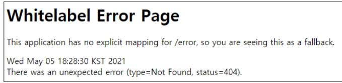
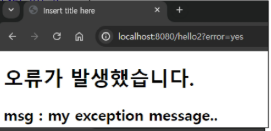
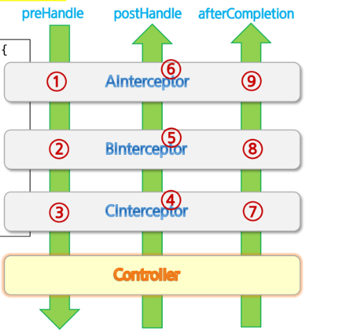
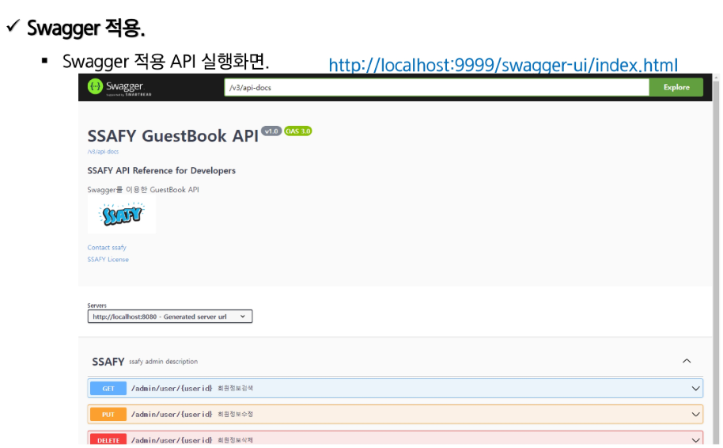
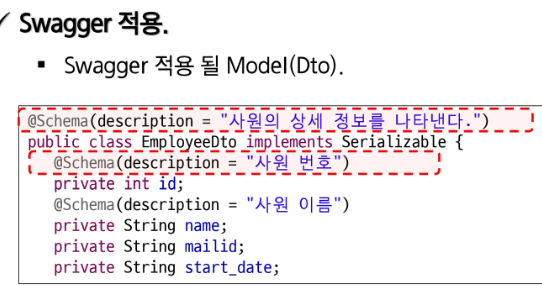
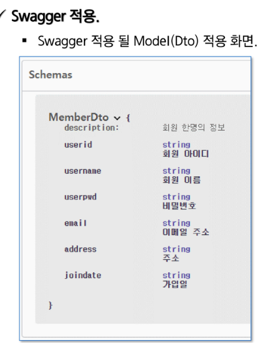
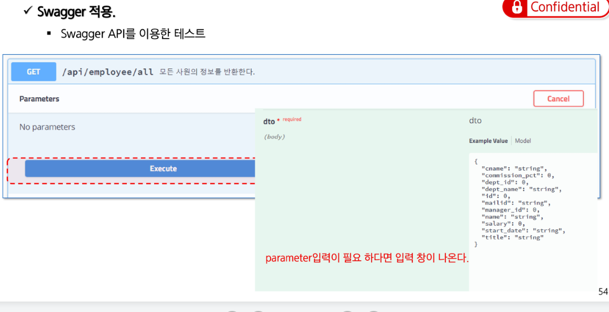
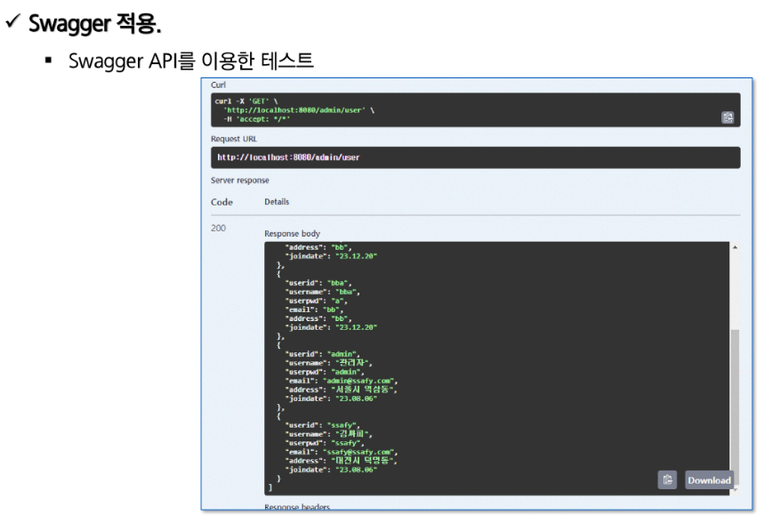
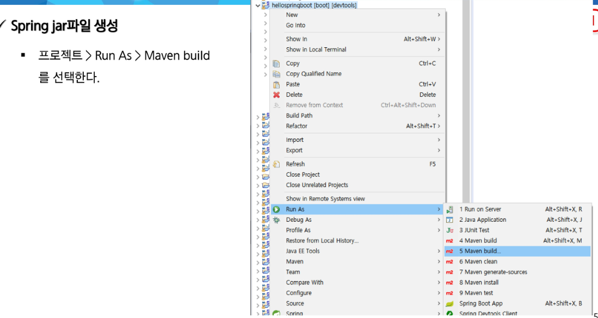

# 설정과 예외처리 

<table>
<thead><tr><th> <font> CORS (Cross-Origin Resource Sharing)</font> </th> </tr></thead>
<tr>
<td>
서로 다른 origin끼리 리소스를 공유할 수 있는 기능을 제공하는 표준이다.<br>
<font>sop: Same-Origin-Policy:</font> 같은 Origin에만 요청을 보낼 수 있다는 정책을 우회하기위한 표준기술이다.<br>
<font>cors,sop:</font> : <strong>웹브라우저가 제공</strong>하는 표준 기술이다.<hr>
<font>기본값으로는 sop가 적용되어있다.</font><br>
* Origin의 구성❓<br>
1. URI스키마(http://,https://) <br>
2. Hostname(Localhost,naver.com)<br>
3. Port(8080,18080 등)<br>

SOP는 웹 브라우저가 가진 기본적인 보안 정책입니다. <strong>"자기 출처(Origin)에서 가져온 스크립트만 신뢰</strong>하고,<br>
 <font>다른 출처의 데이터는 함부로 가져오지 못하게 막겠다"</font>는 규칙입니다. 해커가 <font>악성 스크립트를 심어서(xss)</font> 사용자 몰래 다른 서버로 <br>데이터를 빼돌리는 것을 막기 위한 것입니다.<br>

 상황: 화면을 담당하는 브라우저(Vue.js 등)가 http://localhost:18080에서 실행 중입니다.<br>

요청: 이 브라우저에서 회원가입이나 여행지 목록 조회를 위해 백엔드 서버인 http://localhost:8080으로 API 요청을 보냅니다.<br>

결과 (SOP 위반): 브라우저는 "어? 나는 18080 포트인데 왜 8080 포트 서버한테 데이터를 달라고 하지? 출처가 다르잖아! 위험할 수 있으니 차단해야지!" 하면서 에러를 뱉어냅니다.<hr>
서로 다른 출처끼리 통신을 아예 못하게 막아버리면, 프론트엔드 서버와 백엔드 서버를 분리해서 개발하는 환경 자체가 불가능합니다.<br>
서버가 허락해 준다면, 예외적으로 다른 출처라도 데이터를 주고받을 수 있게 해주자!"**라고 만든 합법적인 우회용 표준 기술이 바로 CORS입니다.<hr>
1. 전역(Global) 설정 (권장): WebMvcConfigurer 인터페이스를 구현하여 프로젝트 전체에 한 번에 CORS 규칙을 적용합니다.<br>
2. 컨트롤러에 애너테이션 붙이기<br>
3. Chrome Plugin을 설치해서 Browser에서의 동작을 (개발 테스트용)
</td>
</tr>
</table>

### Chrome Plugin


#  컨트롤러에 애너테이션 붙이기
```Java
@CrossOrigin(origins = "http://localhost:18080") // 이 출처의 요청은 허락함!
@RestController
public class TravelController { ... }
```

# WebConfiguration으로 컨트롤러에 걸쳐 설정하기(여러 컨트롤러에 걸쳐 설정해야한다면?)
```Java
@Configuration
public class WebConfiguration implements WebMvcConfigurer{

    private String helloPath ="/hello";
    private String allPath = "/**";
    private String allDomain ="*";
    @Override
    public void addCorsMappings(CorsRegistry registry) {
        registry.addMapping(allPath)
                .allowedOrigins("http://localhost:18080");
    }
}
```
addCorsMapping을 override해서 mapping해줄 경로와 허용해줄 origin을 설정해준다. <br>
모든 mapping을 허용해주려면 /hello말고, ./**로 작성한다.<br>
특정 도메인만 허용 -> "*"<br>

# CORS 플러그인만 사용하는 이유 
<table>
<thead><tr><th></th></tr> </thead>
<td>
<tr>
1. 백엔드 API가 아직 완성되지 않았을 때 <br>
상황: 화면 개발은 끝났는데, <strong>데이터를 줄 백엔드 API가 아직 개발 중</strong>이거나 머지되지 않은 경우입니다.<br>
해결: 실제 서버 대신 <strong>목업(Mock) API나 외부 공공 API를 브라우저에서 직접 연결</strong>해 UI가 잘 작동하는지 <br><strong>빠르게 확인</trong>합니다.<hr>
2. 권한이 없는 외부 API를 테스트할 때<br>
상황: <strong>날씨, 뉴스 등 외부 제공 API를 사용</strong>하려는데, 해당 서버에서 <strong>보안상 localhost 접근을 막아</string>둔 경우입니다.<br>
해결: 내 로컬 개발 환경(localhost)을 외부 API 서버에 일일이 허용해달라고 요청할 수 없으므로,<br> 플러그인으로 브라우저의 보안 검사를 우회하여 데이터를 받아옵니다.
<hr>
3. API 응답 값의 구조(JSON)를 미리 확인하고 싶을 때<br>
상황: 코드에 적용하기 전, <strong>브라우저 환경에서 실제 데이터가 어떻게 들어오는지 콘솔에 찍어</strong>보고 싶을 때입니다.<br>
해결: Postman 같은 도구도 있지만, 실제 자바스크립트 코드(fetch, axios 등) 상에서 발생하는 변수<br> 처리나 에러를 즉시 확인하기 위해 브라우저에서 직접 호출합니다. <br>
<hr>
💡 핵심 요약<br>
브라우저의 보안 정책(SOP) 때문에 원래는 프론트엔드 → 외부 API 직접 호출이 막히지만, 개발 편의를 위해<br> 임시로 그 빗장을 푸는 도구가 CORS 플러그인입니다.<br>
</td>
</tr>
</table>

# Exception Handling

* 스프링부트에는 기본적으로  Error Handler가 포함되어 있습니다.
* inde 페이지가 없을 때, localhost:8080으로 요청 시, 보이는 화면이 기본 error handler가 처리해준 결과입니다.<br>
* ■ 기본 Error Handling 로직은<br>
  org.springframework.boot.autoconfigure.web.servlet.error.<br>
  BasicErrorController, ErrorMvcAutoConfiguration에 들어있습니다.<br>

해당 이미지는 해당 경로에 sb로 태그 데이터를 담아서 화면에 뿌립니다.<hr>

# mvc 예외처리하기 ( jsp화면으로 처리하기, json(httpEntity)로 처리하기)


1. jsp화면으로 처리하기 <br>


내가 만든 Exception을 throw new 해서 던지면  MyException
```Java
1. MyException 클래스

public class MyException extends RuntimeException {
    private String code;
    public MyException(String code, String msg) {
        super(msg);//RuntimeException
        this.code = code;
    }
    public String getCode() { return code; }
}
```

```Java

2. HelloController 클래스 

@Controller
public class HelloController {
    private static final Logger log = LoggerFactory.getLogger(HelloController2.class);

    // ~/hello2?error=yes
    @GetMapping("/hello2")
    public String home(Model model, String error) {
        if("yes".equals(error)) throw new MyException("102", "my exception message..");
        return "hello2";
    }
}
```


```Java
3. Global ExceptionController.java 안에 Exception만 받는 Controller를 하나 만든다.  (예외만 따로 받아서 예외 페이지로 유도)

// MyException이 발생했을 때 사용할 handler
@ControllerAdvice
public class GlobalExceptionHandler {
      
      private static final Logger log = LoggerFactory.getLogger(GlobalExceptionHandler.class);
      
      // 이거는 ControllerAdvice 애너테이션이 없다면 
      // 그 컨트롤러 클래스 내부에서 발생하는 예외만 처리할 수 있습니다.
      @ExceptionHandler(MyException.class) 
      public ModelAndView helloError(MyException e) {

        //getMessage는 RunTimeException에 구현된 에러 메시지를 반환하는 메서드이다.
          log.error("handleMyException : {}", e.getMessage());
          ModelAndView mnv = new ModelAndView();
          
          if (e instanceof MyException) {
              mnv.addObject("errmsg", e.getMessage());
          } else {
              mnv.addObject("errmsg", "오류가 발생하였습니다.");
          }
          
          // 보여줄 jsp를 지정한다. /error/commonerr을 호출한다. -> /error/commonerr.jsp 호출
          mnv.setViewName("/error/commonerr");
          return mnv;
      }
}
```



```xml
<%@ page language="java" contentType="text/html; charset=UTF-8" pageEncoding="UTF-8"%>
<%@ taglib uri="http://java.sun.com/jsp/jstl/core" prefix="c" %>
<!DOCTYPE html>
<html>
<head>
<meta charset="UTF-8">
<title>Insert title here</title>
</head>
<body>
<h1>오류가 발생했습니다.</h1>
<h2>msg : ${errmsg}</h2>
</body>
</html>
```


화면을 JSP로 구성할 경우: 전역 ExceptionHandler, HTTP 응답 예외 처리(front에서 예외 받음)<br>

404 같은 HTTP Status에 대한 대응도 전역 Handler에서 처리할 수 있다.<br>

NoHandlerFoundException: 404 Not Found<br>

HttpRequestMethodNotSupportedException: 405 Method Not Allowed<br>

AccessDeniedException: 403 Forbidden 등으로 정의되어 있다.<br>

BindException: form을 잘못 입력함 (맞지않는 형식을 입력했을 때, 프론트 말고 백에서 처리해서 오류페이지로 안내)<br>


```Java
@ExceptionHandler(Exception.class)
public ModelAndView handleException(final Exception e) {
    log.error("handleException : {}", e.getMessage());
    ModelAndView mnv = new ModelAndView();
    
    // 서버에서 발생한 구체적인 오류는 화면으로 전달하지는 않는다.
    if (e instanceof org.springframework.validation.BindException) {
        // 입력 param을 dto로 매핑 중 오류 (ex: age 필드에 문자 입력)
        mnv.addObject("errmsg", "파라미터가 잘 전달되었는지 확인하세요.");
    } else if (e instanceof NoHandlerFoundException) {
        // 404 Not Found
        mnv.addObject("errmsg", "NotFound 페이지가 없어요.");
    } else {
        mnv.addObject("errmsg", "알 수 없는 오류가 발생하였습니다. 잠시 뒤 시도해 주세요.");
    }
    
    mnv.setViewName("/error/commonerr");
    return mnv;
}
```


<hr>
2. json(httpEntity)로 처리하기 <br>

JSP처럼 Exception따로 제공 안해주니까, 내가 정보 담아줄  클래스 하나 따로 만들고,<br>
그거 걍 반환하면 제이슨에 담아서 서블릿 디스패처가 요청한 클라로 보내줌 오류났다고 <br> 

```Java
public class ErrorResponse {
    private String errorCode;
    private String errorMassage;

    public ErrorResponse(String errorCode, String errorMassage) {
        this.errorCode = errorCode;
        this.errorMassage = errorMassage;
    }

    public String getErrorCode() {
        return errorCode;
    }

    public void setErrorCode(String errorCode) {
        this.errorCode = errorCode;
    }

    public String getErrorMassage() {
        return errorMassage;
    }

    public void setErrorMassage(String errorMassage) {
        this.errorMassage = errorMassage;
    }
}
```

 
전역으로 예외 처리`(자동으로 JSON 변환됨)`<br>

```Java
@RestControllerAdvice
public class GlobalExceptionHandler2 {
    private static final Logger log = LoggerFactory.getLogger(GlobalExceptionHandler.class);

    @ExceptionHandler(HelloException.class)
    public ErrorResponse handleHelloException(final HelloException e) {
        log.error("handleRuntimeException : {}", e.getMessage());
        
        // ErrorResponse 객체를 생성하여 반환 (자동으로 JSON 변환됨)
        return new ErrorResponse(e.getCode(), e.getMessage());
    }
}
```
<hr>

# stateless(비연결지향형 프로토콜) http에 `state` 부여하기 


## 용어 정의 


1. <strong>(브라우저) 쿠키</strong>: 웹사이트 접속 시 서버가 브라우저로 보내는 작은 데이터 파일입니다. 방문자를 식별하고 상태를 기억하는 역할을 합니다. <br>

<table>
<thrad><tr> <th> 저장 위치</th> <th> 내용</th><th> 유형</th> <th> 주요 목적</th></tr><thrad><tbody>
<tr><td> 사용자의 로컬 컴퓨터나 모바일 장치에 저장됩니다.</td>
<td> 사용자 ID, 설정, 방문 기록 등 텍스트 기반의 정보가 담겨 있습니다.</td>
<td> 브라우저 종료 시 삭제되는 세션 쿠키, 만료일이 있는 지속적 쿠키로 나뉩니다.</td>
<td> 로그인 유지 , 장바구니 기억, 사용자 맞춤 설정( 언어, 테마,검색 결과) 등 , 편리한 웹 경험을 제공하고<br> 방문기록을 기반으로 추적 및 광고를 표시할 수 있습니다.</td> </tr>
</tbody>
<hr>

2.  <strong>http Session</strong> : 웹서버가 클라이언트를 식별하고 상태 정보를 유지하기 위해 서버 측에 데이터를 저장하는 방식입니다.<br> 

* 민감 정보, 데이터 (권한, 로그인 정보)를 서버 메모리나 데이터베이스에 저장합니다. <br>
* 세션 ID : 서버는 클라를 식별하기 위헤 `고유한 ID를 생성`해 `브라우저에 전달`, 브라우저는 이 `id를 쿠키`에 담아 `매 요청`마다 `서버`에 보냅니다.<br>
* 보안 : 실제 데이터는 서버에 있고 클라이언트는 `암호화된 ID값`만 가지므로 , 쿠키만 사용하는 방식보다 보안상 유히합니다. <br>

쿠키와의 차이는 정보를 다 쿠키에 넣는게 아니라 서버가 부여한 식별 ID를 브라우저가 가지고 있는지만 판단하여<br> 
서버가 로그인 상태유지, 쇼핑몰 장바구니, 사용자별 개인화(검색 기록, 설정값), 보안 강화 (일정 기간동안 활동이 없으면 세션 만료 ,자동 로그아웃)<br>기능을 제공합니다. (서버가 민감데이터를 가지고 있고, 서버가 부여한 식별 id를 인식하여 해당 민감 데이터를 서버로부터 얻어 쿠키 저장방식의 이점에 보안상 이점을 더할 수 있습니다.)<br> 

<hr>

3. <strong>JWT</strong>: 클라이언트와 서버 간 정보를 JSON 객체로 안전하게 주고받기 위해 설계된 토큰 기반 인증 방식<br>

세션 방식의 단점(서버 메모리 차지, 서버 확장 어려움)을 한방에 해결하기 위해 나온 녀석입니다.<br>
상태를 저장하지 않고(Stateless) 자가 수용적인 특징을 가지고 있습니다.<br>


JWT의 3단 구조<br>
JWT는 .(점)을 구분자로 하여 세 부분으로 나뉩니다. (Header.Payload.Signature)<br>

<strong>Header (헤더)</strong>: 토큰의 타입(JWT)과 서명에 사용된 해시 알고리즘(예: SHA-256) 정보.<br>
<strong>Payload (페이로드)</strong>: 사용자 ID, 권한, 토큰 만료 시간 등 실제 전달하려는 정보<br>(※ 이 부분은 누구나 읽을 수 있으므로 비밀번호 같은 민감한 정보는 절대 넣으면 안 됩니다.)<br>
<strong>Signature (서명)</strong>:토큰이 위변조되지 않았음을 증명하는 보안 장치.<br>
핵심 공식: Signature == 해시함수(Header + Payload + 서버에만 숨겨둔 비밀키)이 일치하는지 확인합니다.<br>

<strong>JWT: 왜 사용 하나요❓ 언제 사용하나요❓</strong><br>

<table><thrad><tr> <th></th></tr><thrad>
<tbody>
<tr><td>
<strong> 압도적인 서버 확장성 (Stateless & Scale-out):</strong><br>
세션 방식은 서버(또는 Redis)가 항상 상태를 기억하고 확인해야 해서 병목이 생기기 쉽습니다.(서버 분산 방식 + 레디스 써도 여러 요청이 한번에 레디스에 오면 redis 터짐)<br>
JWT는 <strong>서버가 사용자를 기억할 필요 없이</strong> 들어온 토큰의 서명만 수학적으로 검증하면 끝납니다<br>
서버를 수십 대로 늘리거나, 기능별로 서버가 쪼개져 있는 MSA(마이크로서비스 아키텍처) 환경에서 매우 유리합니다.<br>
</tr></td>
<tr><td>
<strong>플랫폼 호환성 및 모바일 친화성</strong>: 핵심<br>
세션은 웹 브라우저의 '쿠키' 관리에 크게 의존하지만, <strong>모바일 앱(iOS, Android) 환경에서는 쿠키를 제어하기 까다롭</strong>습니다.<br>
JWT는 HTTP 요청의 헤더(Authorization: Bearer &lt;토큰&gt;)에 텍스트로 단순하게 끼워 넣으면 되므로 다양한 플랫폼에서 범용적으로 쓰기 좋습니다.<br>
</tr></td>

<tr><td>
빠른 인증 속도 (Network I/O 회피)<br>

인증할 때마다 외부 DB나 Redis까지 다녀오는 네트워크 지연 없이, 애플리케이션 서버 자체의 <strong>CPU 연산(해시 검증)만으로</strong> 빠르게 신원을 확인할 수 있습니다.<br>
</tr></td>
</table>


## 치명적인 단점과 실무적인 해결책
단점 (통제권 상실):<br>
한 번 클라이언트에게 발급된 토큰은 그 자체로 증명서 역할을 하므로, 누군가에게 탈취당해도 서버에서 강제로 취소하거나 뺏을 방법이 없습니다.<br><hr>
해결책 (Access Token & Refresh Token 분리 도입):<br>
Access Token: 수명을 매우 짧게(예: 30분) 만들어 진짜 서비스에 접근할 때만 씁니다. 털려도 30분 뒤면 휴지조각이 됩니다.<br>
Refresh Token: 수명을 길게(예: 2주) 만들고 아주 안전한 곳에 보관합니다. Access Token의 수명이 다했을 때 새로운 Access Token을 발급받기 위한 <br>용도로만 사용합니다.<br>

털리면 만료될 때까지 속수무책입니다(통제권 없음). 데이터 변조(위조)만 막을 수 있을 뿐, 탈취 자체를 막아주진 않습니다.<br>
<hr>

사실 보안 측면에서는 세션이 jwt 혹은 쿠키 방식보다 낫다. (세션 방식 쓰는게 훨씬 안전, 서버가 민감정보 가지고 있어서 서버 털려도 통제 가능)<br>

그럼 왜 굳이 세션의 완벽한 보안을 포기하고 JWT를 분리해서 쓰는가❓<br>
바로 `플랫폼 호환성`과 `빠른 검증(서버 확장성)`이라는 엄청난 장점 때문에 약간의 보안 리스크(통제권 상실)를 감수하고 JWT를 쓰는 것입니다.<br>


모바일 환경의 호환성: 모바일에도 쿠키가 있나? JWT는 어디에 저장하나❓<br>
여기가 JWT가 모바일과 MSA 환경에서 세상을 지배하게 된 진짜 이유입니다.<br>

모바일 네이티브 앱(iOS, Android)에서 쿠키를 관리하는 건 진짜 미치도록 까다롭고 골치 아픕니다😟<br>
웹 브라우저는 자기가 알아서 쿠키를 챙겨주고 도메인(주소)이 다르면 막아주고(CORS) 알아서 서버로 쏴주지만,<br> <strong>앱 개발 환경에서는 이걸 개발자가 수동으로 다 세팅해야 합니다.</strong><br> 게다가 프론트엔드(React, Vue) 서버와 백엔드(Spring) 서버의 도메인이 다르면 쿠키가 아예 안 구워지는 문제도 수시로 터집니다.<br>

`Q. 그럼 모바일 환경에서 JWT는 쿠키로 저장 안 하나❓`<br>
<strong>네, 안 합니다!</strong>
모바일 앱은 쿠키 대신, 스마트폰 OS가 제공하는 아주 안전한 '금고'에 JWT를 보관합니다<br>

(`iOS는 Keychain`, `Android는 Keystore나 EncryptedSharedPreferences` 등) <br>

전송: 그리고 서버에 요청을 보낼 때, 쿠키에 담아서 보내는 게 아니라 `HTTP 요청의 헤더(Header) 부분에 텍스트로 띡!  하고 붙여서` 보냅니다.<br>

`Authorization: Bearer aaaaa.bbbbb.ccccc(내 JWT 토큰)`<br>

<hr>

`결론`<br>
`JWT를 통해서` `쿠키라는 운반 수단에 얽매이지 않고`, `텍스트(JSON)`로 된 `토큰 자체`를 `헤더에 직접 꽂아서` 어떤 플랫폼이든 자유롭게 통신할 수 있다<br>
<p><strong>클라이언트가 React(웹)이든, iOS(Swift)이든, Android(Kotlin)이든 상관없습니다</strong></p>

<p><strong>백엔드는 그저 "플랫폼 상관없이 HTTP 헤더(Authorization)에 토큰만 잘 꽂아서 보내! 그럼 검증해 줄게!" 라고 선언해 버리면 끝납니다. 프론트엔드와 백엔드의 결합도를 완벽하게 끊어버리는 것이죠.</strong></p>

<p> 브라우저와 모바일 환경(멀티 플랫폼 환경)에서 동일한 방식으로 사용자를 인증하고 싶다면 jwt는 필수입니다. </p>

<p> 모바일 환경에서는 쿠키를 자동으로 관리해주지 않기 때문에 브라우저와 동일한 방식으로 인증을 수행하기위해 공통의 인증방식으로서 jwt를 선택합니다.</p>


<hr>

# 큰일나는 쿠키 예시

```Java
@Controller
public class UserController {

  Cookie객체를 생성해서 유효기간, 경로 등을 지정해서 response에 추가한다.
  로그인 성공 이후의 요청에는 지금 내려보내는 Cookie정보가 항상 같이 들어온다.
  
    @Autowired
    private UserService userService;

    @PostMapping("/login")
    public String login(String userid, String userpwd, Model model, HttpServletResponse response) {
        logger.debug("login, userid : {}", userid);
        MemberDto memberDto = userService.login(userid, userpwd);
        
        if(memberDto != null) {
            Cookie cookie = new Cookie("ssafy_id", memberDto.getUserId());
            //"ssafy_id"라는 이름으로 실제 유저의 ID값을 담은 쿠키를 만듭니다.
            
            cookie.setMaxAge(60 * 60 * 24 * 30); // 30일간 저장.
            // cookie.setMaxAge(-1); // 음수 : browser닫기면 삭제.
            
            cookie.setPath("/"); 
            //하이 사이트의 어떤 주소로 요청을 보내든 이 쿠키를 항상 들고 오도록 길을 열어줍니다.
            
            response.addCookie(cookie);
            //최종적으로 톰캣이 클라이언트에게 쏠 응답(Response) 객체에 이 쿠키를 실어 보냅니다.
        
        } else {
            model.addAttribute("msg", "아이디 또는 비밀번호 확인 후 로그인해 주세요.");
        }
        return "redirect:/";
    }
}
    이 코드에서 아주 치명적인 보안 맹점을 하나 발견하실 수 있을 겁니다. 눈치채셨나요❓
    사용자의 <strong>진짜 아이디(getUserId())를 아무런 암호화나 서명 없이 날것 그대로 쿠키에 박아서</strong> 주고 있다는 점입니다‼️
    만약 이 사이트가 오직 저 쿠키 하나만으로 로그인 상태를 확인한다면 이런 대참사가 벌어집니다.
    
    1. 브라우저에서 F12(개발자 도구)를 엽니다.
    2. Application 탭에 들어가서 ssafy_id 쿠키의 값을 내 아이디에서 **admin**이나 **다른 사람 아이디**로 슬쩍 문자를 수정합니다.
    3. 새로고침을 누릅니다.
    4. 서버는 위조를 판별할 '서명(Signature)'도 없고, 서버가 직접 기억하는 '세션(Session)'도 없기 때문에 바뀐 쿠키 값 그대로 다른 사람의 계정으로 로그인시켜 버립니다.

    💡 세션이나 JWT였다면 어떻게 코드가 바뀌었을까?
    세션(Session)을 썼다면: 개발자가 직접 저렇게 new Cookie를 만들 필요가 없습니다. 스프링이 알아서 난수로 된 JSESSIONID를 만들어서 쿠키로 구워주고, 진짜 유저 ID는 서버 메모리에 고이 모셔뒀을 겁니다.

    JWT를 썼다면: memberDto.getUserId()를 서버의 비밀키로 해시 함수에 돌려서 복잡한 **서명(Signature)**을 만든 뒤, 그 길다란 토큰 문자열을 쿠키에 담아서 내려줬을 겁니다.

```
<p>이 코드에서 아주 치명적인 보안 맹점을 하나 발견하실 수 있을 겁니다. 눈치채셨나요❓</p>
<p>사용자의 <strong>진짜 아이디(getUserId())를 아무런 암호화나 서명 없이 날것 그대로 쿠키에 박아서</strong> 주고 있다는 점입니다‼️</p>

# 화면 구성
```html
<div id="welcome"><h2><span id="userId"></span> 님 환영합니다.</h2>
  <a href="/logout">로그아웃</a>


<script type="text/javascript">
  const cookies = document.cookie; // cookie1=value1; cookie2=value2;...
  const cookie = cookies.split("=")

  if(cookie[0] == 'ssafy_id'){
    document.getElementById("loginForm").style.display = "none";
    document.getElementById("welcome").style.display = "visible";
    document.getElementById("userId").innerText = cookie[1]
  }else{
    document.getElementById("loginForm").style.display = "visible";
    document.getElementById("welcome").style.display = "none";
  }

</script>
정리: 왜 if(cookie[0] == 'ssafy_id')가 위험한가?
사진 속 코드처럼 ssafy_id 쿠키에 진짜 사용자 아이디(user01) 같은 정보를 그대로 담아두면 보안 레벨이 0에 가깝습니다.
위조가 너무 쉬움: 해커가 자기 브라우저 쿠키 값을 admin으로 수정하면, 서버에 별도의 검증 로직이 없을 경우 해커는 즉시 관리자 권한을 얻게 됩니다.


자바스크립트의 document.cookie 명령어로 브라우저에 저장된 쿠키를 이렇게 쉽게 읽어올 수 있다는 것은, 반대로 말하면 해커가 게시판 등에 몰래 심어놓은 악성 자바스크립트(XSS 공격)로도 내 쿠키를 훔쳐 갈 수 있다는 뜻입니다.

쿠키에 중요한 세션 ID나 JWT를 담을 때, 자바스크립트에서 절대 읽지 못하도록 서버 쪽에서 **HttpOnly**라는 철갑옷(옵션)을 둘러서 보낸다고 방금 전 대화에서 짚고 넘어갔었죠‼️

와! 진짜 소름 돋을 정도로 완벽하게 정답을 유추해 내셨습니다! 💯 맞습니다. 보안을 위해 HttpOnly 옵션을 걸어버리면 프론트엔드(자바스크립트)는 쿠키의 존재조차 알 수 없습니다. 따라서 방금 전 사진에 있던 if(cookie[0] == 'ssafy_id') 같은 코드는 아예 작동하지 않게 됩니다.

그렇다면 사용자님의 질문처럼 "프론트엔드는 도대체 사용자가 로그인했다는 걸 어떻게 알고 화면을(환영 메시지나 로그아웃 버튼으로) 바꿔주지?" 라는 거대한 의문이 생기게 되죠.

말씀하신 대로 **'서버가 응답(Response)에 허용 플래그나 별도의 정보를 따로 내려주는 방식'**이 정확한 정답입니다!
----------------------------------------------------------------------------------
응답 바디(Body)에는 UI를 그리는 데 필요한 안전한 정보만 JSON으로 만들어서 보내줍니다.
{
  "status": "success",
  "isLoggedIn": true,
  "userName": "ssafy_id",
  "role": "USER"
}

```

# Intercepter : 인터셉터는 쉽게 말해 컨트롤러에 도달하기 직전에 서 있는 보안 요원
* 로그인 하지 않은 사용자는 글쓰기를 금지하고 싶다. 어떻게 처리해야 할 것인가?<br>

<strong>쿠키/세션 검증:</strong> 인터셉터는 요청이 컨트롤러에 가기 전에 쿠키나 세션을 낚아챕니다. 여기서 아까 배운 대로 세션 ID가 유효한지, 혹은 JWT의 서명이 진짜인지를 계산합니다.<br>

<strong>가차 없는 거부:</strong> 만약 검증 결과가 "비로그인 유저"이거나 "조작된 쿠키"라면, 인터셉터는 컨트롤러를 실행시키지도 않고 그 자리에서 바로 로그인 페이지로 리다이렉트(쫓아내기)를 시킵니다.<br>

HandlerInterceptor를 통한 요청 가로채기.<br>

Controller가 요청을 처리하기 전/후 처리.<br>

로깅, 모니터링 정보 수집, 접근 제어 처리 등의 실제 Business Logic과는 분리되어 처리해야 하는 기능들을 넣고 싶을 때 유용함.<br>

interceptor를 여러 개 설정 할 수 있음(순서주의!!).<br>




# 🛡️ Spring Interceptor를 이용한 사용자 인증 구현

## 1. HandlerInterceptor 제공 메서드
인터셉터는 요청의 생명주기에 따라 세 가지 시점에서 동작을 가로챌 수 있습니다.

| 메서드 | 호출 시점 및 특징 |
| :--- | :--- |
| **preHandle** | **Controller 수행 전** 호출. 반환값이 `false`이면 요청을 즉시 종료함. (인증 체크에 주로 사용) |
| **postHandle** | **Controller 수행 후** 호출. 컨트롤러 로직이 끝난 뒤 추가 작업을 할 때 사용. |
| **afterCompletion** | **View 렌더링까지 완료된 후** 호출. 예외 발생 여부와 상관없이 실행됨. |

---

## 2. 인터셉터 구현: ConfirmInterceptor
`HandlerInterceptor` 인터페이스를 구현하여 특정 조건(로그인 여부)을 체크합니다.

```java
@Component
public class ConfirmInterceptor implements HandlerInterceptor {
    private static final Logger log = LoggerFactory.getLogger(ConfirmInterceptor.class);

    @Override
    public boolean preHandle(HttpServletRequest request, HttpServletResponse response, Object handler) throws Exception {
        boolean isLogin = false;
        Cookie[] cookies = request.getCookies();

        if (cookies != null) {
            for (Cookie cookie : cookies) {
                // "ssafy_id"라는 이름의 쿠키가 존재하면 로그인 된 사용자로 간주
                if ("ssafy_id".equals(cookie.getName())) {
                    isLogin = true;
                    break;
                }
            }
        }

        if (isLogin == false) {
            // 로그인되지 않았다면 메인 페이지("/")로 리다이렉트 후 요청 중단
            response.sendRedirect(request.getContextPath() + "/");
            return false;
        }

        return true; // 로그인 된 경우 컨트롤러로 요청 전달
    }
}
```


3. 인터셉터 등록: WebConfiguration<br>
생성한 인터셉터를 스프링 빈으로 등록하고, 적용할 URL 패턴을 지정합니다.<br>

```java
@Configuration
public class WebConfiguration implements WebMvcConfigurer {

    @Autowired
    private ConfirmInterceptor confirmInterceptor;

    @Override
    public void addInterceptors(InterceptorRegistry registry) {
        // 특정 URL 요청에 대해 인터셉터 적용
        registry.addInterceptor(confirmInterceptor)
                .addPathPatterns("/write", "/update/*", "/deleteArticle/*");
    }
}
```
4. 인터셉터 다중 설정 (체이닝)<br>
인터셉터는 여러 개를 설정할 수 있으며, 등록된 순서대로 실행됩니다.<br>

```java
public void addInterceptors(InterceptorRegistry registry) {
    // A -> B -> C 순서로 요청을 가로채서 처리함
    registry.addInterceptor(AInterceptor).addPathPatterns("/write");
    registry.addInterceptor(BInterceptor).addPathPatterns("/write");
    registry.addInterceptor(CInterceptor).addPathPatterns("/write");
}

💡 주의사항 > 위 예제는 쿠키의 존재 유무만 체크하는 기초적인 방식입니다. 실무에서는 쿠키 값의 위변조를 방지하기 위해 세션 ID 검증이나 JWT 서명 검증 로직이 preHandle 내부에 반드시 포함되어야 합니다.
```


# 📖 Swagger를 이용한 REST API 문서화

## 1. Swagger란?
협업 과정에서 Frontend와 Backend 개발자가 분리됨에 따라, 서로 간의 데이터 처리를 위한 **API 명세서**가 필수적입니다. Swagger는 코드를 통해 자동으로 API 목록을 웹에서 확인하고 테스트할 수 있게 해주는 라이브러리입니다.

* **자동 문서화:** API 추가/변경 시 문서에 수동으로 적용하는 불편함 해소
* **명세 및 설명:** API의 상세 기능 설명 및 파라미터 정보 제공
* **직접 테스트:** 웹 UI에서 API를 즉시 호출하여 결과 확인 가능 (`Try it out`)
* **도구:** 주로 Spring Boot 2.x는 `Springfox`, 3.x는 `SpringDoc` 권장

---

## 2. SpringDoc 적용 방법

### 1) 의존성 추가 (pom.xml)
`springdoc-openapi-starter-webmvc-ui` 라이브러리를 추가합니다.

```xml
<dependency>
    <groupId>org.springdoc</groupId>
    <artifactId>springdoc-openapi-starter-webmvc-ui</artifactId>
    <version>2.2.0</version>
</dependency>
```


* 2) 설정 클래스 작성 (SwaggerConfiguration.java)
* API 문서의 전반적인 메타데이터(제목, 버전, 설명 등)를 설정합니다.
```java
@Configuration
public class SwaggerConfiguration {
    @Bean
    public OpenAPI openAPI() {
        Info info = new Info()
            .title("SSAFY GuestBook API")
            .version("v1.0")
            .description("<h3>SSAFY API Reference for Developers</h3>Swagger를 이용한 GuestBook API 문서입니다.")
            .contact(new Contact().name("ssafy").email("ssafy@ssafy.com"));

        return new OpenAPI().info(info);
    }
}
```
3. 주요 어노테이션 사용법<br>
📌 Controller 적용 (@Operation)<br>
각 API 메서드의 기능 설명을 추가합니다.<br>

```Java
@Operation(summary = "회원목록", description = "회원의 <b>전체목록</b>을 반환해 줍니다.")
@GetMapping("/employee/all")
public ResponseEntity<List<EmployeeDto>> findAllEmployees() {
    // ... 로직
}

⚠️ 주의사항: @RequestBody 사용 시 io.swagger.v3.oas.annotations.parameters 패키지가 아닌 org.springframework.web.bind.annotation 패키지의 것을 import 해야 합니다. 잘못 import 하면 파라미터가 null로 들어올 수 있습니다.
```


```Java
📌 Model(Dto) 적용 (@Schema)
데이터 구조와 각 필드에 대한 상세 설명을 추가합니다.

@Schema(description = "사원의 상세 정보를 나타낸다.")
public class EmployeeDto implements Serializable {
    @Schema(description = "사원 번호")
    private int id;
    
    @Schema(description = "사원 이름")
    private String name;
    
    // ... 필드들
}

Swagger UI 활용하기
설정을 마치고 어플리케이션을 실행한 뒤, 지정된 URL(기본: /swagger-ui/index.html)에 접속하면 다음과 같은 기능을 사용할 수 있습니다.

Schemas: Dto 구조와 각 필드 설명 확인

Try it out: API를 실제로 테스트할 수 있는 모드 활성화

Execute: 파라미터 입력 창에 데이터를 넣고 요청을 보내서 응답 결과를 직접 확인
```







