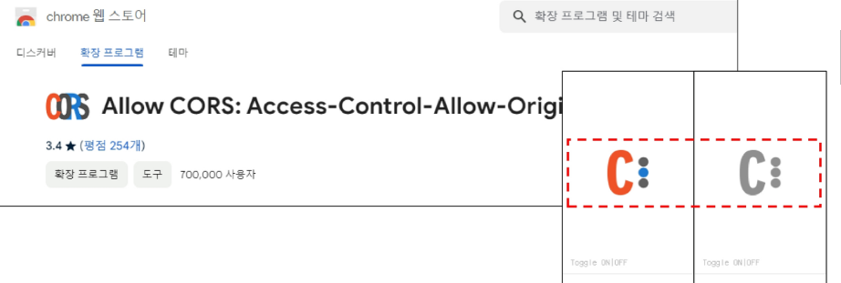

# 설정과 예외처리 

<table>
<thead><tr><th> <font> CORS (Cross-Origin Resource Sharing)</font> </th> </tr></thead>
<tr>
<td>
서로 다른 origin끼리 리소스를 공유할 수 있는 기능을 제공하는 표준이다.<br>
<font>sop: Same-Origin-Policy:</font> 같은 Origin에만 요청을 보낼 수 있다는 정책을 우회하기위한 표준기술이다.<br>
<font>cors,sop:</font> : <strong>웹브라우저가 제공</strong>하는 표준 기술이다.<hr>
<font>기본값으로는 sop가 적용되어있다.</font><br>
* Origin의 구성❓<br>
1. URI스키마(http://,https://) <br>
2. Hostname(Localhost,naver.com)<br>
3. Port(8080,18080 등)<br>

SOP는 웹 브라우저가 가진 기본적인 보안 정책입니다. <strong>"자기 출처(Origin)에서 가져온 스크립트만 신뢰</strong>하고,<br>
 <font>다른 출처의 데이터는 함부로 가져오지 못하게 막겠다"</font>는 규칙입니다. 해커가 <font>악성 스크립트를 심어서(xss)</font> 사용자 몰래 다른 서버로 <br>데이터를 빼돌리는 것을 막기 위한 것입니다.<br>

 상황: 화면을 담당하는 브라우저(Vue.js 등)가 http://localhost:18080에서 실행 중입니다.<br>

요청: 이 브라우저에서 회원가입이나 여행지 목록 조회를 위해 백엔드 서버인 http://localhost:8080으로 API 요청을 보냅니다.<br>

결과 (SOP 위반): 브라우저는 "어? 나는 18080 포트인데 왜 8080 포트 서버한테 데이터를 달라고 하지? 출처가 다르잖아! 위험할 수 있으니 차단해야지!" 하면서 에러를 뱉어냅니다.<hr>
서로 다른 출처끼리 통신을 아예 못하게 막아버리면, 프론트엔드 서버와 백엔드 서버를 분리해서 개발하는 환경 자체가 불가능합니다.<br>
서버가 허락해 준다면, 예외적으로 다른 출처라도 데이터를 주고받을 수 있게 해주자!"**라고 만든 합법적인 우회용 표준 기술이 바로 CORS입니다.<hr>
1. 전역(Global) 설정 (권장): WebMvcConfigurer 인터페이스를 구현하여 프로젝트 전체에 한 번에 CORS 규칙을 적용합니다.<br>
2. 컨트롤러에 애너테이션 붙이기<br>
3. Chrome Plugin을 설치해서 Browser에서의 동작을 (개발 테스트용)
</td>
</tr>
</table>

### Chrome Plugin


#  컨트롤러에 애너테이션 붙이기
```Java
@CrossOrigin(origins = "http://localhost:18080") // 이 출처의 요청은 허락함!
@RestController
public class TravelController { ... }
```

# WebConfiguration으로 컨트롤러에 걸쳐 설정하기(여러 컨트롤러에 걸쳐 설정해야한다면?)
```Java
@Configuration
public class WebConfiguration implements WebMvcConfigurer{

    @Override
    public void addCorsMappings(CorsRegistry registry) {
        registry.addMapping("/hello")
                .allowedOrigins("http://localhost:18080");
    }
}
```
addCorsMapping을 override해서 mapping해줄 경로와 허용해줄 origin을 설정해준다. 
모든 mapping을 허용해주려면 /hello말고, ./**로 작성한다.
특정 도메인만 허용 -> "*"

# CORS 플러그인만 사용하는 이유 
<table>
<thead><tr><th></th></tr> </thead>
<td>
<tr>
1. 백엔드 API가 아직 완성되지 않았을 때 <br>
상황: 화면 개발은 끝났는데, 데이터를 줄 백엔드 API가 아직 개발 중이거나 머지되지 않은 경우입니다.<br>
해결: 실제 서버 대신 목업(Mock) API나 외부 공공 API를 브라우저에서 직접 연결해 UI가 잘 작동하는지 <br>빠르게 확인합니다.
<hr>
2. 권한이 없는 외부 API를 테스트할 때<br>
상황: 날씨, 뉴스 등 외부 제공 API를 사용하려는데, 해당 서버에서 보안상 localhost 접근을 막아둔 경우입니다.<br>
해결: 내 로컬 개발 환경(localhost)을 외부 API 서버에 일일이 허용해달라고 요청할 수 없으므로,<br> 플러그인으로 브라우저의 보안 검사를 우회하여 데이터를 받아옵니다.
<hr>
3. API 응답 값의 구조(JSON)를 미리 확인하고 싶을 때<br>
상황: 코드에 적용하기 전, 브라우저 환경에서 실제 데이터가 어떻게 들어오는지 콘솔에 찍어보고 싶을 때입니다.<br>
해결: Postman 같은 도구도 있지만, 실제 자바스크립트 코드(fetch, axios 등) 상에서 발생하는 변수<br> 처리나 에러를 즉시 확인하기 위해 브라우저에서 직접 호출합니다. <br>
<hr>
💡 핵심 요약<br>
브라우저의 보안 정책(SOP) 때문에 원래는 프론트엔드 → 외부 API 직접 호출이 막히지만, 개발 편의를 위해<br> 임시로 그 빗장을 푸는 도구가 CORS 플러그인입니다.<br>
</td>
</tr>
</table>