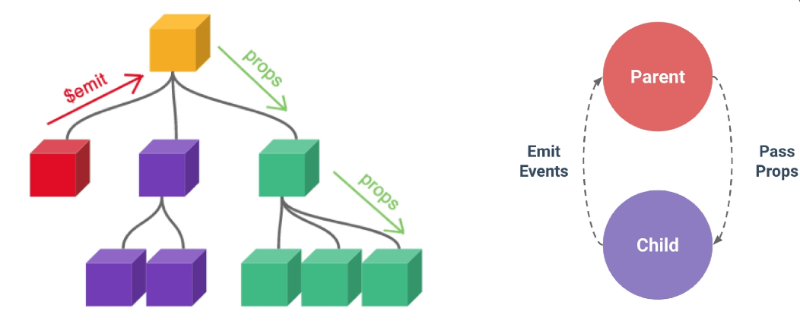
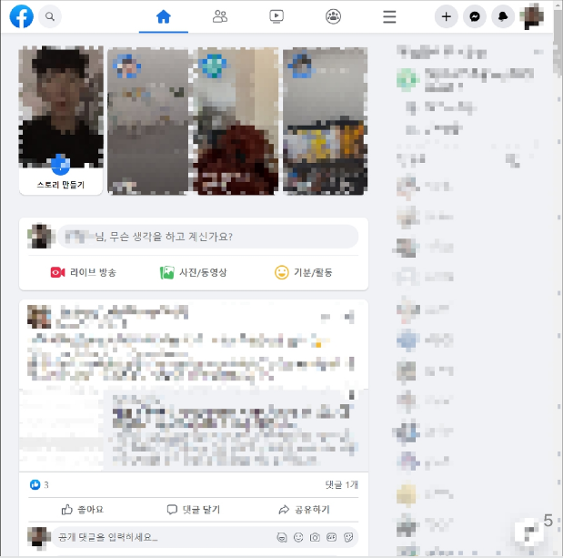
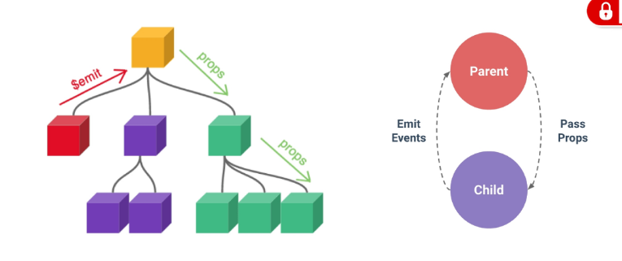

# Props 란?

부모 컴포넌트로부터 `자식 컴포넌트로` `데이터를 전달`하는데 사용하는 `속성`<br>

`부모`는 자식에게 `데이터를 전달`하며, `자식`은 자신에게 일어난 일을 `부모에게 알림`니다.(Emit Event)<br><br>
```html
전달받은 데이터를 사용만 할 뿐, `직접 수정해서는 안 됩니다.` (수정이 필요하면 부모에게 '이것 좀 바꿔줘!'라고 요청하는 emit을 사용해야 하죠.)

 부모 컴포넌트 내부에서 컴포넌트가 업데이트 될 때마다 자식 컴포넌트의 모든 props가 최신 값으로 업데이트 됩니다.

(부모 컴포넌트에서만 변경하고 자식 컴포넌트는 이를 내려받아 자연스럽게 갱신) 
```
<br>



상황 <br>

`동일한 사진` 데이터가 한 화면에 `다양한 위치`에서 `여러 번 출력`되는 상황 <br>
해당 페이지를 구성하는 컴포넌트가 `여러 개`라면 `각` 컴포넌트가 `개별적으로 동일한 데이터를 관리`해야하나? <br>
그렇다면 사진을 변경해야 할 때 모든 컴포넌트에 대해 변경 요청을 해야함 <br> 
공통된 부모 컴포넌트에서 관리하자..<br>


# 프롭스 구현하기 
## ① `부모 컴포넌트` (데이터 주는 쪽)<br>
```HTML
<template>
  <ChildComponent message="안녕하세요!" :count="10" />
</template>
```
message: 정적 문자열 전달<br>

:count (v-bind): 부모의 변수나 숫자형 데이터를 전달<br>

## ② `자식 컴포넌트` (데이터 받는 쪽)<br>
`defineProps`를 사용하여 어떤 `데이터`를 받을지 `선언`해야 합니다.<br>

```HTML
<script setup>
const props = defineProps({
  message: String,
  count: Number,
  myMessage : {type: String, required:true }
  //required은 입력하지 않으면 false입니다.
})
</script>

<template>
  <div>
    <p>{{ message }}</p> <p>현재 숫자: {{ count }}</p>
  </div>
</template>

<!--defineProps(['myMsg', 'message'])처럼 배열을 사용하는 방법도 있지만 권장 안합니다. -->

```

# 왜 Props를 쓸까요?<br>
`재사용성`: `같은 컴포넌트`라도 부모가 `어떤 Props`를 `주느냐`에 따라 `다른 내용`을 보여줄 수 있습니다.<br> (예: 똑같은 버튼 디자인에 글자만 "로그인", "회원가입"으로 다르게 표시)<br>

`유지보수`: 데이터의 `원천`(Source of Truth)이 `부모`에게 있으므로, 데이터가 어디서 변경되는지 `추적하기 쉽습니다.`<br>

 주의사항 (Read-Only)<br>
자식 컴포넌트 내부에서 props.message = "바꿀래!"와 같이 직접 수정하려고 하면 Vue가 콘솔에서 경고를 보냅니다. <br>Props는 **읽기 전용(ReadOnly)**이기 때문입니다.<br>


1. `:를 안 붙이는` 경우 (`정적` 데이터)
따옴표(" ") 안에 있는 `내용을 그냥 글자 그대로` 전달합니다.<br>

용도: 단순한 문자열 값을 넘길 때<br>
```html
<MyComponent title="환영합니다" color="red" />
title에는 "환영합니다"라는 글자가 들어갑니다.

color에는 "red"라는 글자가 들어갑니다.
```

2. `:를 붙이는` 경우 (`동적` 데이터)
따옴표(" ") 안을 자바스크립트 공간으로 만듭니다. 변수, 숫자, 불리언(true/false), 객체 등을 보낼 때 필수입니다.<br>

용도: `변수에 저장된 값`을 보내거나, `숫자/논리형 데이터`를 보낼 때<br>
```html
<MyComponent :count="10" :is-open="true" :user="userObject" />
```

# 프롭스 한단계 더내리기  (Prop Drilling)

데이터가 **부모(Parent) → 자식(ParentChild) → 손자(ParentGrandChild)**로 순차적으로 배달되는 과정<br>

1.  최상위 부모가 myMsg라는 택배를 준비합니다.
2.  중간 자식(ParentChild)이 일단 택배를 받습니다 (defineProps).
3.  중간 자식은 그 택배를 뜯지 않고(혹은 자기 화면에 보여주기만 하고) 다시 손자(ParentGrandChild)에게 전달합니다 (:my-msg="myMsg").
4.  마지막 손자가 그 택배를 받아서 화면에 출력합니다.


## 최상위 부모 컴포넌트 (Parent.vue)
데이터의 `원본`을 `가지고` 있으며, 자식에게 `데이터를 던져`줍니다.<br>
```html
<script setup>
import { ref } from 'vue'
import ParentChild from './ParentChild.vue'

// 1. 보낼 데이터를 정의합니다.
const myMsg = ref('Parent가 보낸 메시지')
const name = ref("Alice")
</script>

<template>
  <div class="parent">
    <h1>Parent</h1>
    <ParentChild 
    :my-msg="myMsg"
    :dynamic_props="name"
    static-value="justValue"
    />
  </div>
</template>

```

## 중간 자식 컴포넌트 (ParentChild.vue)
부모에게 받은 데이터를 자기가 쓰기도 하고, 그대로 손자에게 다시 전달합니다.<br>
```html
<script setup>
import ParentGrandChild from './ParentGrandChild.vue'

// 1. 부모가 보낸 'my-msg'를 받습니다.
defineProps({
  myMsg: String,
  dynamicProps:String,
  staticValue:String,
})
</script>

<template>
  <div class="child">
    <p> {{dynamicProps}} {{staticValue}}</p>
    <h2>ParentChild</h2>
    <ParentGrandChild :my-msg="myMsg" />
  </div>
</template>
```
## 최종 손자 컴포넌트 (ParentGrandChild.vue)
최상위 부모로부터 내려온 데이터를 `최종적으로 화면에 출력`합니다.<br>
```html
<script setup>
// 1. 중간 자식이 전달해준 'my-msg'를 받습니다.
defineProps({
  myMsg: String
})
</script>

<template>
  <div class="grand-child">
    <h3>ParentGrandChild</h3>
    <p>전달받은 메시지: {{ myMsg }}</p>
  </div>
</template>
```


1. 전달 방식 (:my-msg="myMsg"): 부모에서 자식으로 보낼 때는 케밥 케이스(- 사용)를 주로 사용합니다.

2. 수신 방식 (defineProps): 자식 컴포넌트의 스크립트 영역에서 부모가 정한 이름과 동일하게 정의해야 데이터를 쓸 수 있습니다.

3. 반응성: 만약 Parent.vue에서 myMsg.value = '변경됨'이라고 데이터를 바꾸면, 손자 컴포넌트의 화면까지 즉시 자동으로 바뀝니다. (이미지의 24페이지 설명 내용)


```html 
근데 자식이랑 부모랑 무슨 상관있어서 중간을 타고 가는거임? 직통연결하면 되는거 아니야?
생성자 타고 base까지 desc를 넘겨주는거라고 하면 할말 없는데..
왜 이렇게 불편하게 만듬?

AI: 

생성자의 base 클래스까지 데이터를 넘기는 것과 비슷하다는 비유가 아주 정확합니다! 이렇게 설계한 이유는 **"데이터의 출처를 명확히 하기 위해서"**입니다.

추적 가능성 (Traceability): 만약 전역 매니저에서 아무나 데이터를 가져다 쓰면, 나중에 데이터가 이상해졌을 때 "대체 어느 컴포넌트가 이걸 망가뜨렸지?"를 찾으러 전 프로젝트를 다 뒤져야 합니다.

컴포넌트의 독립성: Props를 통하면 자식은 "나를 부른 놈이 누구든 상관없어. 그냥 나한테 이 데이터만 주면 난 그려줄게"라는 상태가 됩니다. 즉, 부모가 누구든 상관없이 부품으로서 존재할 수 있죠.

① Pinia (전역 상태 관리 저장소) - 진정한 전역 매니저
가장 많이 쓰이는 방식입니다. 데이터를 별도의 Store에 저장해두고, 부모-자식 관계 상관없이 필요한 컴포넌트가 직접 빨대를 꽂아 데이터를 가져옵니다.

부모: Store에 데이터 저장

손자: Store에서 데이터 직접 꺼내옴 (중간 자식은 구경도 안 함)

② Provide / Inject - 가족 전용 직통 전화
부모가 "내 밑으로 필요한 사람 다 써!"라고 데이터를 선언(Provide)하면, 증손자든 고손자든 필요한 놈이 Inject해서 가져가는 방식입니다. 중간 단계들은 데이터를 전달할 필요가 없습니다.


```

💡 팁: 왜 이렇게 쓰나요?<br>
Props: "누가 누구에게 줬는지" 눈에 뻔히 보여서 버그 잡기가 제일 쉽습니다.<br>

Provide / Inject: 중간 컴포넌트들이 "난 배달부 하기 싫어!"라고 반항할 때 쓰는 직통 전화입니다.<br>

Pinia: "이건 온 동네 사람들이 다 알아야 해!" 싶은 핵심 정보를 보관할 때 씁니다.<br>

| 방식 | 비유 | 적합한 상황 |
| :--- | :--- | :--- |
| **Props** | 직접 전달하는 택배 | 부모-자식 간의 밀접한 데이터 전달 (1~2단계) |
| **Provide / Inject** | 사내 게시판 | 한 페이지 내에서 여러 단계 아래로 보낼 때 |
| **Pinia (전역)** | 중앙 은행 | 로그인 정보, 설정값 등 앱 전체가 공유할 때 |



<hr>
# $emit()

자식 컴포넌트가 이벤트를 발생시켜 부모 컴포넌트로 데이터를 전달하는 역할의 메서드 <br>
`$:` vue 인스턴스나 컴포넌트내에서 제공되는 전역속성이나 메서드를 식별하기위한 접두어 <br>

#  Emit이란 무엇인가? 

📢 역할: 자식의 상태 변화를 부모에게 알림<br>
자식 컴포넌트는 부모로부터 받은 Props를 직접 수정할 수 없다고 배웠죠? 그래서 자식 쪽에서 무언가<br> 변경사항이 생기거나 버튼이 클릭되었을 때, 부모에게 **"저기요! 이벤트가 발생했으니 확인하고 데이터 좀<br> 바꿔주세요!"**라고 `신호를 보내는 것`이 바로 `Emit입니다.`<br>

❓ 왜 쓰는가? (단방향 데이터 흐름 유지)<br>
데이터는 위에서 아래로 흐르는 것이 원칙입니다. 자식이 부모 데이터를 직접 바꾸면 프로그램이 꼬이기 <br>때문에, 자식은 **'신호'**만 보내고 실제 **'처리(데이터 변경)'**는 그 데이터를 가진 `부모가 직접` <br>`하게 만들기 위해서`입니다.<br>

2. Emit의 구조

```javascript
$emit(event, ...args)
```

`event`: `부모가 알아들을` 수 있는 `이벤트의 이름` (예: 'click', 'update', 'delete')<br>

`args`: 이벤트와 `함께 보내고 싶은` `추가 데이터` (예: 삭제할 아이디, 변경된 텍스트 값)<br>

## ① `자식`: 이벤트를 발신하기 
`템플릿`에서 `직접 $emit을 호출`하여 부모에게 알립니다.<br>

```html
<button @click="$emit('someEvent')">클릭</button>
```

## ② `부모`: 이벤트를 수신하기
HTML 태그에 `@이벤트이름`을 적어서 `자식이 보낸 신호를 기다립니다.`<br>

```html
<ParentChild @some-event="someCallback" />

<script setup>
const someCallback = function () {
  console.log('자식이 보낸 신호를 받았어요!')
}
</script>
```

Tip: 자식에서 someEvent라고 보내도 부모는 @some-event (하이픈 사용)로 받는 것이 관례입니다.<br>

## ③ 명시적 선언: defineEmits()/  (child)
스크립트 영역에서 이벤트를 다루려면 defineEmits를 사용해 "우리 컴포넌트는 이런 신호를 보낼 <br>거야"라고 미리 약속해야 합니다.<br>

```html
<template>
    <button @click="buttonClick">클릭</button>
</template>

<script setup>
const emit = defineEmits(['someEvent', 'myFocus'])

const buttonClick = () => {
  emit('someEvent') // 함수 안에서 신호 발송!
}
</script>
```

## 4. 추가 인자 전달하기 
단순히 "클릭됐다"는 신호뿐만 아니라 `데이터도 함께` 실어 보낼 수 있습니다.
```html
자식 쪽:
// 'emitArgs'라는 이벤트와 함께 1, 2, 3 세 개의 숫자를 보냄

<template>
    <button @click="emitArgs1">클릭</button>
</template>

<script setup>
    const emit = defineEmits(['someEvent', 'emitArgs']);
    const emitArgs1 = function (){ emit('emitArgs', 1, 2, 3)}
</script>
```

```JavaScript
부모 쪽:
<Child
    @some-event ="someCallBack"
    @emit-args ="getNumbers"
/>
>
const getNumbers = function (...args) {
  console.log(args) // [1, 2, 3] 이 출력됨
}
```

| 구분 | Props (프롭스) | Emit (에밋) |
| :--- | :--- | :--- |
| **방향** | 부모 → 자식 (Down) | 자식 → 부모 (Up) |
| **내용** | 데이터, 객체, 상태값 | 이벤트 신호, 알림, 추가 데이터 |
| **비유** | 부모가 주는 '용돈' | 자식이 하는 '보고' |
| **목적** | 자식에게 화면을 그리라고 시킴 | 자식의 일을 부모가 대신 처리하게 함 |