# computed() 

미리 계산된 속성을 사용하여 템플릿에서 표현식을 단순하게 하고, 불필요한 반복 연산을 줄이기 위한 함수<br>

* 정의: 반응성 데이터(ref 등)를 기반으로 새로운 값을 계산해내는 함수입니다.

`캐싱(Caching):`  의존하는 반응형 데이터가 변경되지 않으면, 이전에 계산된 결과(캐싱된 값)를 즉시 반환하는 성능 최적화 기능입니다.<br>
매번 함수를 재실행하는 메서드(Methods)와 달리, 종속된 데이터가 바뀔 때만 재계산하여 불필요한 연산을 줄입니다. <br>

```html
<h2>남은 할 일</h2>
<p>{{ restOfTodos }}</p>
<script>
...
const { createApp, ref, computed } = Vue

// todos가 ref로 선언되어 있다고 가정할 때
const restOfTodos = computed(() => {
  return todos.value.length > 0 ? '아직 남았다' : '퇴근!'
})
...
</script>

computed ref: computed가 반환하는 값은 읽기 전용의 특별한 ref 객체입니다.

JS에서: restOfTodos.value로 값을 읽습니다.

템플릿에서: 일반 ref와 마찬가지로 .value 없이 {{ restOfTodos }}로 바로 씁니다.

의존성 추적 (Dependency Tracking): computed 내부에서 사용된 반응형 데이터(todos)를 자동으로 감시합니다.

재평가(Re-evaluation) 시점: 의존하고 있는 데이터가 변할 때만 함수를 다시 실행합니다.

todos가 변하면 업데이트됨.

todos와 상관없는 다른 값이 변하면 절대 다시 계산하지 않음.


```

왜 computed를 써야 할까요?<br>
todos.value.length가 바뀔 때마다 restOfTodos는 자동으로 다시 계산됩니다.<br>
하지만 todos와 상관없는 다른 변수가 바뀔 때는 이 계산 로직이 실행되지 않습니다.<br>

# v-if :
표현식 값의 t/f를 기반으로 요소를 조건부로 렌더링<br>
v-else directive를 사용하여 v-if에 대한 else 블록을 나타낼 수 있습니다.<br>


```html
<p v-if="isSeen">true일 때 보여요</p>
<p v-else>false일때 보여요</p>
<button @click= "isSeen = !isSeen">토글</button>

<script>
const isSeen = ref(true)
</script>
``` 
v-else-if = "조건 식"을 통해서 3개 이상의 경우에 대해서도 표현 가능 <br>
(모드 구분 및 리스트를 통해 다른 뷰 템플릿을 보여주느 것이 가능 ) <br>

`template요소에 v-if 적용`<br>

v-if는 directive이기 때문에 단일 요소에만 연결이 가능합니다. <br>
이 경우 template 요소에 v-if를 사용하여 하나 이상의 요소에 적용이 가능합니다. 

```html 
<template v-if="name===Cathy">
<div>Cathy입니다</div>
<div>나이는 30살 입니다.</div>
</template>
```
html&lt;template&gt;element

* `페이지가 로드`될 때 `렌더링 되지 않지만` `Javascript를 사용`하여 `나중에` <br>
문서에서 `사용`할 수 있도록 하는 HTML을 보유하기 위한 메커니즘 <br>
* 보이지 않는 `Wrapper 역할`
<hr>

# `v-for`

`소스 데이터`를 기반으로 요소 혹은` 템플릿 블록`을 `여러 번 렌더링` 랍니다,<br>

(Array, Object,number,string,iterable)<br>
`v-for`는  `alias in expression`형식의 특수 구문을 사용하여<br>
 반복되는 현재 요소에 별칭을 제공합니다.<br>

 ```html
<div v-for ="item in items">
    {{item.text}}}
</div>
<div v-for ="(item, index) in items"></div>
<div v-for= "value in object"></div>
<div v-for="(value, key) in object"> </div>
<div v-for= "(value, key,index) in object"></div>
인덱스 ( 객체에서는 키) 에 대한 별칭을 지정할 수 있다.

`중첩된 for문`, 각 v-for 범위는 상위 범위에 접근할 수 있음. 

<ul v-for="item in myInfo">
    <li v-for=" friend in friends">
            {{item.name}} - {{friend}}
    </li>
</ul>
key는 반드시 각 요소에 대한 고유한 값을 나타낼 수 있는 식별자여야 한다.
<div v-for =" item in items "  :key= item.id>
<!-- Content -->
</div>

---------------
<div v-for="(item, index) in myArr">
{{index}}/ {{item}}</div>

<script>
    const myArr = ref([
        {name : "Acice" ,age : 20} ,
        {name : "Bella" ,age : 21} 
        ])
    const myInfo =ref([
        {name:"Alice", age:20, friends:["Bella","Cathy", "Dan"]},
        {name:"Bella", age:21, friends:["Alice","Cathy"]}

    ])
    let id = 0 ;
    const items = ref([
        {id : id++,name :"Alice"},
        {id : id++,name :"Bella"},
    ])

 </script>

 ```
반드시 v-for과 key를 함께 사용한다. ( 내부 컴포넌트의 상태를 일관되게 유지)<br>
데이터의 예측 가능한 행동을 유지( Vue 내부 동작 관련)<br>


동일한 요소에 v-for, v-if를 함께 사용하지 않는 것이 좋다 . <br>

동일한 요소에서 `v-if가 v-for보다 우선순위가 더 높다.`<br>
v-if조건은 v-for 범위에 접근할 수 있습니다.<br>

문제 상황 1 : 데이터중 이미 처리한 (isComplete === true)todo만 처리하기
```html
문제의 코드
<ul>
    <li v-for="todo in todos" v-if="todo.isComplete":key ="todo.id" >
        나 우선순위가 if가 더 높아서 for문 안돌게.
    </li>
</ul>

해결 v-for과 template 요소를 사용하여 v-if를 중첩
<ul>
    <template v-for="todo in todos" :key ="todo.id">
        <li v-if="todo.isComplete">
            {{todo.name}}
        </li>
    </template>
</ul>

<script>
let id = 0 
const toos = reg([

    {id:id++, name :"복습",isComplete:true},
    {id:id++, name :"예습",isComplete:true},
    {id:id++, name :"저녁식사",isComplete:true},
    {id:id++, name :"노래방",isComplete:true},
])

</script>

```
<hr>

# watch()<br>
`반응형 데이터를 관찰`하고, 관찰하는 `데이터가 변경`되면 `콜백함수`를 호출<br>

watch 구조

watch(variavle, (newValue, oldValue))=>{ 
    //do something
}

variable <br>
- 관찰하는 변수 <br>

newValue <br>
- 관찰하는 변수가 변화한 값<br>
- 콜백함수의 첫 번째 인자<br>

oldValue <br>
-콜백함수의 두번째 인자. 

`관찰하는 변수`에 `변화`가 생겼을 때 `기본 동작` 확인하기.
```html
<button @click="count++">Add 1</Button>
<p> Count : {{count}}</p>

<input v-model="message">
<p>Message Length {{messageLength}}</p>
<script>
    const count =ref(0);
    const countWatch = watch(count, (newValue, oldValue)=>{
    consle.log(`newValue:${newValue}, oldValue:${oldValue}`)
    })

    const message=ref("")
    const messageLength = ref(0);
    const messageWatch = watch(message, (newValue, oldValue)=>{
        messageLength.value = newValue.length
    })
</script>

```
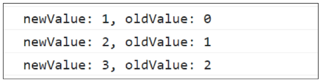

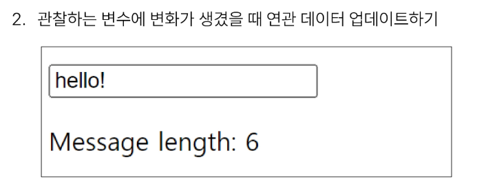

<hr>

<h2>Computed와 Watchers</h2>

<table>
    <thead>
        <tr>
            <th></th>
            <th>Computed</th>
            <th>Watchers</th>
        </tr>
    </thead>
    <tbody>
        <tr>
            <th>공통점</th>
            <td colspan="2">데이터의 변화를 감지하고 처리</td>
        </tr>
        <tr>
            <th>동작</th>
            <td>의존하는 데이터 속성의 계산된 값을 반환</td>
            <td>특정 데이터 속성의 변화를<br>관찰하고 작업을 수행</td>
        </tr>
        <tr>
            <th>사용 목적</th>
            <td>템플릿 내에서 사용되는 데이터 연산용</td>
            <td>데이터 변경에 따른 특정 작업 처리용</td>
        </tr>
        <tr>
            <th>사용 예시</th>
            <td>연산 된 길이, 필터링 된 목록 계산 등</td>
            <td>비동기 API 요청, 연관 데이터 업데이트 등</td>
        </tr>
    </tbody>
</table>
Computed와 watch 모두 의존(관찰)하는 원본 데이터를 직접 변경하지 않는다.<br>

<hr>

# Lifecycle Hooks 

Vue 인스턴스의 `생애주기` 동안 `특정 시점`에 `실행`되는 함수 <br>

개발자가 `특정 단계`에서 의도하는 로직이 실행될 수 있도록 한다. <br>


```html
<script>

    1. Vue컴포넌트 인스턴스가 초기 렌더링 및 `DOM 요소 생성이 완료된 후` 특정 로직을 수행하기.
    const {createApp, ref, onMounted, computed}=Vue;
    createApp({
        setup(){
            onMounted( ()=>{
                console.log('mounted');
            })
            return {x...};    
        } 
    });

2. 반응형 데이터의 변경으로 인해 컴포넌트의 `DOM이 업데이트된 후` 특정 로직을 수행하기.
    <button @click ="count++">Add 1 </button>
    <p>Count:{{count}}</p>
    <p>{{message}}</p>
    const {createApp, ref, onMounted, computed}=Vue;
    createApp({
        setup(){
            const count = ref(0);
            const message = ref(null);
            onUpdated(()=>{
                message.value= 'updated!';
            })
            onMounted( ()=>{
                console.log('mounted');
            })
            return {x...};    
        } 
    });

</script>

```
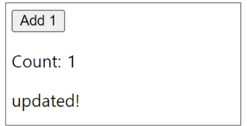

Lifecycle Hooks 특징 <br>
Vue는 Lifecycle Hooks에 등록된 `콜백 함수들`을 `인스턴스와 자동으로 연결`함  <br>

이렇게 동작하려면 hooks 함수들은 반드시 `동기적으로 작성`되어야 함 <br>

인스턴스 생애 주기의 여러 단계에서 호출되는 다른 hooks도 있으며, 가장 일반적으로 사용되는 것은  <br>`onMounted, onUpdated, onUnmounted` <br>

onUpdated 에서 컴포넌트의 상태를 변경하면 무한루프가 발생할 수 있으므로, `컴포넌트 상태 변경 금지`. <br>

<a href="https://vuejs.org/api/composition-api-lifecycle.html">라이프사이클 홈피</a>

```html
Lifecycle Hooks
onMounted : Vue 인스턴스가 DOM에 마운트 된 후에 호출
초기 DOM을 다루거나, API를 호출하거나 DOM을 조작한다.

onUpdated : DOM이 업데이트 된 후 호출
데이터 변경이후의 추가작업을 수행한다.

onUnmounted : Vue 인스턴스가 파괴된 후 호출
모든 데이터 바인딩, 이벤트 리스너 해제된 이후에 호출. 마지막 처리작업 수행
```

# `Single-File Component(SFC)`

컴포넌트의 템플릿, 로직 및 스타일을 하나의 파일로 묶어낸 특수한 파일 형식`(*.vue 파일)`

이미지에 있는 텍스트와 코드를 추출한 내용입니다.

Vue SFC는 HTML, CSS 및 JavaScript 3개를 하나로 합친 것

&lt;script&gt;, &lt;template&gt; 및 &lt;style&gt;블록은 `하나의 파일`에서 컴포넌트의 `뷰, 로직 및 스타일`을 `캡슐화`하고 배치


# `<Template>` <br>

각 *.vue 파일은 최상위 `<template>` 블록을 `하나만` 포함할 수 잇음 <br> 

# `<style scope>` <br>

*.vue 파일에는 여러 `<style>`태그가 포함될 수 있음<br>
 scope가 지정되면 css는 혀재 컴포넌트에만 적용<br>


```html
<script setup>
import { ref } from 'vue'

const msg = ref('Hello World!')
</script>

<template>
  <div class="greeting">{{ msg }}</div>
</template>

<style scoped>
.greeting {
  color: red;
}
</style>
```

<h2>Vue SFC 언어 블록 상세 개요</h2>

<table>
    <thead>
        <tr>
            <th>구분</th>
            <th>설명 및 주요 특징</th>
        </tr>
    </thead>
    <tbody>
        <tr>
            <th>&lt;script setup&gt;</th>
            <td>
                <ul>
                    <li>각 <span class="code-inline">*.vue</span> 파일은 하나의 <span class="code-inline">&lt;script setup&gt;</span> 블록만 포함할 수 있음 (일반 <span class="code-inline">&lt;script&gt;</span> 제외)</li>
                    <li>컴포넌트의 <span class="code-inline">setup()</span> 함수로 사용되며, 컴포넌트의 각 인스턴스에 대해 실행됨</li>
                </ul>
            </td>
        </tr>
        <tr>
            <th>&lt;template&gt;</th>
            <td>
                <ul>
                    <li>각 <span class="code-inline">*.vue</span> 파일은 최상위 <span class="code-inline">&lt;template&gt;</span> 블록을 하나만 포함할 수 있음</li>
                </ul>
            </td>
        </tr>
        <tr>
            <th>&lt;style scoped&gt;</th>
            <td>
                <ul>
                    <li><span class="code-inline">*.vue</span> 파일에는 여러 개의 <span class="code-inline">&lt;style&gt;</span> 태그가 포함될 수 있음</li>
                    <li><span class="code-inline">scoped</span> 속성이 지정되면 CSS는 현재 컴포넌트의 요소에만 제한적으로 적용됨</li>
                </ul>
            </td>
        </tr>
    </tbody>
</table>

<hr>
컴포넌트 사용하기<br>
실시간 코드 테스트: https://play.vuejs.org/ 에서 별도의 설정 없이 Vue 컴포넌트 코드를 작성하고 결과를 미리 볼 수 있습니다.<br>

컴파일 및 빌드: `Vue SFC`(Single File Component)는 `브라우저가 직접 이해할 수 없`으므로,<br> `컴파일러를 통해 변환된 후 빌드 과정`을 거쳐야 합니다.<br>

빌드 도구: 실제 프로젝트 환경에서는 일반적으로 `SFC 컴파일러를 포함한 Vite`와 같은 공식 빌드 도구를 <br>사용하여 개발 및 배포를 진행합니다.<br>

요약 및 팁
Vue의 SFC 방식은 개발자에게는 직관적인 구조를 제공하지만, 최종적으로는 브라우저가 읽을 수 있는 표준 <br>`JavaScript와 CSS로 변환되는 과정`이 `필요`합니다. 이를 위해 `Vite`는 매우 빠른 `핫 모듈 교체`<br>(HMR) 기능을 제공하여 현대적인 Vue 개발의 표준이 되었습니다.<br>

`Node.js의 역할`<br>

JavaScript의 실행 환경 확장<br>

기존에 브라우저 안에서만 동작할 수 있었던 JavaScript를 브라우저가 아닌 `서버 측에서도 실행`할 수 있게 함<br>

이를 통해 프론트엔드와 백엔드에서 동일한 언어로 개발할 수 있는 환경이 조성됨<br>
<hr>
NPM(Node Package Manager) 생태계<br>

`NPM`을 활용해 수많은 `오픈 소스 패키지`와 `라이브러리`를` 제공<br>

개발자들이 손쉽게 코드를 공유하고 재사용할 수 있게 하여 개발 생산성을 높임<br>

`Node.js`는 단순히 서버를 만드는 도구를 넘어,<br> 앞서 살펴본 `Vue SFC의 빌드 및 컴파일 과정`(Vite 등)을 `처리`하는 핵심 엔진 역할도 수행합니다.<br>

<hr>

`Vite 프로젝트` 생성하기<br>
프론트 엔드 개발 도구 <br>
```cmd
 npm create vue@latest
 
```
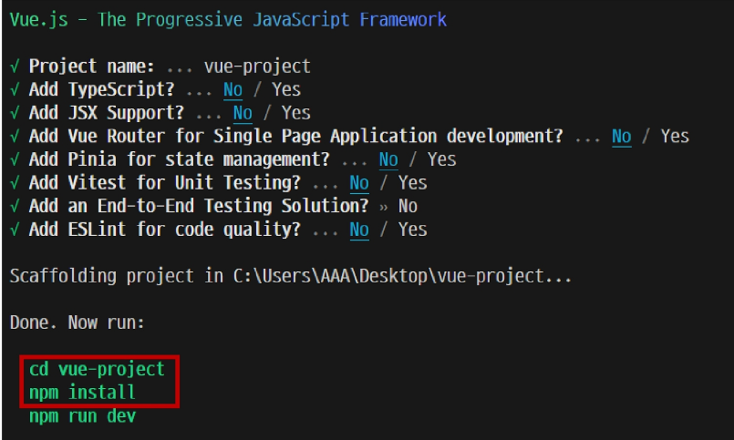
```cmd
npm run dev
```
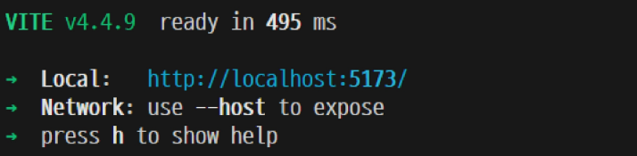

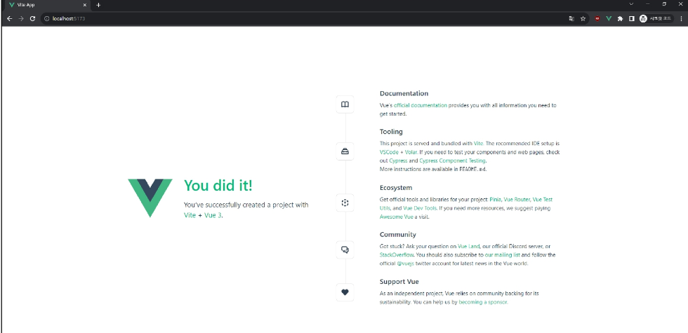


<hr>

# `node_modules`

1. Node.js 프로젝트에서 사용되는 외부 패키지들이 저장되는 디렉토리<br>
2. 프로젝트의 의존성 모듈을 저장하고 관리하는 공간<br>
3. 프로젝트가 실행될 때 필요한 라이브러리와 패키지들을 포함 <br>
4. .gitignore에 작성됨<br>

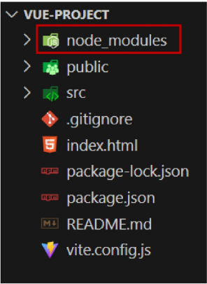

<hr>

# `Packge-lock.json`

패키지들의 실제 설치 버전,의존성 관계, 하위 패키지 등을 포함하여 
패키지 설치에 필요한 모든 정보를 포함<br>

패키지들의 `정확한 버전을 보장`하여, `여러 개발자가 협업`하거나 서버 환경에서 `일관성있는 의존성`을 유지하는데 도움을 줌. <br>

`npm install` 명령을 통해 `패키지를 설치`할 때, `명시된 버전과 의존성을 기반으로 설치`.<br>

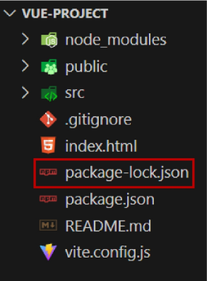
<hr>

# `package.json`

프로젝트의 매타 정보 및 의존성 패키지 목록 포함<br>

프로젝트의 이름 ,버전 ,작성자 ,라이선스 같은 메타 정보 포함<br>

package-lock.json과 함께 `프로젝트의 의존성을 관리`하고, `버전 충돌 및 일관성을 유지`합니다.
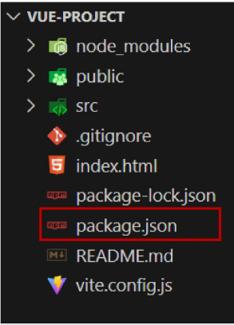
<hr>

# public 디렉토리
주로 정적 파일을 위치시킨다.<br>
- 소스코드에서 참조되지 않는 
-항상 같은 이름을 갖는
- import할 필요 없는 
* 항상 root 절대 경로를 사용하여 참조 
- public/icn.png는 소스코드에서 /icon.png로 참조할 수 있음
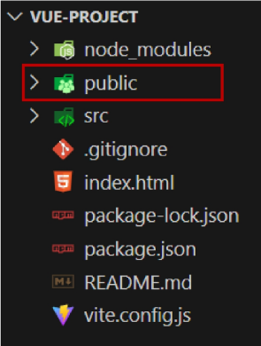

# src 디렉토리 

프로젝트의 주요 소스 코드를 포함하는 곳 <br>

컴포넌트, 스타일 , 라우팅 등 프로젝트의 핵심 코드를 관리 <br>
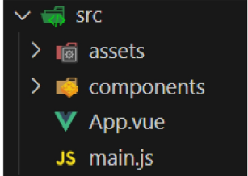

# src/assets 

프로젝트 내에서 사용되는 자원( 이미지, 폰트, 스타일 시트 등)을 관리<br>

컴포넌트 자체에서 참조하는 내부 파일을 저장하는데 사용 <br>

컴포넌트가 아닌 곳에서는 `public 디렉토리`에 `위치한 파일을 사용` <br>

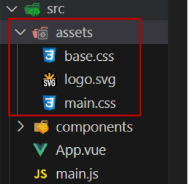

# src/components 

Vue 컴포넌트들을 작성하는 곳 <br>

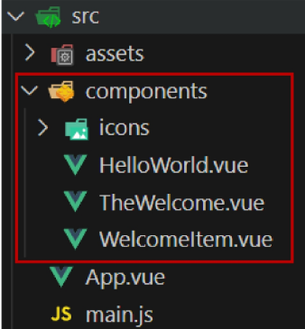

# src/App.vue

- vue 앱의 최상위 Root 컴포넌트 
- 다른 하위 컴포넌트들을 포함
- 애플리케이션 전체의 레이아웃과 공통적인 요소를 정의

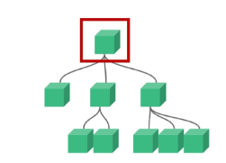
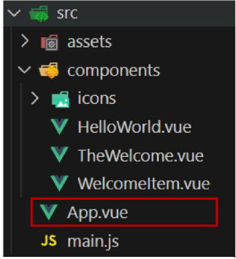

# src/main.js

- Vue 인스턴스를 생성하고 애플리케이션을 초기화
-`필요한 라이브러리를 import`하고 `전역 설정`을 수행


# index.html
Vue 앱의 기본 HTML 파일<br>

`앱의 진입점` (entry point)<br>

`Root 컴포넌트`인 App.vue가 해당 페이지에 `마운트(mount) 됨.` Vue 앱이 SPA인 이유<br>

필요한 스타일 시트, 스크립트 등의 외부 리소스를 로드 할 수 있음 (ex. bootstrap CDN)<br>


# 컴포넌트 사용하기

```html
<!--App.vue -->

<template>
  <h1>App.vue</h1>
  <MyComponent />
</template>

<script setup>
// import MyComponent from './components/MyComponent.vue'
import MyComponent from '@/components/MyComponent.vue'
</script>
```
App(부모) - MyComponent(자식) 관계 형성<br>
@ = src/를 뜻하는 약어입니다<br>


```html

<!--MyComponent.vue -->
<template>
  <div>
    <h2>MyComponent</h2>
    <MyComponentItem />
    <MyComponentItem />
    <MyComponentItem />
  </div>
</template>

<script setup>
import MyComponentItem from '@/components/MyComponentItem.vue'
</script>

```

```html

<!--MyComponentItem.vue -->
<template>
  <p>MyComponentItem</p>
</template>
```

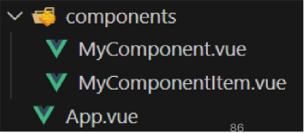

# Composition API
import해서 가져온 API 함수들을 사용하여 컴포넌트의 로직을 정의<br>

Vue3 에서의 권장 방식<br>

```html
<template>
  <button @click="increment">{{ count }}</button>
</template>

<script setup>
import { ref, onMounted } from 'vue'

const count = ref(0)

function increment() {
  count.value++
}

onMounted(() => {
  console.log(`숫자 세기의 초기값은 ${ count.value }`)
})
</script>
```

# Option API
data, methods 및 mounted 같은 객체를 사용하여 컴포넌트의 로직을 정의<br>

Vue2 에서의 작성 방식<br>
```html
<template>
  <button @click="increment">{{ count }}</button>
</template>

<script>
export default {
  data() {
    return {
      count: 0
    }
  },

  methods: {
    increment() {
      this.count++
    }
  },

  mounted() {
    console.log(`숫자 세기의 초기값은 ${ this.count }`)
  }
}
</script>
```

- Composition API + SFC

- 규모가 있는 앱의 전체를 구축하려는 경우

- Option API

- 빌드 도구를 사용하지 않거나 복잡성이 낮은 프로젝트에서 사용하려는 경우