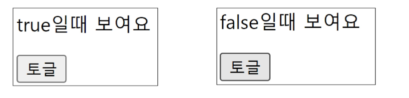

# computed() 

미리 계산된 속성을 사용하여 템플릿에서 표현식을 단순하게 하고, 불필요한 반복 연산을 줄이기 위한 함수<br>

* 정의: 반응성 데이터(ref 등)를 기반으로 새로운 값을 계산해내는 함수입니다.

`캐싱(Caching):`  의존하는 반응형 데이터가 변경되지 않으면, 이전에 계산된 결과(캐싱된 값)를 즉시 반환하는 성능 최적화 기능입니다.<br>
매번 함수를 재실행하는 메서드(Methods)와 달리, 종속된 데이터가 바뀔 때만 재계산하여 불필요한 연산을 줄입니다. <br>

```html
<h2>남은 할 일</h2>
<p>{{ restOfTodos }}</p>
<script>
...
const { createApp, ref, computed } = Vue

// todos가 ref로 선언되어 있다고 가정할 때
const restOfTodos = computed(() => {
  return todos.value.length > 0 ? '아직 남았다' : '퇴근!'
})
...
</script>

computed ref: computed가 반환하는 값은 읽기 전용의 특별한 ref 객체입니다.

JS에서: restOfTodos.value로 값을 읽습니다.

템플릿에서: 일반 ref와 마찬가지로 .value 없이 {{ restOfTodos }}로 바로 씁니다.

의존성 추적 (Dependency Tracking): computed 내부에서 사용된 반응형 데이터(todos)를 자동으로 감시합니다.

재평가(Re-evaluation) 시점: 의존하고 있는 데이터가 변할 때만 함수를 다시 실행합니다.

todos가 변하면 업데이트됨.

todos와 상관없는 다른 값이 변하면 절대 다시 계산하지 않음.


```

왜 computed를 써야 할까요?<br>
todos.value.length가 바뀔 때마다 restOfTodos는 자동으로 다시 계산됩니다.<br>
하지만 todos와 상관없는 다른 변수가 바뀔 때는 이 계산 로직이 실행되지 않습니다.<br>

# v-if :
표현식 값의 t/f를 기반으로 요소를 조건부로 렌더링<br>
v-else directive를 사용하여 v-if에 대한 else 블록을 나타낼 수 있습니다.<br>


```html
<p v-if="isSeen">true일 때 보여요</p>
<p v-else>false일때 보여요</p>
<button @click= "isSeen = !isSeen">토글</button>

<script>
const isSeen = ref(true)
</script>
``` 
v-else-if = "조건 식"을 통해서 3개 이상의 경우에 대해서도 표현 가능 <br>
(모드 구분 및 리스트를 통해 다른 뷰 템플릿을 보여주느 것이 가능 ) <br>

`template요소에 v-if 적용`<br>

v-if는 directive이기 때문에 단일 요소에만 연결이 가능합니다. <br>
이 경우 template 요소에 v-if를 사용하여 하나 이상의 요소에 적용이 가능합니다. 

```html 
<template v-if="name===Cathy">
<div>Cathy입니다</div>
<div>나이는 30살 입니다.</div>
</template>
```
html&lt;template&gt;element

페이지가 로드될 때 렌더링 되지 않지만 Javascript를 사용하여 나중에 <br>
문서에서 사용할 수 있도록 하는 HTML을 보유하기 위한 메커니즘 <br>
보이지 않는 `Wrapper 역할`
<hr>

# `v-for`

소스 데이터를 기반으로 요소 혹은 템플릿 블록을 여러번 렌더링 랍니다,<br>

(Array, Object,number,string,iterable)<br>
v-for는  `alias in expression`형식의 특수 구문을 사용하여<br>
 반복되는 현재 요소에 별칭을 제공합니다.<br>

 ```html
<div v-for ="item in items">
    {{item.text}}}
</div>
<div v-for ="(item, index) in items"></div>
<div v-for= "value in object"></div>
<div v-for="(value, key) in object"> </div>
<div v-for= "(value, key,index) in object"></div>
인덱스 ( 객체에서는 키) 에 대한 별칭을 지정할 수 있다.

---------------
<div v-for="(item, index) in myArr">
{{index}}/ {{item}}</div>

<script>
    const myArr = ref([
        {name : "Acice" ,age : 20} ,
        {name : "Bella" ,age : 21} 
        ])


 </script>

 ```
동일한 요소에 v-for, v-if를 함께 사용하지 않는 것이 좋다 . 

동일한 요소에 v-if, v0for보다 우선순위가 더 높다 .
v-if조건은 v-for 범위에 접그ㄴ할 수 있습니다.