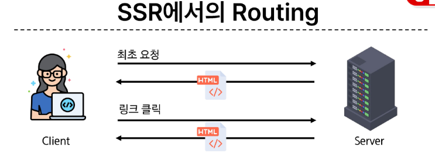
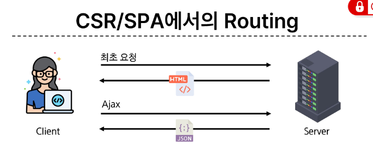
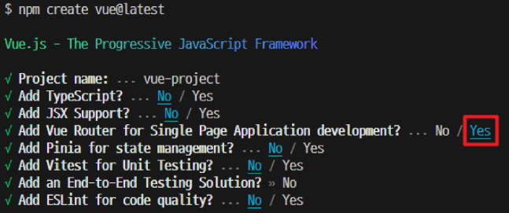
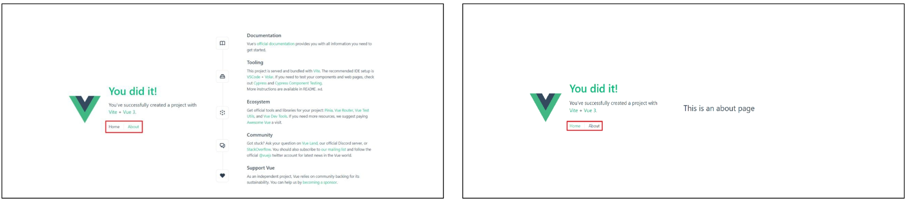
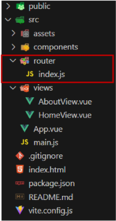
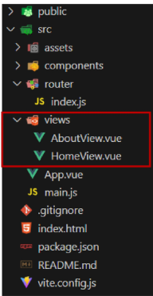

# Routing이란 무엇인가? 

1. 사용자가 요청한 URL(자원의 위치,주소)에 따라 알맞은 화면을 연결하여 보여주는 기술입니다. <br>
2. 네트워크에서 `경로`를 `선택하는 프로세스`(웹 애플리케이션에서 다른 페이지 간의 전환과 경로를 관리하는 기술)
3. 메서드를 지정할 수 있으며, URL과 매서드 방식을 지정하면 외부 서버로부터 데이터를 가져오는 것도 가능합니다. 

```html

1. vue.js로 만드는 웹 애플리케이션은 보통 **spa** 방식을 따릅니다.
spa에서는 최초 접속 시 `하나의 html 페이지만 로드`한 뒤 사용자가 메뉴를 클릭해 url이 바뀌면 
페이지 전체를 새로고침하지 않고 화면의 필요한 (컴포넌트)부분만 `부드럽게` 교체합니다.

결론: "어떤 주소로 들어왔을 때 어떤 컴포넌트를 보여줄지" 교통정리를 해주는 것이 바로 라우팅


🛠️ Vue Router의 3가지 핵심 요소

1. Routes (경로 매핑 규칙)

- "어떤 URL로 접속하면, 어떤 컴포넌트를 보여줄 것인가?"에 대한 설계도입니다.
-  예: /home 주소에는 Home.vue를 보여주고, /profile 주소에는 Profile.vue를 보여줍니다.

2. <router-link> (네비게이션)

- HTML의 <a> 태그(링크)와 역할이 같습니다 .브라우저의 `URL 주소만 살짝 바꿔주는` Vue Router 전용 태그입니다
- `페이지를 아예 새로고침하지 않습니다.`

3. <router-view> (화면 출력 영역)

- 현재 URL에 매핑된 컴포넌트가 실제로 ```렌더링되어 화면에 표시되는 빈 공간(도화지)입니다.

```


* 서버가 사용자가 방문한 url 경로를 기반으로 응답을 전송
* `링크를 클릭`하면 브라우저는 `서버로부터` `HTML 응답`을 `수신`하고 새 HTML로 전체 페이지를 다시 로드합니다.




* SPA에서 routing은 브라우저의 `클라이언트 측`에서 수행합니다. 
* 클라이언트 측 JavaScript가 `새 데이터`를 `동적으로 가져와` 전체 페이지를 다시 로드하지 않습니다. 
* 페이지는 1개이지만, 링크에 따라 `여러 컴포넌트`를 `렌더링`하여 마치 여러 페이지를 사용하는 것처럼 보이도록 해야합니다.


# 만약 Routing이 없다면? 

```html

- 유저가 URL을 통한 페이지의 변화를 감지할 수 없음
- 페이지가 무엇을 렌더링중인지에 대한 상태를 알 수 없음 
    * url이 1개이기 때문에 새로 고침 시 처음 페이지로 되돌아감 
    * 링크를 공유할 시 첫 페이지만 공유 가능 
- 브라우저의 뒤로 가기 기능을 사용할 수 없습니다.


```



서버 실행 후 Router로 인한 프로젝트 변화 확인<br>
Home,About 링크에 따라 변경되는 URL과 새로 렌더링되는 화면<br>



# RouterLink
페이지를 다시 로드 하지 않고 `URL을 변경`하고 `URL 생성` 및 관련 로직을 처리<br>
HTML의 a 태그를 렌더링<br>


```javascript
<!--App.vue-->
<template>
  <header>
    <nav>
      <RouterLink to="/">Home</RouterLink>
      <RouterLink to="/about">About</RouterLink>
    </nav>
  </header>
  <RouterView />
</template>

```
<hr>

## `RouterView`는 `URL에 해당하는 컴포넌트를 표시`합니다. 어디에나 배치하여 레이아웃에 맞출 수 있습니다.(url에 해당하는 컴포넌트를 갈아끼웁니다.)  -->


## router/index.js
 `라우팅에 관련된 정보` 및 `설정`이 작성 되는 곳, router에 `URL과 컴포넌트를 매핑`

 

<hr>

# views

`RouterView 위치`에 렌더링 할 `컴포넌트를 배치`<br>
기존 components 폴더와 기능적으로 다른 것은 없으며 단순 분류의 의미로 구성됨<br>
❖ 일반 컴포넌트와 구분하기 위해 컴포넌트 이름을 View로 끝나도록 작성하는 것을 권장<br>
<hr>

```javascript
`components 폴더`: 버튼, 입력창, 네비게이션 바처럼 여러 화면에서 `재사용되는 작은 UI 조각들을` 모아둡니다.

`views 폴더`: 라우터 주소에 매핑되어 하나의 독립적인 전체 `화면(페이지) 역할`을 하는 `큰 단위의 컴포넌트들`을 모아둡니다.
```



<hr>

# 라우터 세팅하기


```javascript

<!-- App.vue -->

<RouterLink to="/">Home</RouterLink>
<RouterLink to="/about">About</RouterLink>

// index.js

<script setup>
const router = createRouter({
  routes: [
    {
      path: '/',
      name: 'home',
      component: HomeView
    },
    ...
  ]
})
</script>

# 라우팅 기본

1. index.js에 라우터 관련 설정 작성(주소, 이름, 컴포넌트)

2. RouterLink의 ‘to’ 속성으로 index.js에서 정의한 주소 속성 값(path)을 사용


💡 Vue 전문가의 덧붙임:

먼저 `index.js에서 설계도`를 그립니다. (path: '/'로 접속하면 HomeView 컴포넌트를 보여주자!)

그리고 App.vue 화면에서는 사용자가 클릭할 수 있는 버튼(링크)을 만듭니다. 이때 <RouterLink to="/"> 처럼 index.js에서 약속한 path 값을 그대로 적어주는 것이 핵심입니다.

```
<hr>

# NamedRoutes(라우팅 경로에 이름 지정하기)

