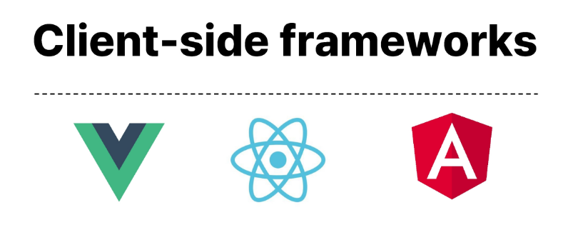
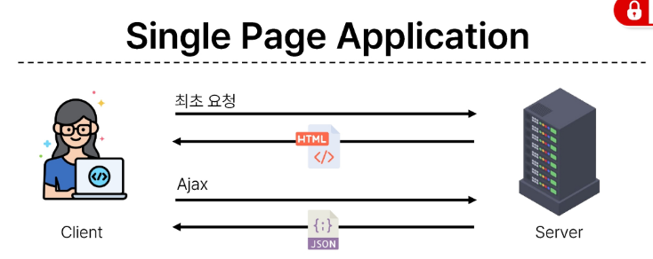

# Vue


# Front-end Dev



Client-side frameworks가 필요한 이유 

1. 사용자는 웹에서 문서만 읽는 것이 아니라 음악을 스트리밍하고,<br> 영화를 보고, 원거리에 있는 사람들과 텍스트 및 영상 태팅을 통해 즉시 통신한다.<br><br>

2. 현대적이고 복잡한 대화형 웹사이트를 <strong>웹 애플리케이션</strong>이라고 부른다.<br>
Java Script 기반의 Client-side frameworks의 출현으로 `매우 동적`인 `대화형 애플리케이션`을 훨씬 더 쉽게 구축할 수 있다. <br>

3. 친구 목록, 타임라인, 스토리 등 친구 이름이 `출력되는 모든 곳`이 `함께 변경`되어야한다.<br>

4. 애플리케이션의 기본 `데이터를 안정적으로 추적`하고 `업데이트 하는 도구`가 필요하다(렌더링, 추가, 삭제 등 )<br>

5. 애플리케이션의 상태를 변경할 때마다 데이터가 일치하도록 모든 관련 UI를 업데이트 해야 한다는 것 <br> 

<h3> Vanilla js만으로 모든 데이터르 조작한다면? </h3>

데이터 `추적이 안된다.`<br>

`데이터 변경`이 일어나면 이 변화에 영향을 받는 `모든 element들을` 찾아 `갱신해야한다.` 매우 복잡함<br> 


# SPA란?(CSR) 

페이지 한 개로 구성된 앱 어플리케이션, 웹 어플리케이션의 `초기 로딩 후` , `새로운 페이지 요청 없이`<br>
동적으로 화면을 `갱신`하며 상호작용하는 웹 애플리케이션 <br> 

<table> 
<thead><tr><th>Single Page Application</th></tr></thead>
<tbody> <tr><td> 


</td></tr> </tbody></table>
1. 서버로부터 필요한 모든 <strong>정적 HTML</strong>을 <strong>처음에 한번</strong> 가져온다,<br>
2. 브라우저가 페이지를 로드하면 Vue프레임워크는 각 HTML 요소에 적절한 javaScript코드를 실행<br>( 이벤트 응답, 데이터 요청 후, UI 업데이트 등)<br>
- 페이지 간 이동 시, 페이지 갱신에 필요한 <strong>데이터만</strong>을 Json으로 전달받아 페이지 일부 갱신, <br>
- Google Maps, 인스타그램 등의 서비스에서 갱신 시 새로고침이 없는 이유<br>
</table>




# Vue 란 ?
사용자 인터페이스(UI)를 구축하기위한 javaScript 프레임워크입니다. <br>

MVVM 패턴의 ViewModel 계층에 초점을 맞춤 <br>

```html

<div id="app">
  <h1>{{ message }}</h1>
  <button @click="count++">
    Count is: {{ count }}
  </button>

  <button v-on:click ="increment" > {{count}} </button>
</div>

<script src="https://unpkg.com/vue@3/dist/vue.global.js"></script>
<script>

  const { createApp, ref } = Vue
  Vue 객체에서 앱 생성 함수(createApp)와 반응형 변수 생성 함수(ref)를 구조 분해 할당
  

  # setup() 함수: Vue 3 Composition API의 핵심으로, '데이터'와 '기능'을 선언하는 장소
  
  # ref(): 값을 **반응형(Reactive)**으로 만듭니다. 인자를 받아 .Value 속성이 있는 ref 객체로
  래핑하여 반환. ref로 래핑된 변수의 값이 변경되면,
  해당 값을 사용하는 `템플릿 {{}}` 은 자동으로 업데이트. 인자는 어떤 타입도 가능.
  `템플릿의 참조{{msg}}`에 접근하려면 setup함수에서 `ref선언` 및 `반환` 필요 
  `템플릿{{}}`에서 Ref를 사용할때는 .Value를 작성할 필요 없다. 
  
  # return { ... }: setup 안에서 만든 변수들을 HTML 템플릿에서 사용할 수 있도록 내보냅니다.


  const app = createApp({
    setup() {
      const message = ref('Hello vue!')
      const count = ref(0)
      const increment = function(){
        count.value++; //익명 함수 할당(일급 객체 다잉~)
      }

      return {
        message,
        count
      }
    }
  })

  app.mount('#app')
</script>
```
`app.mount('#app')`: 설정이 끝난 `Vue 앱`을 HTML의 &lt;div id="app"&gt;에 `부착`하여 작동을 시작하게 합니다.<br><br>

`createApp`: CreateApp()에 전달되는 (익명)객체는 Vue 컴포넌트(Component) `{ setUp(){...} }` <br>
* `컴포넌트의 상태`는 `setup() 함수 내에서` 선언되어야 하며 `{상태s 및 refs...}객체를 반환`해야 함.
- 반환된 객체의 속성은 `템플릿{{}} 안에서` 사용가능 <br>
<br>

`Event Listner in Vue:` `v-on` directive를 사용하여 DOM 이벤트를 수신할 수 있습니다.<br>
Listner에 할당한 함수 내에서 refs를 변경하여 구성 요소 상태를 업데이트 


<hr>
선언적 렌더링: {{ }} 문법을 사용하여 자바스크립트 데이터를 HTML에 바로 표시합니다.<br>

`CDN 주소`: `https://unpkg.com/vue@3/dist/vue.global.js` (Vue 3 최신 버전을 불러옵니다.)<br>
`반응성(Reactivity):` `ref(0)`으로 선언된 데이터는 `값이 변경`될 때마다 화면이 자동으로 `갱신`됩니다.<br>(변수(레퍼런스)를 `인자로 전달`하면 `Vue가 추적`)<br>

이벤트 바인딩: `@click`을 통해 `버튼 클릭 시`의 동작을 정의합니다.<br>

<hr>
Vue.js 서버 실행하기 
```javascript
npm install
npm run dev
```
<hr>

`명령형 방식(Vanilla JS):` "`ID가 msg인 요소`를 찾아서, 그 안의 텍스트를 Hello로 `바꾸고`, 글자 색을 빨갛게 해라." (단계별로 지시)<br>
(기존 방식은 데이터를 꾸고 나서 데이터가 영향을 주는 요소를 따로 가져와서 개발자가 로직을 작성해야 렌더링에 변화를 줄 수 있다.)

* 선언적 (Vue): "이 화면은 message라는 데이터를 보여주는 곳이야."라고 선언해 둡니다.
<br>특징: HTML 구조 안에 {{ message }} 같은 템플릿 구문을 써서, 데이터와 화면이 어떻게 연결되는지 <br>한눈에 보이게 합니다. 코드가 직관적이라 유지보수가 훨씬 편해집니다.
<br>
 
* ` 반응형 (Reactivity)`<br>
`자동 추적:` Vue는 내부적으로 자바스크립트 `객체의 변화를 감시(Proxy 사용`)하고 있습니다.<br>
`효율적인 업데이트 (Virtual DOM):바뀐 부분만 계산해서 딱 그 요소만 업데이트하기 때문에 매우 빠릅니다.(바뀐 요소만 Dom Tree 재구성)<br>
예전처럼 데이터를 수정한 뒤 일일이 document.getElementById().innerText = ... 같은 코드를 짤 필요가 없습니다. 그냥 자바스크립트 변수 값만 바꾸면 끝입니다.<br>

<hr>


# Template Systax 

DOM을 기본 구성 요소 인스턴스의 데이터에 선언적으로 바인딩할 수 있는 html 기반 템플릿 문법
1. Vue 인스턴스에 DOM을 연결 
2. 확장된 문법 제공 &lt; template   v-on:click = "functionName" &gt; ...

## 1. Text Interpolation
```html
<p> Message:{{msg}}</p>
```
데이터 바인딩의 가장 기본적인 형테 <br>
이중 중괄호 구문을 사용 <br>
콧수염 구문은 해당 `구성 요소인스턴스`의 `msg 속성의 value멤버`으로 대체 <br>
msg 속성이 변경될때마다 업데이트 <br>

### 2. Raw HTML 

```html
<div v-html="rawHtml"> 안에는 RawHtml 들어감 (개발자도구에서도)</div>
<script>
    const {CreateApp , ref} = Vue 
    app= CreateApp({
        setUp(){
            const rawHtml  = ref("<span style ="color:red"> this shouldbe red</span>")

        
            return {rawHtml};
        }
    })
    app.mount('#app')
</script>

v-html은 신뢰할 수 있는 콘텐츠에만 사용해야 합니다. 만약 사용자가 게시판에 직접 입력한 내용을 v-html로 그대로 보여주면, 악의적인 사용자가 <script> 태그를 심어 다른 사용자의 정보를 탈취하는 XSS 공격에 노출될 수 있습니다.

```
콧수염 구문은 데이터를 일반 텍스트로 해석하기때문에 HTML을 출력하려면 v-html을 사용합니다.<br>00

### Attribute Bindings

- 콧수염 구문은 HTML 속성 내에서 사용할 수 없기 때문에 v-bind를 사용
- HTML의 id 속성 값을 vue의 dynamicId 속성과 동기화 되도록 함 
- 바인딩 값이 null이나 undefined인 경우 렌더링 요서에서 제거됨
```html

1. 왜 v-bind를 써야 하나요?
HTML 속성 안에는 콧수염 구문을 직접 넣을 수 없기 때문입니다.

잘못된 예: <div id="{{ dynamicId }}"></div> (작동하지 않음)

올바른 예: <div v-bind:id="dynamicId"></div> (성공!)


- 데이터: dynamicId라는 변수에 'my-id'라는 문자열이 들어있습니다.
- 바인딩: v-bind:id="dynamicId"라고 선언하면, Vue가 이 코드를 해석해서 실제 HTML에는 <div id="my-id"></div>라고 그려줍니다.
- 실시간 동기화: 나중에 자바스크립트에서 dynamicId.value = 'new-id'라고 값을 바꾸면, HTML의 id 값도 즉시 new-id로 변경됩니다.


약어(Shorthand): v-bind는 정말 자주 쓰이기 때문에 :(콜론) 하나로 줄여 쓸 수 있습니다.
예: :id="dynamicId", :src="imagePath", :class="{ active: isTrue }"

```


### JavaScript Expressions


- Vue는 모든 데이터 바인딩 내에서 JavaScript 표현식의 모든 기능을 지원 
- Vue 템플릿에서 JavaScript 표현식을 사용할 수 있는 위치 
1. 콧수염 구문 내부 
2. 모든 Dircetive의 속성 값 ( v- 로 시작하는 특수 속성)
- 각 바인딩에는 하나의 단일 표현식만 포함될 수 있음. 
- 표현식은 값으로 평가 핳 수 있는 코드 조각( Return 뒤에 사용할 수 있는 코드여야 함)
- 선언식이나 조건식은 안됨(삼항연산자 사용해야됨)
```html
<div id="app">
  <p>Next Number: {{ number + 1 }}</p>

  <p>Status: {{ ok ? 'YES' : 'NO' }}</p>

  <p>Reversed: {{ message.split('').reverse().join('') }}</p>

  <div :id="`list-${id}`">
    이 요소의 ID는 list-{{ id }} 입니다. (개발자 도구에서 확인 가능)
  </div>
</div>

<script src="https://unpkg.com/vue@3/dist/vue.global.js"></script>
<script>
  const { createApp, ref } = Vue

  createApp({
    setup() {
      const number = ref(10)
      const ok = ref(true)
      const message = ref('안녕하세요')
      const id = ref(15)

      return {
        number,
        ok,
        message,
        id
      }
    }
  }).mount('#app')
</script>
```

# Directive란 ? 
- `v-`접두사가 있는 특수 속성<br>

-  표현식값이 변경될 때 DOM에 반응적으로 업데이트를 적용<br>
```html
 <p v-if = "seen">hi</P>
 seen 표현식() 값의 t/f를 기반으로 <p>요소를 제거/삽입
```


```html
<a v-bind:href ="myUrl">link</a>
href는 HTML  a요소의 href 속성값을 myUrl 값에 바인딩하도록 v-bind의 인자

<button v-on:click="doSomething">Button</Button>
아래 예시의 click은 이벤트 수신할 이벤트 이름을 작성하는 v-on의 인자

v-text, v-show , v-if, v-for,...

HTML의 속성값을 Vue의 상태 속성값과 동기화되도록 함

<a :href = "myUrl">move to url</a>


<script src="https://unpkg.com/vue@3/dist/vue.global.js"></script>
<script>
const { createApp, ref } = Vue

const app = createApp({
  setup() {
    const imageSrc = ref('https://picsum.photos/200')
    const myUrl = ref('https://www.google.co.kr/')
    return {
      imageSrc,
      myUrl,
    }
  }
})
app.mount('#app')</script>

```

# 클래스(Class)와 스타일(Style) 바인딩


```html

1. 기본 원리: 객체 바인딩 (1/3)
문법: :class="{ '클래스명': 불리언값 }"
작동: 불리언값이 true이면 클래스가 붙고, false이면 떨어집니다.

2. 일반 클래스와 혼용하기 (2/3)
:class="{ ... }": 조건에 따라 붙었다 떨어졌다 하는 클래스들입니다.

3. 객체를 변수로 분리하기 (3/3)
HTML 코드가 너무 길어지는 것을 방지하기 위해, 
바인딩할 객체 자체를 JavaScript 영역으로 뺄 수 있습니다.

const classObj = ref({ ... })
장점: HTML 템플릿이 깔끔해지고, 자바스크립트 로직 안에서 여러 클래스 상태를 한꺼번에 관리하기 좋습니다.
<div id="app">
  <div class="static" :class="{ active: isActive, 'text-primary': hasInfo }">
    직접 객체 바인딩
  </div>

  <hr>

  <div class="static" :class="classObj">
    객체 변수 바인딩
  </div>


  <div :class="[classObj, baseClass]">
    배열로 섞인 클래스 적용
  </div>


  <button @click="toggle">상태 변경 버튼</button>
</div>

<script src="https://unpkg.com/vue@3/dist/vue.global.js"></script>
<script>
  const { createApp, ref } = Vue

  createApp({
    setup() {
      const isActive = ref(false)
      const hasInfo = ref(true)

      // (3/3) 슬라이드 내용: 객체로 관리
      const classObj = ref({
        active: isActive,         // ref가 객체 속성으로 들어가면 자동으로 unwrap 됨
        'text-primary': hasInfo
      })
      const baseClass = ref('padding-box shadow-bg')
      const toggle = () => {
        isActive.value = !isActive.value
      }

      return { isActive, hasInfo, classObj, toggle,baseClass }
    }
  }).mount('#app')
</script>

<style>
  .static { font-weight: bold; padding: 10px; border: 1px solid #ccc; }
  .active { background-color: #e0f7fa; border-color: #00bcd4; }
  .text-primary { color: blue; }
</style>
```

# Dynamically data binding

# Event Handling 

**이벤트 핸들링(v-on)**<br>
DOM요소에 이벤트 리스너 연결 및 수신,사용자의 동작(클릭, 키보드 입력 등)을 감지하고 처리<br>
1. 이벤트 바인딩 기본 (`v-on과 @`)<br>
2. 문법: v-on:click="핸들러" 또는 약어인 **@click="핸들러"**를 사용합니다.<br>
3. `Inline Handlers:` @click="count++" 처럼 `짧은 코드를 직접` 넣습니다.
4. `Method Handlers:` `@click="myFunc"` 처럼 `JS에 정의된 함수` 이름을 연결합니다. 이때 Vue는 `**기본 이벤트 객체(event)**`를 `자동으로 함수에` 넘겨줍니다.<br>

* `event` :Vue가 제공하는 DOM이벤트 객체 $event로 객체 전달
* addEventListener('click', (e) => { ... })를 쓸 때 받는 그 e 객체와 완전히 동일한 녀석입니다.

```html
브라우저에서 click, keyup, submit 같은 사건이 터지면,
 Vue는 그 사건 정보를 담고 있는 원본 객체를 $event라는
  이름의 봉투에 담아서 우리 함수로 보내주는 역할만 합니다.

따라서 $event 안에는 우리가 자바스크립트에서 쓰던 속성들이 그대로 들어있습니다.

$event.target: 이벤트를 발생시킨 태그

$event.preventDefault(): 기본 동작 방지

$event.clientX / clientY: 마우스 클릭 좌표

$event.key: 누른 키보드 버튼 이름

```

## 핸들러에서 인자 전달하기
1. 커스텀 인자: @click="greeting('hello')" 처럼 내가 원하는 값을 보낼 수 있습니다.<br>
원본 이벤트와 함께 보내기: 만약 내가 정한 값과 원본 event 객체를 <br>동시에 쓰고 싶다면, 특별한 변수인 **$event**를 사용합니다.<br>

예: @click="warning('메시지', $event)"<br>

3. 이벤트 수식어 (Event Modifiers) - 매우 중요!<br>
자바스크립트로 일일이 e.preventDefault()를 칠 필요가 없게 해줍니다.<br>

.prevent: 기본 동작(예: 폼 제출 시 페이지 새로고침)을 막습니다. <br>(@submit.prevent)<br>

.stop: 이벤트 버블링(상위 요소로 이벤트가 퍼지는 것)을 막습니다.<br>

체이닝 가능: @click.stop.prevent 처럼 여러 개를 한 번에 걸 수 있습니다.<br>

4. 키 수식어 (Key Modifiers)<br>
키보드 입력을 처리할 때 노가다(?)를 줄여줍니다.<br>

.enter: 엔터 키를 눌렀을 때만 실행합니다. (@keyup.enter="submit")<br>

이외에도 .esc, .space, .up, .down 등이 있습니다.<br>
```html 
<div id="app">
  <input 
    type="text" 
    v-model="searchQuery" 
    @keyup.enter="handleSearch"
    placeholder="여행지를 검색하세요"
  >

  <form @submit.prevent="savePlan">
    <button type="submit">일정 저장</button>
  </form>

  <button @click="sendMessage('Chat Started', $event)">
    실시간 채팅 시작
  </button>
</div>

<script src="https://unpkg.com/vue@3/dist/vue.global.js"></script>
<script>
  const { createApp, ref } = Vue
  createApp({
    setup() {
      const searchQuery = ref('')
      
      const handleSearch = () => {
        alert(`${searchQuery.value} 검색을 시작합니다!`);
      }

      const sendMessage = (msg, e) => {
        console.log(msg); // 'Chat Started'
        console.log(e.target); // 클릭된 버튼 요소
      }

      return { searchQuery, handleSearch, sendMessage }
    }
  }).mount('#app')

  * @submit.prevent는 HTML 폼(form)이 제출될 때 브라우저가 기본적으로 수행하는 "페이지 새로고침" 동작을 막아주는 Vue의 아주 편리한 기능입니다.

  *  Vue와 같은 SPA(Single Page Application): 페이지 전체를 새로고침하지 않고, 자바스크립트(Axios 등)를 통해 데이터만 몰래 보내고 화면을 유지해야 합니다. 새로고침이 일어나면 현재 앱의 상태(입력 중인 데이터 등)가 모두 날아가 버리기 때문이죠.
</script>
```

# Form input Bindings


* 양방향 바인딩이란?<br>
개념: 화면의 입력창(Input) 값이 바뀌면 JS 데이터가 바뀌고, 반대로 JS 데이터가 바뀌면 화면의 입력창 값도 즉시 바뀌는 구조입니다.<br>

방법 `1 (수동)`: :`value(v-bind)로 데이터`를 보여주고, `@input(v-on)으로 데이터에 저장`합니다.<br>

방법 `2 (자동)`: `**v-model**`을 사용하면 위 두 과정을 한 줄로 처리할 수 있습니다.<br>

# `2 (자동)`<br>
```html

<p>{{ inputText1 }}</p>
<input :value="inputText1" @input="onInput">

<script>
const inputText1 = ref('')

const onInput = function (event) {
  inputText1.value = event.currentTarget.value
}
<script>


:value="inputText1": 데이터(JS) → 화면(Input)으로 값을 전달합니다. (v-bind)
@input="onInput": 화면(Input)에서 입력이 발생하면 데이터(JS)를 업데이트합니다. (v-on)

event.currentTarget.value: 입력 이벤트가 발생한 태그의 현재 입력된 값을 가져와서 ref 변수에 대입합니다.

```

`v-model vs (v-bind + v-on)`<br>
일반적으로 v-model이 훨씬 편하지만, 한국어 입력을 처리할 때는 주의해야 합니다.<br>

방식,특징<br>
v-model,"코드가 간결함. 하지만 IME 문자(한국어, 중국어 등) 입력 시 한 글자가 완성되어야 데이터가 업데이트되는 현상이 있음."<br>
v-bind + v-on,"코드는 길지만, 한국어 입력 시 자음/모음 단위로 실시간 반영이 필요할 때 사용함."<br>


```html
<div id="app">
  <input :value="text" @input="e => text = e.target.value">
  <p>입력값: {{ text }}</p>

  <h3>가고 싶은 도시</h3>
  <input type="checkbox" value="Seoul" v-model="cities"> 서울
  <input type="checkbox" value="Gumi" v-model="cities"> 구미
  <p>선택된 도시: {{ cities }}</p>
</div>

<script setup>
import { ref } from 'vue'
const text = ref('')
const cities = ref([]) // 여러 개를 담기 위해 배열로 선언!
</script>

---------------------------------------------------
<div id="app">
  <div>Selected: {{ selected }}</div>

  <select v-model="selected">
    <option disabled value="">Please select one</option>
    
    <option value="Alice">Alice</option>
    <option value="Bella">Bella</option>
    <option value="Cathy">Cathy</option>
  </select>
</div>

<script src="https://unpkg.com/vue@3/dist/vue.global.js"></script>
<script>
  const { createApp, ref } = Vue

  createApp({
    setup() {
      // 2. 초기값을 빈 문자열('')로 설정하여 위 placeholder와 매칭시킵니다.
      const selected = ref('')

      return { selected }
    }
  }).mount('#app')
</script>
```