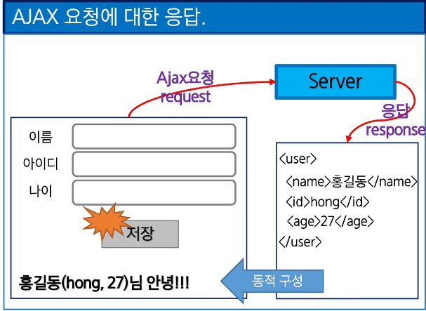
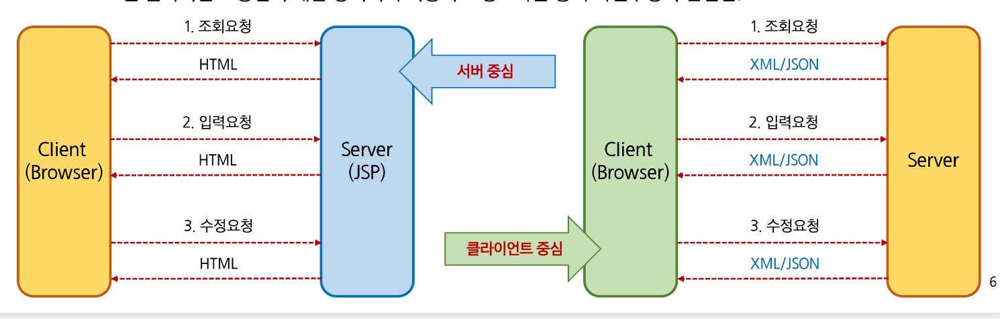

# Ajax

`화면 새로고침 없이`, 몰래 `서버랑 데이터를 주고받는 기술`<br>

1. 왜 나왔을까? (새로고침의 답답함)<br>
```javascript
예전 웹사이트를 떠올려보세요. 게시판에서 2페이지 버튼을 누르면 화면 전체가 하얗게 변했다가 다시 처음부터 위에서 아래로 렌더링되면서 켜졌죠?
버튼 하나 눌렀을 뿐인데 전체 페이지를 서버에서 다시 받아와야 해서 시간도 오래 걸리고 화면이 깜빡거렸습니다.
```

2. AJAX의 등장 (화면은 그대로, 데이터만 쏙쏙)
```javascript
구글 지도나 인스타그램을 보면, 스크롤을 내리거나 버튼을 누를 때 화면이 깜빡이지 않고 부드럽게 다음 사진이나 지도가 나타나죠?

웹 페이지 전체를 다시 로딩하지 않고, 필요한 데이터(예: 다음 게시글 목록)만 서버에 살짝 요청해서 가져온 뒤 화면의 일부분만 바꿔치기하는 겁니다.

```

`Ajax`란 `JavaScript를 사용`해서 `비동기적`으로 통신하는 `패턴이나 방식`을 부르는 이름입니다.<br>

`비동기(Asynchronous) 방식`: 서버에 데이터를 요청해 놓고, `응답이 올 때까지 화면을 멈춰놓고 기다리는 게 아니라`(동기식),<br> 사용자는 스크롤도 내리고 다른 버튼도 누르며 계속 웹서핑을 할 수 있습니다(비동기식)<br>


`동적으로 DOM을 구성`해야 하므로 `구현이 복잡`:<br>
서버에서 데이터를 받아온 뒤, 자바스크립트를 이용해 HTML의 어느 부분에 이 데이터를 꽂아 넣을지<br> 직접 코드로 다 짜줘야(DOM 조작) 하기 때문입니다.<br>



# 두 가지 렌더링 방식
```javascript

1. 서버 중심의 상호작용 (서버가 다 만들어주는 '완제품' 방식)
개념: 식당(서버)에서 요리사가 완성된 요리를 손님(클라이언트/웹 브라우저) 테이블에 그대로 내어주는 방식입니다.

작동 방식: 브라우저가 "이 페이지 보여줘!" 하면, 서버가 ```JSP, PHP``` 같은 언어를 써서 HTML 화면 전체를 뚝딱뚝딱 다 완성한 다음 브라우저로 보냅니다. 브라우저는 그걸 받아서 화면에 띄우기만 하면 됩니다. (이것을 전문 용어로 SSR, Server-Side Rendering이라고 부르기도 합니다.)

특징: 우리가 아까 이야기했던 '페이지 이동 시 화면이 하얗게 깜빡거리는' 전통적인 방식의 웹사이트들이 주로 이 방식을 사용합니다.


2. 클라이언트 중심의 상호작용 (브라우저가 직접 그리는 '밀키트' 방식)
개념: 식당(서버)은 요리 재료(데이터)만 주고, 손님(브라우저)이 테이블에서 직접 조리(화면 구성)해서 먹는 방식입니다.

작동 방식: 브라우저는 처음에 뼈대만 있는 빈 그릇(기본 HTML)을 받고, 서버에 "화면에 채울 데이터만 좀 줘!"라고 요청합니다. 서버가 데이터(주로 JSON 형식)만 던져주면, 브라우저가 **자바스크립트(JavaScript)**를 이용해 화면을 직접 그려냅니다. (이것을 CSR, Client-Side Rendering이라고 부릅니다.)

```



```javascript

//① 심부름꾼 고용하기
let xmlHttpRequest = new XMLHttpRequest();


//② 심부름 지시서 작성하기 (open)
let url = 'https://jsonplaceholder...'; // 목적지
let method = 'GET'; // 가져오는 방식
xmlHttpRequest.open(method, url, true);


//③ 배달 완료 시 할 일 정해주기 (onreadystatechange)- 콜백 등록 
xmlHttpRequest.onreadystatechange = function(){ ... 
    //④ 배달 사고 없이 잘 왔는지 확인하기 (readyState, status)
    if(xmlHttpRequest.readyState == 4 && xmlHttpRequest.status == 200){
        console.log(xmlHttpRequest.responseText);
    }
}

//⑤ 심부름꾼 출발시키기 (send)
xmlHttpRequest.send();

```

<h3>✓ readyState.</h3>
<table border="1" style="border-collapse: collapse; text-align: left; width: 100%;">
  <thead>
    <tr style="background-color: #e2efda;">
      <th style="padding: 8px;">값</th>
      <th style="padding: 8px;">의미</th>
      <th style="padding: 8px;">설명</th>
    </tr>
  </thead>
  <tbody>
    <tr>
      <td style="padding: 8px; text-align: center;">0</td>
      <td style="padding: 8px;">Uninitialized</td>
      <td style="padding: 8px;">객체만 생성 (open 메소드 호출 전).</td>
    </tr>
    <tr style="background-color: #f9f9f9;">
      <td style="padding: 8px; text-align: center;">1</td>
      <td style="padding: 8px;">Loading</td>
      <td style="padding: 8px;">open 메소드 호출.</td>
    </tr>
    <tr>
      <td style="padding: 8px; text-align: center;">2</td>
      <td style="padding: 8px;">Loaded</td>
      <td style="padding: 8px;">send 메소드 호출. status의 헤더가 아직 도착되기 전 상태.</td>
    </tr>
    <tr style="background-color: #f9f9f9;">
      <td style="padding: 8px; text-align: center;">3</td>
      <td style="padding: 8px;">Interactive</td>
      <td style="padding: 8px;">데이터 일부를 받은 상태.</td>
    </tr>
    <tr style="background-color: #e2efda;">
      <td style="padding: 8px; text-align: center;">4</td>
      <td style="padding: 8px;">Completed</td>
      <td style="padding: 8px;">데이터 전부를 받은 상태.</td>
    </tr>
  </tbody>
</table>

<br>

<h3>✓ status.</h3>
<table border="1" style="border-collapse: collapse; text-align: left; width: 100%;">
  <thead>
    <tr style="background-color: #fce4d6;">
      <th style="padding: 8px;">값</th>
      <th style="padding: 8px;">텍스트(status Text)</th>
      <th style="padding: 8px;">설명</th>
    </tr>
  </thead>
  <tbody>
    <tr>
      <td style="padding: 8px; text-align: center;">200</td>
      <td style="padding: 8px;">OK</td>
      <td style="padding: 8px;">요청 성공.</td>
    </tr>
    <tr style="background-color: #f9f9f9;">
      <td style="padding: 8px; text-align: center;">403</td>
      <td style="padding: 8px;">Forbidden</td>
      <td style="padding: 8px;">접근 거부.</td>
    </tr>
    <tr style="background-color: #fce4d6;">
      <td style="padding: 8px; text-align: center;">404</td>
      <td style="padding: 8px;">Not Found</td>
      <td style="padding: 8px;">페이지 없음.</td>
    </tr>
    <tr style="background-color: #f9f9f9;">
      <td style="padding: 8px; text-align: center;">500</td>
      <td style="padding: 8px;">Internal Server Error</td>
      <td style="padding: 8px;">서버 오류 발생.</td>
    </tr>
  </tbody>
</table>

# 프로미스 
비동기 작업(서버 통신 등)을 할 때, 콜백 지옥을 .then()과 .catch()를 이용해 위에서 아래로 깔끔하고 읽기 쉽게 정리해 주는 아주 고마운 문법<br>
``` javascript
.then() (그리고 나서~): "앞의 작업이 성공적으로 끝났으면, 그리고 나서 이 결과(result)를 가지고 다음 작업을 해!" 라는 뜻입니다. 기차 칸을 연결하듯이 .then()을 계속 이어서 쓸 수 있는데, 이를 **체이닝(Chaining)**이라고 부릅니다.

.catch() (에러 잡기): 콜백 지옥에서는 에러 처리도 복잡했지만, Promise는 끝에 .catch() 하나만 달아두면 됩니다. 위에서 내려오다가 1번이든 3번이든 어디서 하나라도 에러가 빵 터지면, 맨 아래 .catch()로 쏙 빠져나와서 에러를 안전하게 처리해 줍니다
```


```javascript
//비동기 콜백방식
work1( function(){
    //비동기작업 ...
    work2(result1, function (result2){
        //비동기작업 ...
        work3(result2, function(result3){
            ...
        })
    })
})

```

```javascript

//promise 방식
work()
  .then((result) => {
      
  })
  .then((result) => {
      
  })
  .then((result) => {
      
  })
  .catch(error => {
      
  })
```


# fetch API 

* 복잡했던 XMLHttpRequest 대신 사용하는 아주 깔끔하고 모던한 통신 방법입니다.
```javascript
fetch( url, {
  method: "GET",
  headers: { "Content-Type": "application/json" },
})
.then( function (response) {
  if(response.status === 200){
    console.log("first then", response) //Response객체.status, statusText등을 갖는다.
    return response.json() // type을 출력해보면 Promise
  } else {
    console.log(response.statusText);
  }
})
.then( function(jsonData) {
  console.log('second then', jsonData);
})
.catch( function(error) {
  console.log(error)
})
```

# axios
📝 강의 핵심 내용
axios객체를 활용해서 요청을 보내고, 응답데이터로 promise객체를 받는다.<br>

promise는 then(), catch()를 활용해서 필요한 로직을 수행한다.<br>

```javascript
<script src="https://unpkg.com/axios/dist/axios.min.js"></script>

<script type="text/javascript">
  document.addEventListener("DOMContentLoaded", function(){
      document.getElementById('button').addEventListener('click', function(){
          const url = 'https://jsonplaceholder.typicode.com/todos/1';
          
          const axiosObj = axios({
              method : 'get',
              url : url
          })
          console.log(axiosObj)  //Promise Object
          
          axiosObj.then( function(response) {
              console.log(response)  // Response객체
              console.log(response.data) // Response에 전달받은 객체 data
              console.log(JSON.stringify(response.data)) // json객체 --> string문자열로 변환
          })
      });
  });


const response = await fetch(url);      // 1. 통신 끝날 때까지 기다림
const data = await response.json();     // 2. JSON으로 변환될 때까지 또 기다림

const response = await axios(url);      // 1. 통신 + 변환 끝날 때까지 한 번에 기다림
const data = response.data;             // 변환 완료된 값 바로 꺼내 씀


fetch의 방식 (성질이 급함): 데이터의 앞부분인 **헤더(Header, "데이터 갑니다~" 하는 알림)**만 도착하면, 알맹이는 아직 들어오고 있는 중인데도 일단 첫 번째 .then을 바로 실행해 버립니다.
여기서 우리가 response.json()을 호출하면 "아직 쫄쫄쫄 들어오고 있는 데이터 물줄기가 끝까지 다 들어올 때까지 기다렸다가, 다 모이면 그때 JSON으로 바꿔서 줄게!" 라는 의미가 됩니다. 네트워크에서 데이터를 끝까지 다 받는 걸 기다려야 하니 이 과정이 두 번째 비동기 작업이 되는 것입니다.

Axios의 방식 (우직함): Axios는 헤더가 도착해도 호들갑 떨지 않습니다. 뒤에서 데이터 물줄기가 끝까지 다 들어올 때까지 조용히 기다립니다. 데이터가 100% 다 모이고 JSON 변환까지 완벽하게 끝난 '완제품'이 되었을 때, 비로소 우리가 작성한 단 하나의 .then을 실행시켜 줍니다.

</script>
```
# XML, Json type data처리

# localStorage, sessionStorage


# Bootstrap

# grid 


# Vue.js

JavaScript 코드를 체계적으로 관리하고, UI를 빠르고 효윻적으로 그리기 위한 프로그레시프 프레임워크입니다.<br>

왜 쓰죠?<br>

1. DOM 조작의 자동화 :<br>
 순수 javaScript만으로 복잡한 화면을 만들면, 데이터가 바뀔때마다 HTML요소를 일일이 찾아 갱신해야 합니다. <br>
 vue.js를 사용하면, `데이터가 변경`되면 `화면이 알아서 업데이트`되는 반응형시스템을 제공합니다. <br>
개발자는 화면 갱신 로직에 신경쓰지 않고 `데이터 모델링만` 신경쓰면 됩니다.

```JavaScript
 document.getElementById("id")
 document.getElementByClassName("class")
 document.querySelector("#id")<br>
```

2. `컴포넌트 기반 개발`:<br>
 화면을 네비게이션바 채팅창, 화상회의 화면 , 지도 영역 등 독립된 부품(컴포넌트) 로 쪼개서 개발할 수 있습니다.<br> (코드의 재사용성 및 유지보수를 압도적으로 늘릴 수 있습니다.)<br>

3. 배우기 쉽고 생산성이 높다고 알려져있습니다.( 직관적인 문법, html 템플릿 기반의 문법)<br>

<p>어떤 때에 쓰이죠? </p><br>

1. `SPA 구축`: 페이지 이동 시 화면 전체를 새로고침하는 게 아니라, 필요한 데이터만 받아와 화면의 일부만 <br>부드럽게 교체하는 모던 웹 애플리케이션을 만들 때 필수적입니다.<br>

2. `실시간 동기화가 잦은 복잡한 UI`: 예를 들어, 다중 사용자가 동시에 접속해 지도 위에 실시간으로 마커(핀)를 꽂거나,<br> 채팅과 화상 통화가 `동시에 이루어지는 등 상태(State) 변화`가 `매우 잦고` `복잡한 서비스 화면`을 안정적으로 렌더링할 때 강력한 힘을 발휘합니다.

3. 한 데이터의 변경이 여러 요소에게 영향을 미치는 경우, 프롭스라는 기능을 사용하여<br> 자동으로 각 원소에 데이터를 전달해주는 등 편리한 기능 제공 


